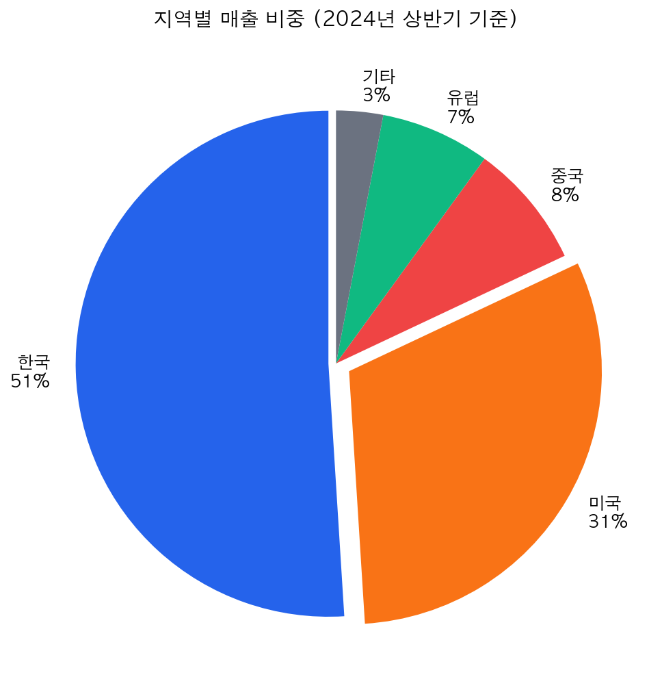
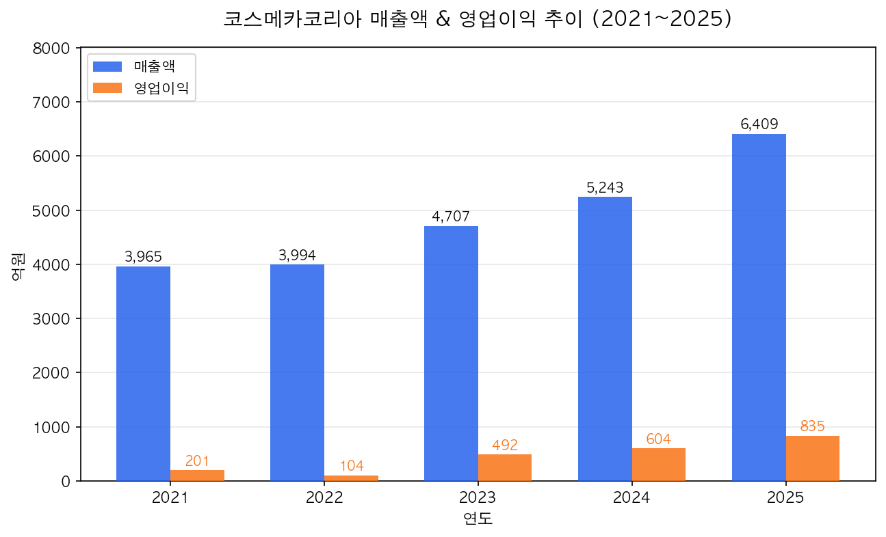
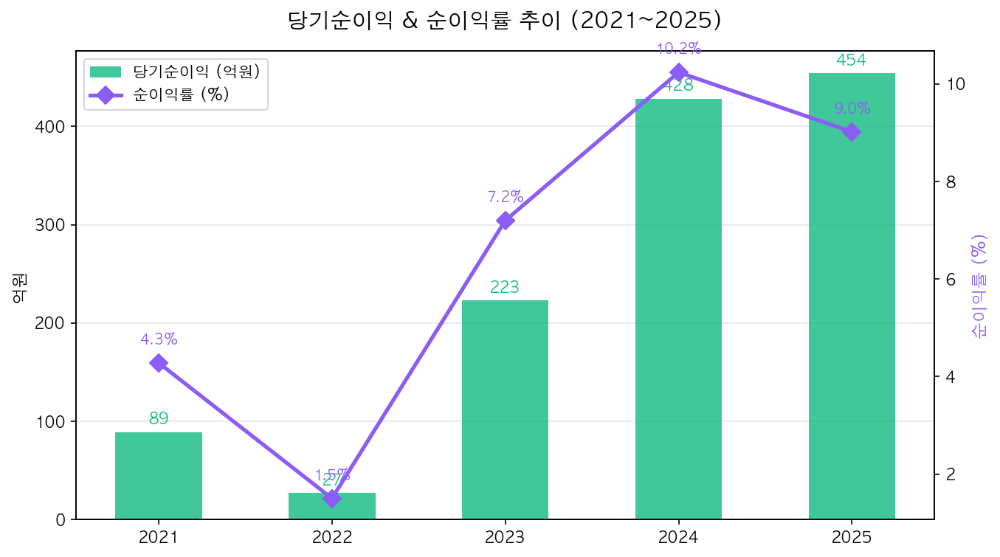
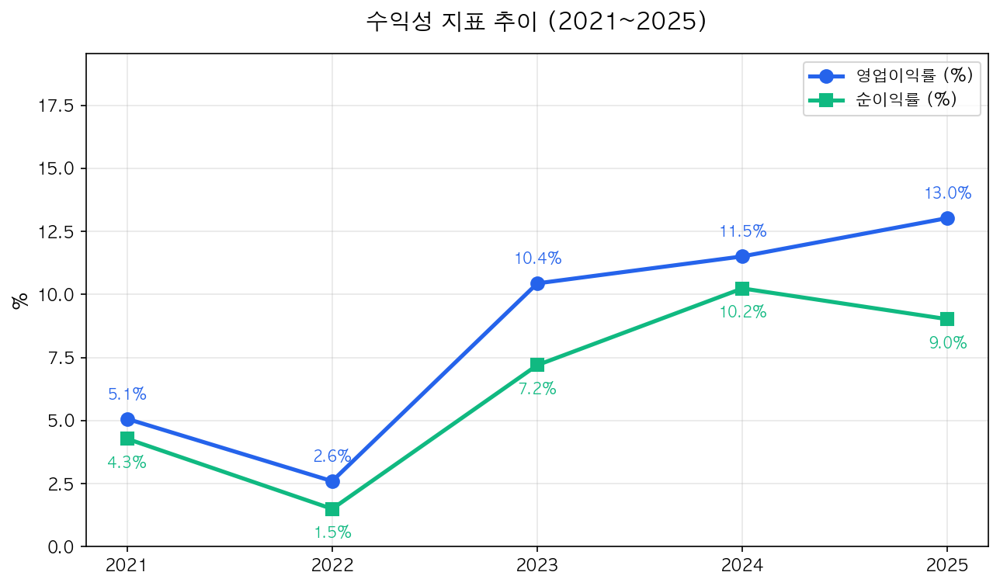
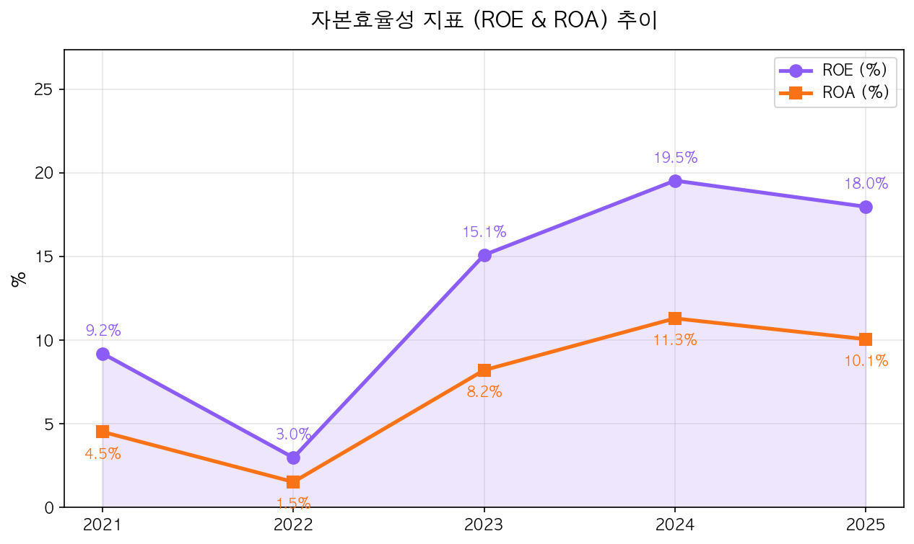
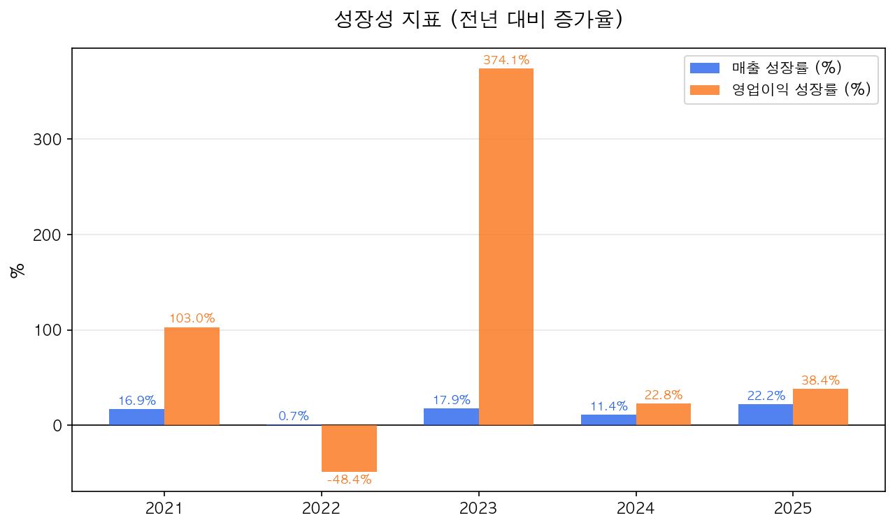
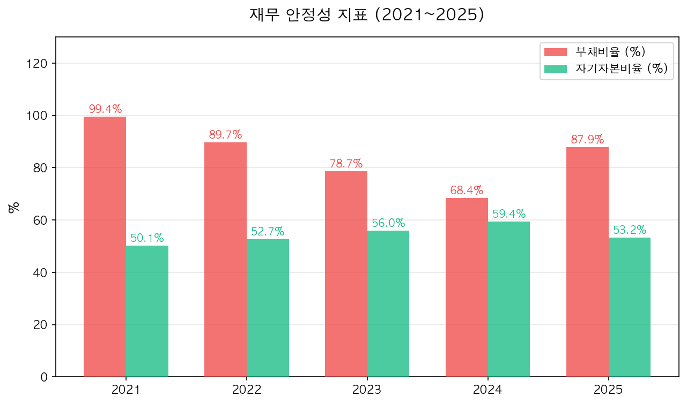
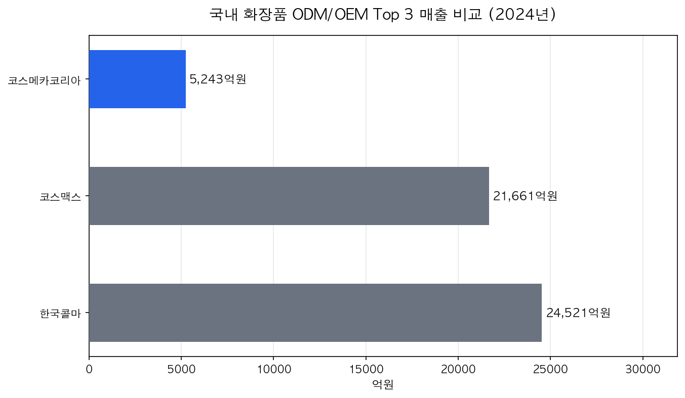
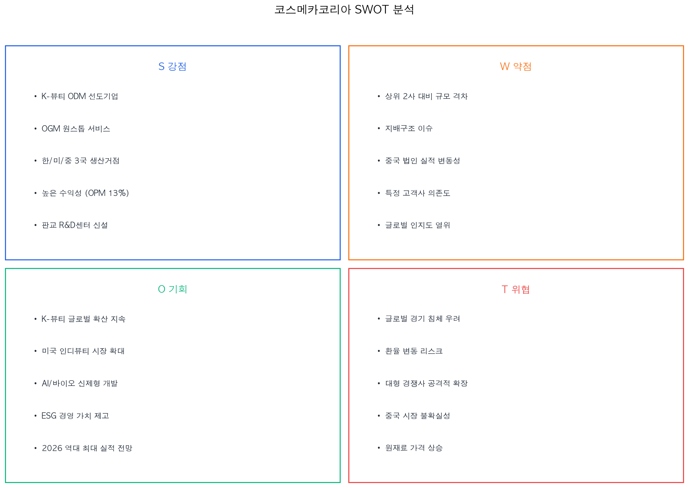

# 코스메카코리아 (241710.KQ) 투자 분석 보고서

**작성일**: 2026년 4월 1일  
**종목코드**: 241710 (코스닥)  
**현재 주가**: 약 80,000원 | **시가총액**: 약 8,512억원  
**투자의견**: 매수(BUY) | **목표주가**: 89,000~125,000원

---

## 목차

1. [회사 개요](#1-회사-개요)
2. [비전과 경영철학](#2-비전과-경영철학)
3. [사업모델 분석](#3-사업모델-분석)
4. [재무제표 분석 (초보자 가이드)](#4-재무제표-분석-초보자-가이드)
5. [수익성 분석](#5-수익성-분석)
6. [성장성 분석](#6-성장성-분석)
7. [재무 안정성 분석](#7-재무-안정성-분석)
8. [산업 분석 및 경쟁 환경](#8-산업-분석-및-경쟁-환경)
9. [SWOT 분석 및 투자 리스크](#9-swot-분석-및-투자-리스크)
10. [밸류에이션 및 투자 결론](#10-밸류에이션-및-투자-결론)

---

## 1. 회사 개요

### 코스메카코리아는 어떤 회사인가?

코스메카코리아는 **화장품을 대신 만들어주는 회사**입니다. 여러분이 편의점이나 올리브영에서 보는 다양한 화장품 브랜드들 -- 이 브랜드들이 직접 공장을 짓고 화장품을 만드는 것이 아니라, 코스메카코리아 같은 전문 제조업체에 "이런 화장품을 만들어주세요"라고 주문합니다. 이것을 **ODM**(Original Design Manufacturing, 설계부터 생산까지) 또는 **OEM**(Original Equipment Manufacturing, 주문자 상표 부착 생산)이라고 합니다.

> **쉬운 비유**: 코스메카코리아는 화장품 업계의 '삼성전자 파운드리'와 같은 역할입니다. 삼성전자가 다른 회사의 반도체를 대신 만들어주듯, 코스메카코리아는 다른 브랜드의 화장품을 대신 만들어줍니다.

| 항목 | 내용 |
|------|------|
| **정식 명칭** | (주)코스메카코리아 (Cosmecca Korea Co., Ltd.) |
| **설립일** | 1999년 10월 15일 |
| **창업자/회장** | 조임래 |
| **종목코드** | 241710 (코스닥) |
| **업종** | 화장품 ODM/OEM |
| **본사/공장** | 충청북도 음성군 |
| **R&D 센터** | 경기도 성남시 판교 제2테크노밸리 (2025년 10월 신축 개소) |
| **직원 수** | 약 445~498명 |
| **상장일** | 2016년 (코스닥) |
| **해외 법인** | 미국(Cosmecca USA), 중국(코스메카차이나) |
| **시가총액** | 약 8,512억원 (2026.3.31 기준) |
| **발행주식수** | 10,680,000주 |

### 주요 주주 구성

| 주주 | 지분율 | 비고 |
|------|--------|------|
| 박은희 외 3인 (특수관계인) | 38.95% | 조임래 회장 배우자 포함, 경영권 안정적 |
| 국민연금공단 | 11.99% | 장기 기관투자자 |
| KB자산운용 | 6.11% | |
| 트러스톤자산운용 | 6.06% | |
| 외국인 투자자 합계 | 16.85% | |

> **초보자 해설**: 최대주주(경영진 가족)가 약 39%를 보유하고 있어 경영권이 안정적입니다. 국민연금과 같은 대형 기관투자자가 12%를 보유하고 있다는 것은, 전문 투자자들도 이 회사의 성장성을 인정한다는 신호입니다.

---

## 2. 비전과 경영철학

### 2026년 경영 키워드: '비천도해(飛天渡海)'

조임래 회장은 2026년 경영 키워드로 **'비천도해(飛天渡海)'** -- "하늘을 날고 바다를 건넌다"를 제시했습니다. 기존의 한계를 넘어 기술, 조직, 글로벌 전략 전반의 혁신을 추진하겠다는 강한 의지를 담고 있습니다.

### 핵심 비전

> **"Global Best OGM Company"**  
> 글로벌 최고의 OGM(Original Global Standard and Good Manufacturing) 기업

### 4대 전략 방향

| 전략 | 내용 |
|------|------|
| **기술 고도화** | AI, 바이오, 신소재 기반 고부가가치 제형 기술 개발 |
| **AX 전환** | 연구/생산/품질/마케팅 전 영역에 AI와 데이터 적용 |
| **스마트팩토리** | 디지털 트윈 기반 지능형 제조 체계 구축 |
| **ESG 경영** | 환경 대응, 인재 중심 문화, 투명한 윤리경영 |

### ESG (환경/사회/지배구조) 성과

- **ESG 등급**: 서스틴베스트(Sustinvest) **A등급** 획득
- **정부포상**: '2025 지속가능경영 유공' 산업통상자원부 장관표창 수상
- 업사이클링 원료 기술, 4R 전략(Reduce/Reuse/Replace/Recycle), 태양광 패널 설치

---

## 3. 사업모델 분석

### OGM 시스템: 단순 대리 생산이 아닌 '토탈 솔루션'

코스메카코리아의 사업모델은 단순히 "남의 화장품을 대신 만들어주는 것"이 아닙니다.

```
[고객사(브랜드)] ──→ [코스메카코리아 OGM 시스템]
                         │
                         ├── 트렌드 분석 & 기획
                         ├── 원료/제형 연구개발 (R&D)
                         ├── 규제 검토 (각국 인허가)
                         ├── 시제품 제작 & 테스트
                         ├── 대량 생산
                         └── 포장 설계 & 완제품 출하
```

> **쉬운 비유**: 브랜드사가 "보습력이 좋은 크림을 만들고 싶어요"라고만 말하면, 코스메카코리아가 원료 선정부터 디자인, 생산, 포장까지 **처음부터 끝까지(One-Stop)** 해결해줍니다.

### 제품 포트폴리오

- **스킨케어** (기초화장품) -- 핵심 매출원
- **메이크업** (색조화장품)
- **클렌징**
- **헤어/바디 케어**
- 20여 가지 이상의 효능제품, 비건제품

### 지역별 매출 비중 (2024년 상반기)



| 지역 | 비중 | 설명 |
|------|------|------|
| **한국** | 51% | K-뷰티 인디 브랜드 수주 호조 |
| **미국** | 31% | Cosmecca USA 법인 통한 현지 생산 |
| **중국** | 8% | 중국 법인 운영 (변동성 있음) |
| **유럽** | 7% | K-뷰티 유럽 진출 확대 |
| **기타** | 3% | 동남아, 캐나다 등 |

### 5대 경쟁우위 (경제적 해자)

1. **'Made in Korea' 프리미엄**: K-뷰티 글로벌 열풍의 핵심 수혜
2. **인디 브랜드 중심의 다변화된 고객군**: 특정 대형 고객 의존도가 낮음
3. **OGM 원스톱 서비스**: 기획~생산~포장까지 통합 제공
4. **3국 생산거점**: 한국/미국/중국에서 로컬 생산 가능
5. **R&D 역량 강화**: 판교 중앙연구원 신설 (2025년)

---

## 4. 재무제표 분석 (초보자 가이드)

> **재무제표란?** 회사의 '성적표'입니다. 학교에서 국어, 수학, 영어 점수를 보듯, 회사는 매출, 이익, 부채 등의 숫자로 경영 성과를 보여줍니다.

### 핵심 재무 지표 한눈에 보기



### 연도별 손익 현황 (연결기준)

| 항목 | 2021년 | 2022년 | 2023년 | 2024년 | 2025년 |
|------|--------|--------|--------|--------|--------|
| **매출액** | 3,965억 | 3,994억 | 4,707억 | 5,243억 | **6,409억** |
| **영업이익** | 201억 | 104억 | 492억 | 604억 | **835억** |
| **당기순이익** | 89억 | 27억 | 223억 | 428억 | **454억** |

### 초보자를 위한 용어 해설

#### 매출액 (Revenue) -- "얼마나 팔았나?"
> 회사가 물건이나 서비스를 팔아서 벌어들인 **총 금액**입니다.  
> 코스메카코리아는 2025년에 **6,409억원**어치의 화장품을 만들어 납품했습니다.  
> 2021년 3,965억원에서 5년간 **62% 성장** -- 매우 건강한 성장세입니다.

#### 영업이익 (Operating Profit) -- "본업으로 얼마 남겼나?"
> 매출에서 원재료비, 인건비, 임대료 등 사업 운영에 드는 비용을 뺀 금액입니다.  
> 2025년 영업이익 **835억원**은 역대 최대입니다.  
> **중요**: 영업이익은 '본업의 실력'을 보여주는 핵심 지표입니다.

#### 당기순이익 (Net Income) -- "최종적으로 얼마 남겼나?"
> 영업이익에서 이자비용, 세금 등 모든 비용을 빼고 **최종적으로 남은 순수한 이익**입니다.  
> 2025년 순이익 **454억원** -- 2022년(27억원) 대비 **16.8배** 증가했습니다.



---

## 5. 수익성 분석

> **수익성이란?** "100원을 팔면 얼마가 남는가?"를 보여줍니다. 아무리 많이 팔아도 남는 게 없으면 좋은 사업이 아닙니다.



### 주요 수익성 지표

| 지표 | 2021년 | 2022년 | 2023년 | 2024년 | 2025년 | 의미 |
|------|--------|--------|--------|--------|--------|------|
| **영업이익률** | 5.1% | 2.6% | 10.4% | 11.5% | **13.0%** | 100원 팔면 13원 남음 |
| **순이익률** | 4.3% | 1.5% | 7.2% | 10.2% | **9.0%** | 세금 등 다 빼고 9원 남음 |
| **매출총이익률** | 18.4% | 16.3% | 22.8% | 23.8% | **24.7%** | 원가 제외 후 마진 |

### 수익성 해설

**2022년이 바닥이었습니다.** 영업이익률이 2.6%까지 떨어졌는데, 이는 코로나 이후 원재료 가격 상승과 물류비 증가의 영향이었습니다.

**2023년부터 극적인 반등!** K-뷰티 열풍이 본격화되면서 매출이 늘어나고, 원가 관리 효율화로 영업이익률이 **10%대**로 올라섰습니다.

**2025년 영업이익률 13%는 업계 최고 수준**입니다. 경쟁사인 코스맥스(약 6~7%), 한국콜마(약 5~6%)와 비교하면 코스메카코리아의 수익성이 월등히 높습니다.

> **초보자 핵심**: 영업이익률 13%는 "100원어치 화장품을 만들어 팔면 13원이 순수하게 남는다"는 뜻입니다. 화장품 ODM 업계에서 이 정도면 **매우 우수한 수익성**입니다.

### ROE & ROA -- "주주의 돈을 얼마나 잘 불려주는가?"



| 지표 | 2021년 | 2022년 | 2023년 | 2024년 | 2025년 |
|------|--------|--------|--------|--------|--------|
| **ROE** | 9.2% | 3.0% | 15.1% | 19.5% | **18.0%** |
| **ROA** | 4.5% | 1.5% | 8.2% | 11.3% | **10.1%** |

#### ROE (Return on Equity, 자기자본이익률)
> **"주주가 맡긴 돈 100원으로 18원을 벌었다"**는 뜻입니다.  
> 일반적으로 ROE가 15% 이상이면 '우수', 20% 이상이면 '매우 우수'로 평가합니다.  
> 코스메카코리아의 ROE 18%는 **주주의 돈을 매우 효율적으로 활용**하고 있다는 증거입니다.

#### ROA (Return on Assets, 총자산이익률)
> 회사가 가진 **모든 자산**(빌린 돈 포함)으로 얼마나 벌었는지를 보여줍니다.  
> ROA 10%도 매우 양호한 수준입니다.

---

## 6. 성장성 분석

> **성장성이란?** "작년보다 얼마나 더 벌었는가?"를 보여줍니다. 주가는 결국 미래의 성장을 반영하므로, 투자에서 가장 중요한 지표 중 하나입니다.



### 연도별 성장률

| 지표 | 2021년 | 2022년 | 2023년 | 2024년 | 2025년 |
|------|--------|--------|--------|--------|--------|
| **매출 성장률** | +16.9% | +0.7% | +17.9% | +11.4% | **+22.2%** |
| **영업이익 성장률** | +103.0% | -48.4% | +374.1% | +22.8% | **+38.4%** |
| **순이익 성장률** | +239.6% | -70.2% | +740.3% | +91.8% | **+6.2%** |

### 성장 스토리 해석

**코스메카코리아의 성장은 'V자 반등' 후 '가속 성장' 패턴을 보입니다.**

1. **2021년**: 코로나 이후 회복, 매출 성장세 시작
2. **2022년**: 성장 정체기 (매출 +0.7%, 영업이익 -48%). 원재료비 상승과 중국 봉쇄의 영향
3. **2023년**: K-뷰티 붐과 함께 **폭발적 반등** (영업이익 +374%)
4. **2024년**: 안정적 성장 궤도 진입 (매출 5,243억원)
5. **2025년**: **역대 최대 실적** 달성 (매출 6,409억원, 영업이익 835억원)

### 2026년 전망 (증권사 컨센서스)

| 항목 | 2025년 실적 | 2026년 전망 | 성장률 |
|------|------------|------------|--------|
| 매출액 | 6,409억원 | **7,190억원** | +12.2% |
| 영업이익 | 835억원 | **1,016억원** | +21.7% |

> **초보자 핵심**: 증권사들은 2026년에도 코스메카코리아가 **역대 최대 실적을 경신**할 것으로 예상합니다. 특히 영업이익 **1,000억원 돌파**가 기대됩니다!

---

## 7. 재무 안정성 분석

> **안정성이란?** "이 회사가 망하지 않을까?"를 판단하는 지표입니다. 아무리 잘 벌어도 빚이 너무 많으면 위험합니다.



### 주요 안정성 지표

| 지표 | 2021년 | 2022년 | 2023년 | 2024년 | 2025년 | 해석 |
|------|--------|--------|--------|--------|--------|------|
| **부채비율** | 99.4% | 89.7% | 78.7% | 68.4% | 87.9% | 양호 (200% 이하 양호) |
| **자기자본비율** | 50.1% | 52.7% | 56.0% | 59.4% | 53.2% | 양호 (50% 이상 양호) |
| **유동비율** | 135.7% | 130.6% | 143.1% | 149.8% | 133.1% | 양호 (100% 이상 양호) |
| **이자보상비율** | 6.8배 | 2.8배 | 12.2배 | 18.9배 | **23.6배** | 매우 양호 |

### 안정성 용어 해설

#### 부채비율 -- "빌린 돈이 얼마나 되나?"
> 내 돈(자기자본) 대비 빌린 돈(부채)의 비율입니다.  
> 2025년 87.9%는 "내 돈 100원에 빌린 돈 88원" 수준으로, **매우 양호**합니다.  
> 일반적으로 200% 이하면 안전하다고 봅니다.

#### 이자보상비율 -- "이자를 갚을 능력이 있는가?"
> 영업이익으로 이자를 몇 번이나 갚을 수 있는지를 보여줍니다.  
> 2025년 **23.6배**는 "이자의 23.6배를 벌고 있다"는 뜻으로, **이자 부담이 거의 없다**는 의미입니다.

#### 유동비율 -- "당장 갚아야 할 빚을 갚을 수 있는가?"
> 1년 안에 현금화할 수 있는 자산(유동자산) ÷ 1년 안에 갚아야 할 빚(유동부채)  
> 133%는 "빚보다 현금화 가능한 자산이 1.33배 더 많다"는 뜻으로, **단기 안정성 양호**입니다.

> **초보자 결론**: 코스메카코리아는 빚이 적고, 이자를 넉넉하게 갚을 수 있으며, 단기 유동성도 충분합니다. **재무적으로 매우 건전한 회사**입니다.

---

## 8. 산업 분석 및 경쟁 환경

### 글로벌 화장품 OEM/ODM 시장

- **2025년 시장 규모**: 약 6,781억 달러 (약 900조원)
- **2032년 전망**: 약 1조 469억 달러 (CAGR 6.4%)
- **성장 동력**: K-뷰티 글로벌 확산, 인디 뷰티 브랜드 증가, 소비자 맞춤형 화장품 수요

### 한국 화장품 ODM/OEM 시장: Top 3 비교



| 기업 | 2024년 매출 | 영업이익률 | 특징 |
|------|-----------|-----------|------|
| **한국콜마** | 2조 4,521억 | ~5-6% | 업계 1위, 규모의 경제 |
| **코스맥스** | 2조 1,661억 | ~6-7% | 업계 2위, 글로벌 네트워크 |
| **코스메카코리아** | 5,243억 | **~13%** | 업계 3위, **최고 수익성** |

### 코스메카코리아의 차별화 포인트

코스메카코리아는 매출 규모로는 상위 2사의 약 1/4 수준이지만, **수익성은 2배 이상** 높습니다.

이는 다음과 같은 전략적 차이에서 비롯됩니다:

1. **인디 브랜드 집중**: 대형 브랜드보다 마진이 높은 중소형 인디 브랜드 위주 수주
2. **고부가가치 제품**: 단순 OEM보다 R&D 비중이 높은 ODM/OGM 비중이 높음
3. **효율적 운영**: 선택과 집중 전략으로 자원 배분 최적화

> **초보자 핵심**: "크기는 작지만 알짜배기"인 회사입니다. 많이 파는 것보다 **남기는 것**이 중요한데, 코스메카코리아는 업계에서 가장 많이 남기는 회사입니다.

---

## 9. SWOT 분석 및 투자 리스크



### 강점 (Strengths)

- K-뷰티 ODM 선도기업으로서의 기술력과 신뢰도
- OGM 원스톱 서비스 (기획~생산~포장)
- 한국/미국/중국 **3개국 생산거점** 보유
- **업계 최고 수익성** (영업이익률 13%)
- 판교 중앙연구원 신설로 R&D 역량 대폭 강화
- 이자보상비율 23.6배의 건전한 재무구조

### 약점 (Weaknesses)

- 상위 2사(코스맥스, 한국콜마) 대비 **매출 규모 격차** (약 1/4 수준)
- **지배구조 이슈**: 창업주 이사회 의장 겸임으로 코스피 이전상장 불발
- 중국 법인의 실적 변동성
- 글로벌 인지도 측면에서 경쟁사 대비 열위

### 기회 (Opportunities)

- K-뷰티 글로벌 확산 지속 (특히 미국, 유럽, 동남아)
- 미국 인디 뷰티 시장 확대 + 'Made in Korea' 프리미엄
- AI/바이오 기반 차세대 화장품 개발
- 2026년 역대 최대 실적(매출 7,190억, 영업이익 1,016억) 전망

### 위협 (Threats)

- **글로벌 경기 침체 시** 화장품은 비필수재로 수요 감소 우려
- **환율 변동 리스크**: 해외 매출 비중 약 50%
- 대형 경쟁사(코스맥스, 한국콜마)의 공격적 확장
- 원재료 가격 상승 리스크

### 주요 투자 리스크 상세

| 리스크 | 심각도 | 설명 |
|--------|--------|------|
| 경기 침체 | 중 | K-뷰티 수요 둔화 가능성 |
| 환율 변동 | 중 | 원/달러 환율 변동이 실적에 직접 영향 |
| 경쟁 심화 | 중 | 대형사의 인디 브랜드 시장 진출 |
| 지배구조 | 낮음 | 코스피 이전 실패, 장기적 개선 필요 |
| 중국 리스크 | 낮음 | 중국 매출 비중 8%로 제한적 영향 |

---

## 10. 밸류에이션 및 투자 결론

### 현재 밸류에이션

| 지표 | 현재 값 | 해석 |
|------|---------|------|
| **PER (주가수익비율)** | 약 15.7~18.7배 | 성장주 기준 적정~저평가 |
| **PBR (주가순자산비율)** | 약 2.81배 | 성장 프리미엄 반영 |
| **EPS (주당순이익)** | 4,255원 | |
| **BPS (주당순자산)** | ~20,450원 | |
| **배당금** | 370원 (수익률 ~0.5%) | 성장 재투자 중심 |

### PER 해설 (초보자용)

> **PER이란?** "이 회사의 1년 이익 대비 주가가 몇 배인가?"를 보여줍니다.  
> 
> PER 18배라면: "이 회사가 지금처럼 벌면 18년 만에 투자금을 회수할 수 있다"는 뜻입니다.  
> 
> **그런데!** 2026년 예상 실적 기준으로 계산하면(Forward PER):  
> - 2026년 예상 순이익: 약 530~570억원  
> - Forward PER: **약 13배**  
> 
> 이는 성장주치고 **저평가 영역**입니다. 연간 20% 이상 이익이 성장하는 회사의 PER이 13배라면 매력적입니다.

### 증권사 투자의견

| 증권사 | 투자의견 | 목표주가 | 현재 대비 |
|--------|---------|---------|----------|
| 삼성증권 | BUY | 125,000원 | +56% |
| KB증권 | BUY | 120,000원 | +50% |
| NH투자증권 | BUY | - | 시총 1조원 전망 |

### 최근 주가 동향

| 항목 | 수치 |
|------|------|
| 현재 주가 | ~80,000원 |
| 52주 최고 | 106,400원 |
| 52주 최저 | 39,400원 |
| 52주 등락률 | 약 +170% (최저→최고) |
| 베타 | 0.60 (시장 대비 변동성 낮음) |

### 최근 주요 뉴스 (2025~2026년)

| 시기 | 뉴스 | 영향 |
|------|------|------|
| 2025년 전체 | **역대 최대 실적**: 매출 6,409억(+22%), 영업이익 835억(+38%) | 긍정 |
| 2025.10 | **판교 중앙연구원 개소**: 지하5층~지상11층 규모 R&D 센터 | 긍정 |
| 2025.11 | **3분기 어닝 서프라이즈**: 매출 +44% YoY, 주가 14% 급등 | 긍정 |
| 2025 | **코스피 이전상장 불발**: 지배구조 이슈 | 부정 |
| 2025 | **ESG 정부포상 수상** | 긍정 |
| 2026.02 | **증권사 목표주가 대폭 상향** (삼성 12.5만, KB 12만) | 긍정 |

---

## 투자 결론

### 핵심 투자 포인트 요약

| 항목 | 평가 |
|------|------|
| **성장성** | ★★★★★ K-뷰티 확산 + 인디 브랜드 수주 확대로 고성장 지속 |
| **수익성** | ★★★★★ 업계 최고 수준의 영업이익률 (13%) |
| **안정성** | ★★★★☆ 건전한 재무구조, 부채 관리 양호 |
| **밸류에이션** | ★★★★☆ Forward PER 13배, 성장 대비 저평가 |
| **경영진** | ★★★☆☆ 비전은 우수하나 지배구조 개선 필요 |

### 종합 의견

**코스메카코리아는 K-뷰티 글로벌 확산의 핵심 수혜주입니다.**

- 5년간 매출 62% 성장, 영업이익률 5%→13%로 극적 개선
- 2026년 영업이익 1,000억원 돌파 전망
- Forward PER 13배로 성장 대비 밸류에이션 매력적
- 한/미/중 3국 생산거점 + 판교 R&D센터로 장기 성장 기반 구축

**주요 모니터링 포인트**: 중국 법인 실적, 환율 변동, 지배구조 개선 여부, K-뷰티 트렌드 지속성

---

> **면책 조항**: 본 보고서는 투자 참고 자료이며, 투자 판단의 최종 책임은 투자자 본인에게 있습니다. 과거 실적이 미래 수익을 보장하지 않습니다.

---
*보고서 작성: 2026년 4월 1일 기준 공개 정보 기반*
