# Alphabet Inc. (GOOGL) 종합 투자 분석 보고서

**작성일:** 2026년 4월 1일  
**종목코드:** GOOGL / GOOG (NASDAQ)  
**현재 주가:** ~$285 | **시가총액:** ~$3.48조 | **투자의견:** 매수 (Buy) | **목표주가:** $387.50

---

## 목차
1. [회사 개요](#1-회사-개요)
2. [비전과 경영철학](#2-비전과-경영철학)
3. [사업모델 분석](#3-사업모델-분석)
4. [재무제표 분석](#4-재무제표-분석--초보자-가이드)
5. [수익성 분석](#5-수익성-분석)
6. [성장성 분석](#6-성장성-분석)
7. [재무 안정성 분석](#7-재무-안정성-분석)
8. [현금흐름 분석](#8-현금흐름-분석--초보자-가이드)
9. [산업 분석 및 경쟁 환경](#9-산업-분석-및-경쟁-환경)
10. [SWOT 분석 및 투자 리스크](#10-swot-분석-및-투자-리스크)
11. [밸류에이션 및 투자 결론](#11-밸류에이션-및-투자-결론)

---

## 1. 회사 개요

| 항목 | 내용 |
|------|------|
| **설립일** | 2015년 10월 2일 (Google: 1998년) |
| **CEO** | Sundar Pichai |
| **본사** | Mountain View, California, USA |
| **직원 수** | ~190,820명 |
| **종목코드** | GOOGL / GOOG (NASDAQ) |
| **시가총액** | ~$3.48조 (2026년 1월 $4조 돌파) |
| **주요 사업** | 검색, 디지털 광고, 클라우드, AI, YouTube |

### 주주 구성

| 주주 | 지분율 | 의결권 |
|------|--------|--------|
| Larry Page (공동창업자) | ~5.0% | ~26% |
| Sergey Brin (공동창업자) | ~4.9% | ~25% |
| Vanguard Group | ~7.5% | 제한적 |
| BlackRock | ~6.5% | 제한적 |
| State Street | ~3.5% | 제한적 |
| 기관투자자 합계 | ~64.5% | 소수 |

> 💡 **초보자 가이드:** 알파벳은 차등의결권 구조를 가지고 있어요. 창업자인 Larry Page와 Sergey Brin이 경제적 지분은 약 10%에 불과하지만, Class B 주식(1주당 10표)을 통해 의결권의 약 51%를 장악하고 있습니다.

---

## 2. 비전과 경영철학

**미션:** "전 세계의 정보를 체계화하여 누구나 접근하고 활용할 수 있게 만든다"

### AI-First 전략
- 모든 제품에 **Gemini AI** 통합 (검색, 클라우드, YouTube, Android, Workspace)
- 2025년 말 **Gemini 3 Pro** 출시 — 멀티모달 추론에서 GPT-5.2 능가
- Gemini AI 앱 **7.5억 월간 활성 사용자** 돌파
- 2026년 CAPEX **$1,750~1,850억** — AI 인프라에 역대 최대 투자

### ESG 경영
- 2030년까지 전 사업장 **탄소 순 배출 제로(Net-Zero)** 목표
- 모든 데이터 센터 **24시간 탄소 무배출 에너지** 사용 목표
- 차세대 원자력 및 지열 에너지 투자
- AI를 활용한 기후변화 대응 (전 세계 온실가스 5-10% 감축 목표)

---

## 3. 사업모델 분석

### FY2024 매출 구성 (총 $350.0B)

| 사업부문 | 매출 | 비중 | 특징 |
|----------|------|------|------|
| Google Search | $198.1B | 56.6% | 검색 광고 (세계 1위) |
| Google Cloud | $43.2B | 12.4% | AI/ML 차별화 클라우드 |
| 구독/플랫폼/디바이스 | $40.3B | 11.5% | Play, Pixel, YouTube Premium |
| YouTube 광고 | $36.2B | 10.3% | 세계 최대 동영상 플랫폼 |
| Google Network | $30.4B | 8.7% | 제3자 사이트 광고 |
| Other Bets | $1.7B | 0.5% | Waymo, Verily 등 |

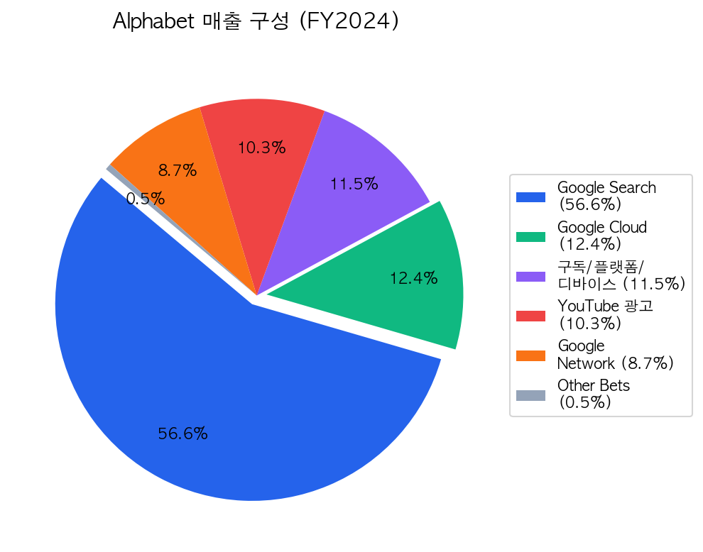

### 경쟁 우위 (Economic Moat)
1. **검색 독점:** 전 세계 검색 시장 점유율 90%+ — 데이터 플라이휠 효과
2. **광고 플랫폼 지배력:** 세계 최대 디지털 광고 플랫폼
3. **생태계 락인:** Android(30억+ 기기), Chrome, Gmail, Maps, Workspace
4. **AI 인프라 규모:** 자체 TPU 칩 + 세계 최대 규모의 AI 컴퓨팅
5. **현금 창출력:** 연간 FCF $72.8B — 어마어마한 투자를 감당할 체력

---

## 4. 재무제표 분석 — 초보자 가이드

> 💡 **초보자 가이드:** 재무제표는 기업의 "건강검진 결과표"와 같아요. **매출액**은 "총 벌어들인 돈", **영업이익**은 "본업으로 남긴 돈", **순이익**은 "세금까지 다 내고 최종적으로 남은 돈"이에요!

| 구분 | 2020 | 2021 | 2022 | 2023 | 2024 |
|------|------|------|------|------|------|
| **매출액 ($B)** | 182.5 | 257.6 | 282.8 | 307.4 | 350.0 |
| **영업이익 ($B)** | 41.2 | 78.7 | 74.8 | 84.3 | 112.4 |
| **순이익 ($B)** | 40.3 | 76.0 | 60.0 | 73.8 | 100.1 |
| **EPS ($)** | 2.93 | 5.61 | 4.56 | 5.80 | 8.04 |

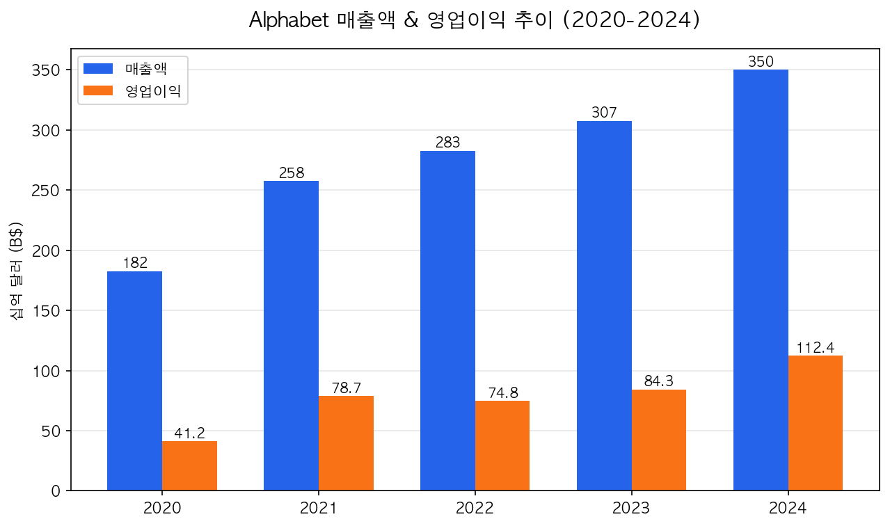

**해석:** 알파벳의 매출은 5년간 $182.5B → $350.0B로 약 92% 성장했습니다. 2024년에는 영업이익이 $112.4B로 역대 최고치를 기록했는데, AI 기반 광고 효율화와 구글 클라우드의 흑자 전환이 기여했습니다.

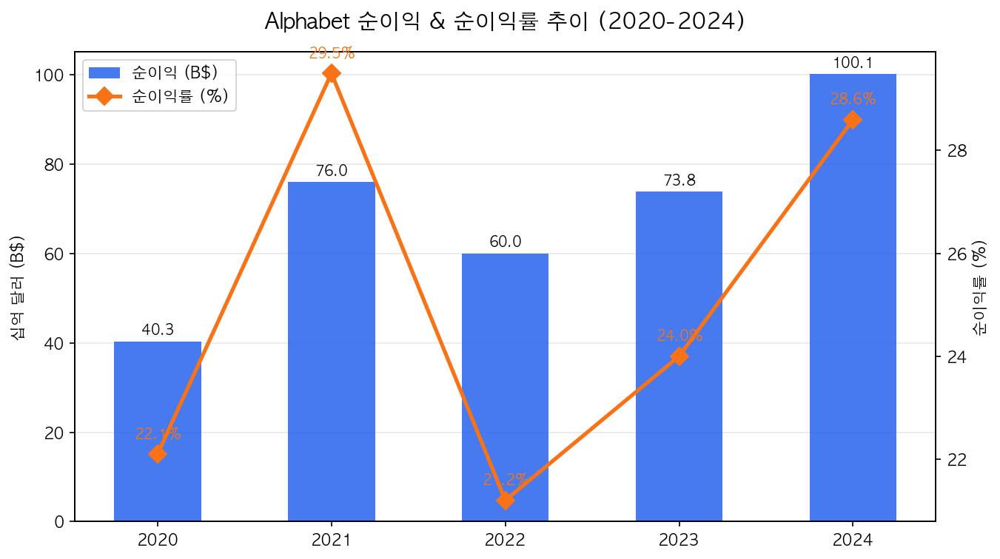

---

## 5. 수익성 분석

> 💡 **초보자 가이드:** **영업이익률**은 "매출 100원 중 본업으로 몇 원을 남기는지"를 보여줘요. **ROE**(자기자본이익률)는 "주주가 맡긴 돈으로 얼마를 벌었는지"예요. ROE 15% 이상이면 우수합니다!

| 구분 | 2020 | 2021 | 2022 | 2023 | 2024 |
|------|------|------|------|------|------|
| **영업이익률** | 22.6% | 30.6% | 26.5% | 27.4% | 32.1% |
| **순이익률** | 22.1% | 29.5% | 21.2% | 24.0% | 28.6% |
| **ROE** | 18.1% | 32.1% | 23.6% | 27.4% | 32.9% |
| **ROA** | 12.6% | 14.5% | 12.9% | 13.7% | 16.5% |

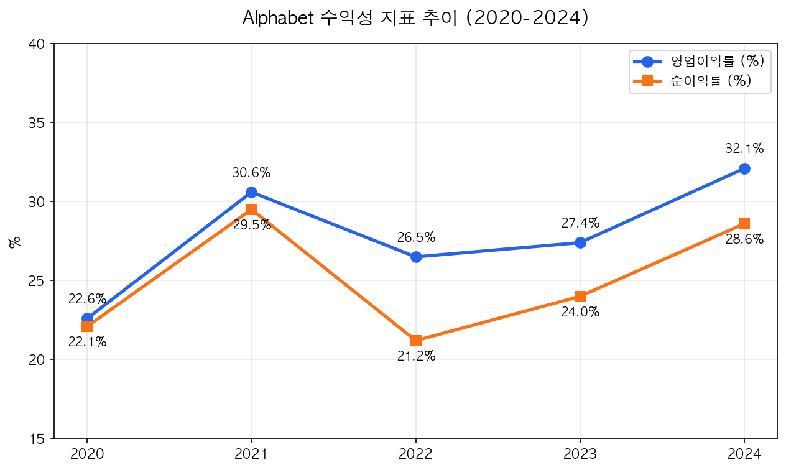

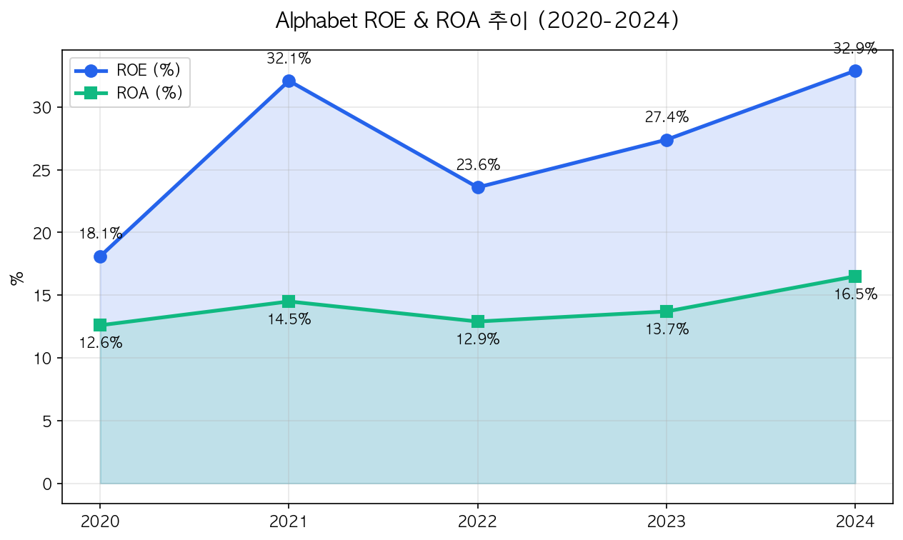

**해석:** 영업이익률 32.1%는 사상 최고치입니다. 매출 100달러 중 32달러가 이익으로 남는다는 뜻이에요. ROE 32.9%는 주주가 투자한 100달러로 약 33달러를 벌어들이고 있다는 의미로, 테크 대기업 중 최상위권입니다.

---

## 6. 성장성 분석

| 구분 | 2020 | 2021 | 2022 | 2023 | 2024 |
|------|------|------|------|------|------|
| **매출 성장률** | +12.8% | +41.2% | +9.8% | +8.7% | +13.9% |
| **영업이익 성장률** | +20.4% | +91.0% | -5.0% | +12.7% | +33.3% |
| **순이익 성장률** | +17.3% | +88.8% | -21.1% | +23.0% | +35.7% |

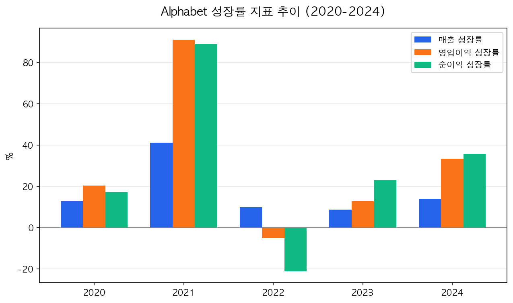

**해석:** 2021년 코로나 기저효과로 폭증 후, 2022년 둔화를 겪었지만 2024년 강력한 반등에 성공했습니다. AI 기반 사업 모델의 효과가 가시화되고 있습니다.

### FY2025 프리뷰
- 매출: **$403B+** (최초 $400B 돌파)
- 순이익: **$132.2B** (전년 대비 +32%)
- 구글 클라우드: Q4 2025 **48% 성장**

---

## 7. 재무 안정성 분석

> 💡 **초보자 가이드:** **부채비율**은 "빚이 자기 돈의 몇 배인지"를 보여줘요. 낮을수록 안전합니다. **유동비율**은 "1년 안에 갚아야 할 빚을 당장 갚을 수 있는지"인데, 1배 이상이면 안전해요!

| 구분 | 2020 | 2021 | 2022 | 2023 | 2024 |
|------|------|------|------|------|------|
| **부채비율 (D/A)** | 30.0% | 30.0% | 30.0% | 30.0% | 28.0% |
| **자기자본비율** | 70.0% | 70.0% | 70.0% | 70.0% | 72.0% |
| **유동비율** | 3.07x | 2.93x | 2.38x | 2.10x | 1.84x |
| **D/E 비율** | 0.12x | 0.11x | 0.12x | 0.11x | 0.09x |
| **이자보상비율** | >100x | >100x | >100x | >100x | >100x |

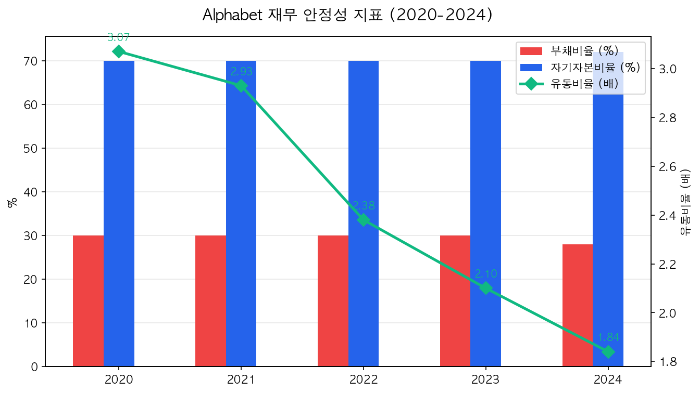

**해석:** D/E 비율 0.09배 — 사실상 무차입 경영입니다. 이자보상비율 100배 이상은 "이자를 100번은 갚을 수 있다"는 뜻으로 초우량 재무 건전성을 의미합니다.

---

## 8. 현금흐름 분석 — 초보자 가이드

> 💡 **초보자 가이드:** **영업CF**는 "장사해서 번 현금", **투자CF**는 "미래를 위해 쓴 현금", **재무CF**는 "빚 갚거나 배당/자사주 매입에 쓴 현금"이에요. **FCF**(잉여현금흐름)는 기업이 자유롭게 쓸 수 있는 현금이에요!

| 구분 | 2020 | 2021 | 2022 | 2023 | 2024 |
|------|------|------|------|------|------|
| **영업CF ($B)** | 65.1 | 91.7 | 91.5 | 101.7 | 125.3 |
| **투자CF ($B)** | -32.8 | -35.5 | -20.3 | -27.1 | -45.5 |
| **재무CF ($B)** | -24.4 | -61.4 | -69.8 | -72.1 | -79.7 |
| **CAPEX ($B)** | 22.3 | 24.6 | 31.5 | 32.3 | 52.5 |
| **FCF ($B)** | 42.8 | 67.0 | 60.0 | 69.5 | 72.8 |
| **기말현금 ($B)** | 26.5 | 20.9 | 21.9 | 24.0 | 23.5 |

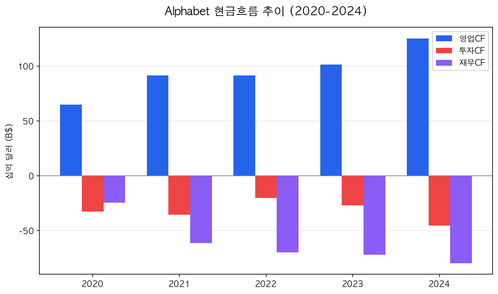

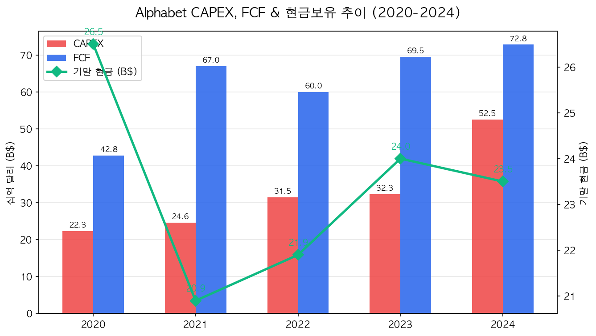

### 이익의 질 분석

영업CF/영업이익 비율이 평균 130~160%로, 회계상 이익보다 실제 현금 유입이 훨씬 많아 **"이익의 질"이 매우 우수**합니다.

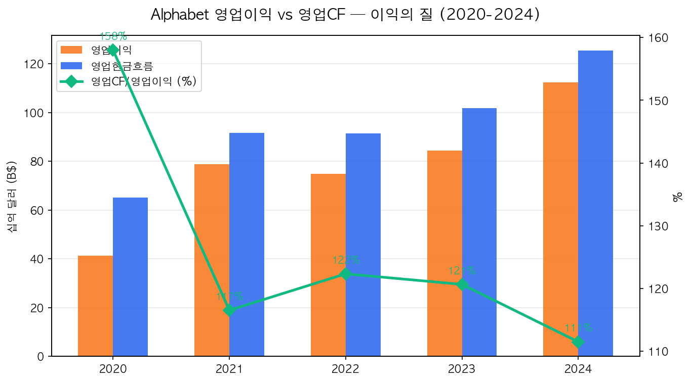

---

## 9. 산업 분석 및 경쟁 환경

### 시장 규모

| 시장 | 2025년 규모 | 2026년 전망 | CAGR |
|------|------------|------------|------|
| 글로벌 디지털 광고 | ~$312B | ~$355B | ~13.8% |
| 글로벌 클라우드 컴퓨팅 | ~$913B | ~$1.04T | ~20.6% |
| 글로벌 AI 시장 | ~$294B | ~$376B | ~26.6% |

### 경쟁사 비교

| 기업 | FY2024 매출 | 주요 경쟁 영역 |
|------|-----------|---------------|
| Amazon | $620B | 클라우드(AWS #1), 광고 사업 확대 |
| Apple | $400B | 모바일 생태계, 개인정보 기반 광고 |
| **Alphabet** | **$350B** | **검색, 광고, 클라우드, AI** |
| Microsoft | $265B | 클라우드(Azure #2), AI(OpenAI), 검색(Bing) |
| Meta | $165B | 디지털 광고 (복점 경쟁자) |

**클라우드 시장 점유율 (2024):** AWS ~32% > Azure ~23% > Google Cloud ~11%

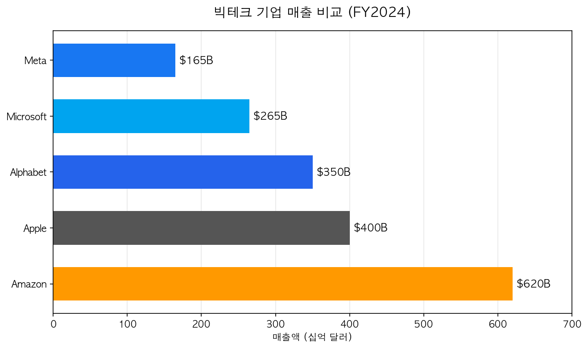

---

## 10. SWOT 분석 및 투자 리스크

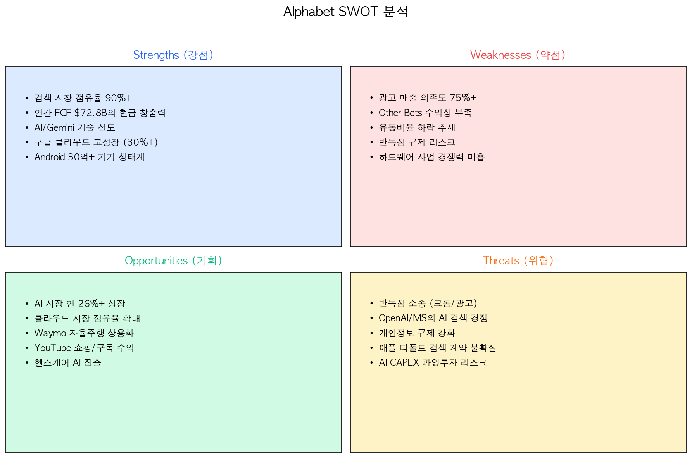

### 주요 투자 리스크

1. **반독점 규제:** 검색 행동 규제 확정 + 광고 기술(Ad-Tech) 재판에서 Google Ad Manager/AdX 강제 분리 가능성 (2026년 말)
2. **과잉 투자 리스크:** 2026년 CAPEX $1,750~1,850억 — AI 투자 수익이 기대에 못 미칠 경우 감가상각 부담
3. **AI 경쟁 심화:** OpenAI/Microsoft, Meta, Anthropic 등과의 AI 경쟁. AI 검색이 기존 광고 모델 잠식 가능
4. **애플 계약 불확실성:** 연간 ~$260억 규모 디폴트 검색 계약 구조 변경 리스크

---

## 11. 밸류에이션 및 투자 결론

### 밸류에이션 지표

| 구분 | 2020 | 2021 | 2022 | 2023 | 2024 |
|------|------|------|------|------|------|
| **PER (배)** | 29.3 | 25.3 | 19.1 | 23.8 | 23.2 |
| **PBR (배)** | 5.7 | 7.6 | 4.5 | 6.2 | 7.2 |
| **EPS ($)** | 2.93 | 5.61 | 4.56 | 5.80 | 8.04 |
| **배당금 ($)** | - | - | - | - | 0.84 |

> 💡 **초보자 가이드:** **PER** 23배 = "현재 이익 수준으로 투자금 회수에 23년". 하지만 이익이 30%+ 성장하면 실제 회수 기간은 훨씬 짧아요! **PEG 비율**(PER/성장률) 0.7배는 성장성 대비 저평가를 의미합니다.

### 증권사 컨센서스

| 항목 | 내용 |
|------|------|
| 투자의견 | **매수 (Buy)** — 60 Buy / 7 Hold / 0 Sell |
| 목표주가 (중간값) | **$387.50** |
| 목표주가 범위 | $185.00 ~ $443.00 |
| 현재주가 대비 상승여력 | **~36%** |

### 종합 투자 평가

| 평가 항목 | 점수 | 코멘트 |
|-----------|------|--------|
| 수익성 | ★★★★★ | 영업이익률 32%, ROE 33% — 초우량 |
| 성장성 | ★★★★☆ | AI/클라우드 성장 강력, 광고 안정적 |
| 재무 안정성 | ★★★★★ | 사실상 무차입, 이자보상비율 100배+ |
| 현금 창출력 | ★★★★★ | FCF $72.8B, 영업CF/영업이익 130%+ |
| 밸류에이션 | ★★★★☆ | PER 23배 — 성장 대비 합리적 |
| 리스크 | ★★★☆☆ | 반독점, AI CAPEX 과잉투자 우려 |
| **종합** | **★★★★☆ (4.2/5)** | **강력한 펀더멘털, 합리적 밸류에이션** |

### 투자 결론

알파벳은 **검색 광고 독점, AI 기술 선도, 클라우드 고성장**이라는 세 가지 강력한 성장 엔진을 보유한 기업입니다. PER 23배에 순이익 성장률 30%+를 감안하면 PEG 비율이 약 0.7배로 **성장성 대비 저평가**된 수준입니다. 반독점 리스크와 대규모 AI 투자가 단기적 불확실성 요인이지만, 장기 투자 관점에서는 매력적인 투자 기회로 판단됩니다.

---

> **면책 조항:** 본 보고서는 공개된 정보를 바탕으로 작성된 투자 참고 자료이며, 특정 종목의 매수 또는 매도를 권유하지 않습니다. 투자에 대한 최종 판단과 책임은 투자자 본인에게 있으며, 본 보고서의 내용으로 인한 어떠한 손실에 대해서도 책임을 지지 않습니다.
