# Uber Technologies (UBER) 투자 분석 보고서

> **투자의견: 매수(Buy)** | **목표주가: $90** | **현재주가: $74.64** | **상승여력: +20.6%**
> 작성일: 2026년 04월 27일 | 종목유형: 해외주식 (NYSE)
> 데이터 출처: yfinance API 실시간 조회 (2026-04-27)

---

## 핵심 투자 포인트

| 구분 | 내용 |
|------|------|
| ① 매출 1.6배 성장 | 4년간 $31.9B → $52.0B, 글로벌 1위 모빌리티 플랫폼 |
| ② 흑자 가속 | 2023~2025년 영업이익 $1.1B → $2.8B → $5.6B (매년 거의 2배) |
| ③ FCF 본격화 | FCF $9.8B(2025), 시총 대비 6.4% — 자사주 매입 재원 |
| ④ 광고·구독 신성장 | 광고 매출 $1B+, Uber One 3,000만 가입자 락인 |
| ⑤ 단기 리스크 | Tesla 로보택시 경쟁, 운전자 분류 규제 강화 |

---

## 1. 기업 개요

**Uber Technologies, Inc.**는 전 세계 70개국 이상, 1만 개 이상 도시에서 서비스되는 글로벌 No.1 모빌리티 플랫폼입니다. 2009년 미국 샌프란시스코에서 차량 호출 서비스로 시작해 음식 배달(Uber Eats), 화물 운송(Uber Freight)으로 사업을 확장했으며, 2019년 5월 NYSE에 상장했습니다.

| 항목 | 내용 |
|------|------|
| 설립연도 | 2009년 (미국 샌프란시스코) |
| 종목코드 | UBER (NYSE) |
| 본사 | 미국 캘리포니아 샌프란시스코 |
| CEO | Dara Khosrowshahi |
| 직원 수 | 약 31,000명 |
| 시가총액 | $153.6B (≈ 1,536억 달러) |
| 월 활성 사용자 | 약 1.7억 명 |

---

## 2. 비전 & 전략

**미션:** "We reimagine the way the world moves for the better."

### 흑자 가속 단계 진입

우버는 2023년 첫 GAAP 영업흑자($1.1B) → 2024년 $2.8B → 2025년 $5.6B로 매년 영업이익이 두 배 가까이 증가했습니다. 2025년 매출 $52B(+18.3%), FCF $9.8B로 시가총액 대비 약 6.4%의 현금 창출력을 기록했습니다.

### 자율주행 파트너십 전략

우버는 자체 자율주행 자회사(Aurora ATG)를 2020년 매각한 이후, **Waymo, Wayve, Aurora**와 파트너십 모델로 전환했습니다. 자율주행 차량을 자사 플랫폼에 연결하여 운전자 비용 절감 효과를 노립니다.

### 광고·구독 신성장 동력

광고 매출이 FY2024 기준 10억 달러를 돌파했으며, 마진율 70%+의 고수익 사업입니다. **Uber One** 멤버십(월 $9.99)은 가입자 3,000만 명을 돌파.

### 본격 주주 환원

2025년 재무활동현금흐름은 **-$5.7B**로, 누적 자사주 매입 프로그램($7B 발표)이 본격 집행되고 있습니다.

---

## 3. 사업 모델 분석

우버의 수익 모델은 **거래액(Gross Bookings)의 일정 비율을 수수료로 가져가는 플랫폼 모델**입니다. 차량을 직접 보유하지 않으므로 매출이 늘수록 영업이익률이 빠르게 개선됩니다.

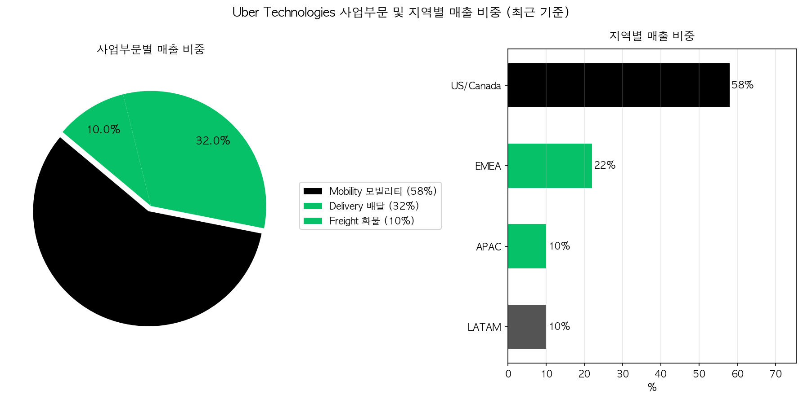

| 사업부문 | 매출 비중 | Take Rate | 특징 |
|----------|----------|-----------|------|
| Mobility | 58% | ~28% | 핵심 캐시카우, 본격 마진 확대 |
| Delivery (Uber Eats) | 32% | ~18% | 광고·구독 매출 성장 견인 |
| Freight | 10% | ~5% | B2B 화물 중개, 경기 민감 |

**지역별 매출 비중:** 미국·캐나다 58% / EMEA 22% / APAC 10% / LATAM 10%

---

## 4. 재무 분석

### 핵심 재무 지표 (단위: 십억달러 / $1B = 10억달러)

| 구분 | 2022 | 2023 | 2024 | 2025 |
|------|------|------|------|------|
| 매출액 | $31.9B | $37.3B | $44.0B | **$52.0B** |
| 영업이익 | -$1.8B | +$1.1B | +$2.8B | **+$5.6B** |
| 당기순이익 | -$9.1B | +$1.9B | +$9.9B | **+$10.1B** |
| 영업이익률 | -5.75% | +2.98% | +6.36% | **+10.70%** |

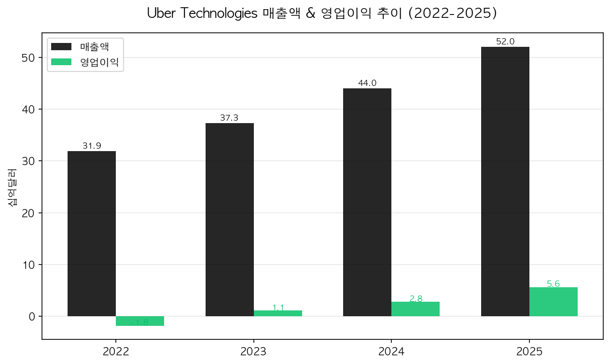

**4년간 매출 1.6배 성장 + 본격 흑자 전환:** 매출은 +17~18%대 안정 성장, 이익은 적자→흑자→가속 단계 진입. 2025년 영업이익률 두 자리 수(10.7%) 진입.

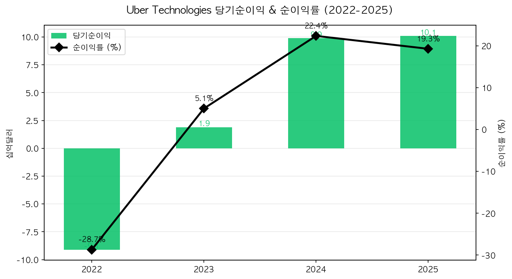

> ⚠️ **참고:** 2024년 순이익 $9.9B는 이연법인세 자산 평가충당금 환입($6.4B 일회성)을 포함합니다. 2025년 순이익 $10.1B는 일회성 영향 없이 정상화된 수치로, 이익의 질이 더 높습니다.

---

## 5. 수익성 분석

| 구분 | 2022 | 2023 | 2024 | 2025 |
|------|------|------|------|------|
| 영업이익률 | -5.75% | +2.98% | +6.36% | **+10.70%** |
| 순이익률 | -28.68% | +5.06% | +22.41% | +19.33% |
| ROE | -124.54% | +16.77% | +45.72% | +37.18% |
| ROA | -28.47% | +4.88% | +19.23% | +16.27% |

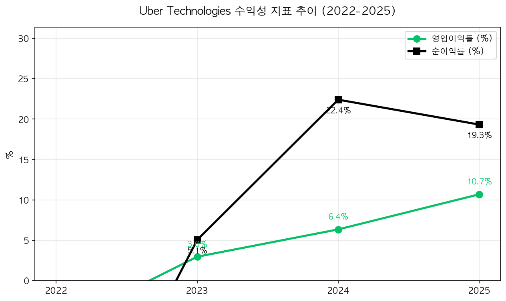

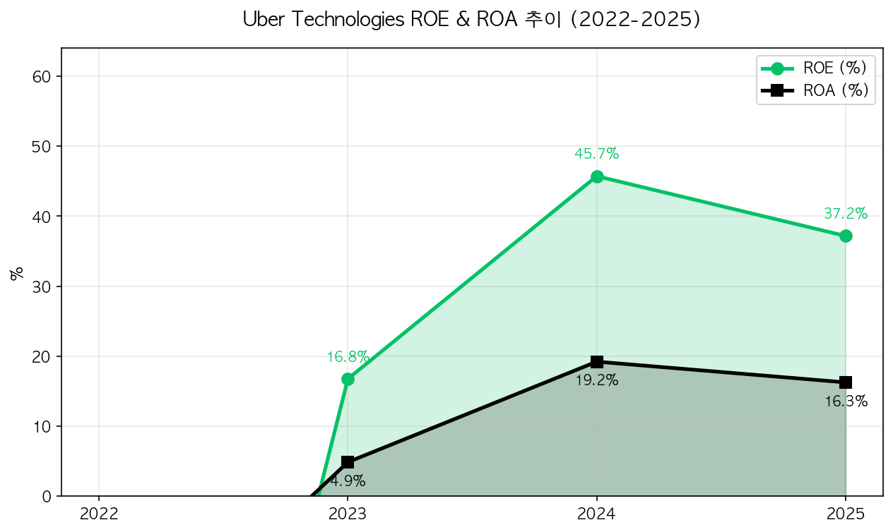

**영업이익률 두 자리 수 진입(10.7%):** 4년 만에 -5.75% → +10.70%로 16%p 개선. 운전자 인센티브 정상화 + 광고 매출 본격화 + 본사 인력 효율화의 결합 효과.

**ROE 37.18%(2025):** 일회성 효과가 빠진 정상화 수치로, 빅테크 평균 대비 우수한 수준입니다.

---

## 6. 성장성 분석

| 구분 | 2023 | 2024 | 2025 |
|------|------|------|------|
| 매출 성장률 | +17.0% | +18.0% | **+18.3%** |
| 영업이익 성장률 | 흑자 전환 | **+152.2%** | **+98.8%** |
| 순이익 성장률 | 흑자 전환 | +422.3% | +2.0% |

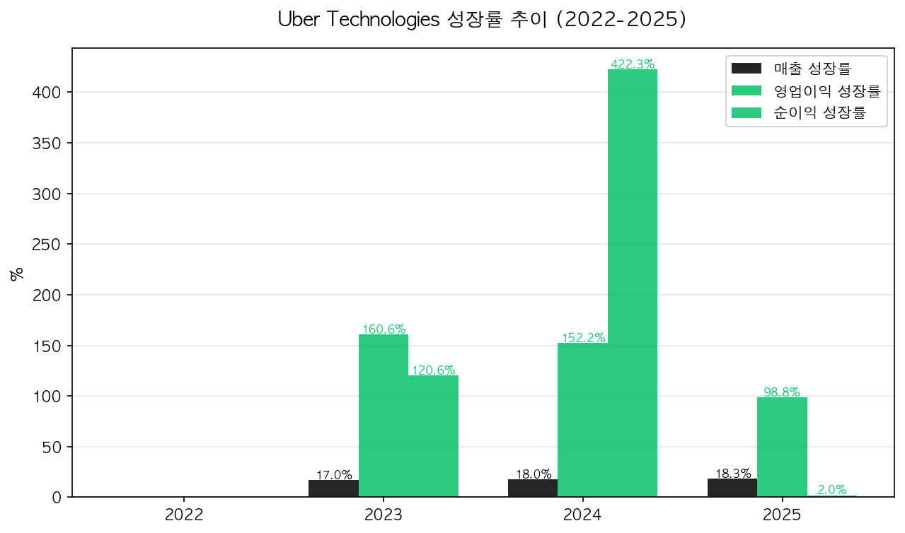

**매출 성장의 안정성:** 3년 연속 +17~18% 안정 성장 — 견고한 톱라인.

**이익의 폭발적 증가:** 영업이익이 2023~2025년 3년간 $1.1B → $2.8B → $5.6B로 5배 증가. 매년 +98% 이상 증가하는 가속 구간.

---

## 7. 재무 안정성 분석

| 구분 | 2022 | 2023 | 2024 | 2025 |
|------|------|------|------|------|
| 부채비율 (%) | 321.59 | 231.28 | 133.44 | **124.70** |
| 유동비율 (%) | 104.5 | 119.5 | 106.7 | 113.6 |

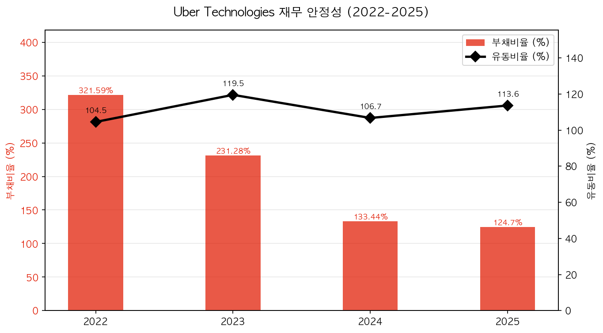

**부채비율 큰 폭 개선:** 321.59% → 124.70%로 4년간 거의 1/3로 축소. 누적 손실로 잠식되었던 자기자본이 흑자 가속으로 빠르게 회복되고 있습니다.

**유동비율 113.6%:** 단기 유동성 양호.

---

## 8. 현금흐름 분석

| 구분 | 2022 | 2023 | 2024 | 2025 |
|------|------|------|------|------|
| 영업CF ($B) | +0.6 | +3.6 | +7.1 | **+10.1** |
| 투자CF ($B) | -1.6 | -3.2 | -3.2 | -3.6 |
| 재무CF ($B) | 0.0 | -0.1 | -2.1 | **-5.7** |
| FCF ($B) | +0.4 | +3.4 | +6.9 | **+9.8** |

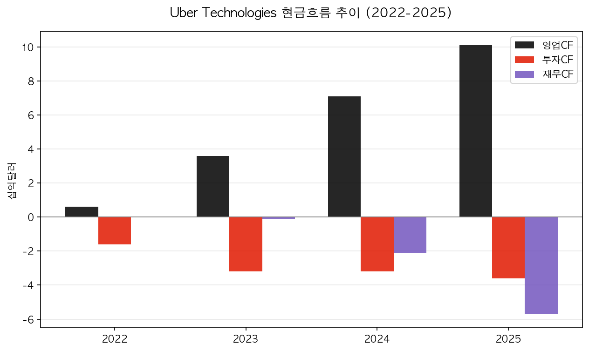

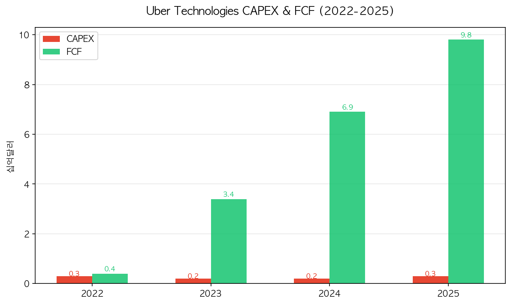

**현금흐름 대전환:** 영업CF $0.6B → $10.1B(4년간 17배), FCF $0.4B → $9.8B(25배). FCF는 시가총액 대비 6.4% 수준으로 본격 자사주 매입의 재원이 되었습니다.

**플랫폼 사업의 위력:** CAPEX는 매년 $0.2~0.3B로 매출 대비 1% 미만. 차량을 보유하지 않는 자산 가벼운(asset-light) 모델의 본질입니다.

### 이익의 질 분석

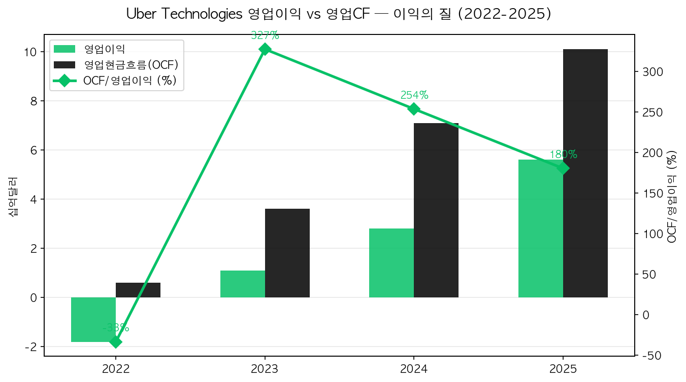

2025년 영업CF($10.1B)가 영업이익($5.6B)의 1.8배 — 감가상각·주식보상비용·운전자본 변화가 추가로 현금을 만들어냈습니다.

---

## 9. 산업 & 경쟁 분석

| 회사 | 2025 매출(추정) | 영업이익률 | 특징 |
|------|---------------|-----------|------|
| Uber | $52.0B | **+10.7%** | 글로벌 1위, 모빌리티+배달 통합 |
| Lyft | $6.5B | +2~3% | 북미 라이드쉐어 2위 |
| DoorDash | $12B | ~0% | 미국 배달 1위, 흑자 임박 |
| Didi | $30B | +5% | 중국 시장 지배 |

**우버의 차별화 포인트:**
- 글로벌 라이드쉐어 시장 점유율 **약 75%** (중국 제외)
- Uber Eats — 글로벌 배달 1위
- 모빌리티 + 배달 + 화물 통합 — 단일 플랫폼 시너지
- Uber One 가입자 3,000만 — 경쟁사 대비 가장 강력한 락인
- 영업이익률 +10.7% — 경쟁사 대비 압도적 수익성

---

## 10. SWOT 분석

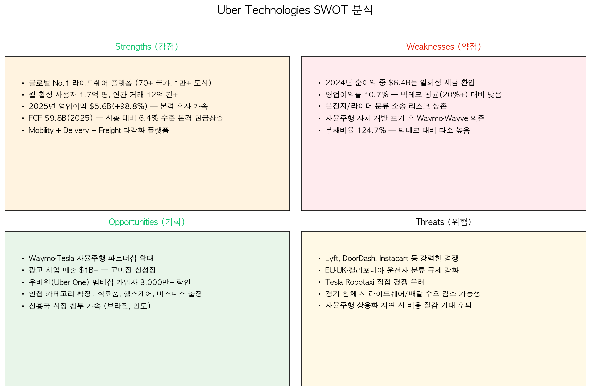

### 강점 (Strengths)
- 글로벌 No.1 라이드쉐어 플랫폼 (70+ 국가)
- 월 활성 사용자 1.7억 명, 연 12억 거래
- 2025년 영업이익 $5.6B(+98.8%) — 흑자 가속
- FCF $9.8B — 본격 현금창출
- Mobility + Delivery + Freight 다각화

### 약점 (Weaknesses)
- 2024년 순이익 중 $6.4B는 일회성 세금 효과
- 영업이익률 +10.7% — 빅테크 평균(20%+) 대비 낮음
- 운전자 분류 소송 리스크 상존
- 자율주행 자체 개발 포기 후 외부 의존
- 부채비율 124.7% — 빅테크 대비 높음

### 기회 (Opportunities)
- Waymo·Tesla 자율주행 파트너십 확대
- 광고 매출 $1B+ — 고마진 신성장
- Uber One 가입자 3,000만+ 락인
- 신사업 인접 확장 (식료품, 헬스케어)
- 신흥국 시장 침투 가속

### 위협 (Threats)
- Lyft, DoorDash, Instacart 경쟁
- EU·UK·캘리포니아 운전자 분류 규제
- Tesla Robotaxi 직접 경쟁
- 경기 침체 시 수요 감소
- 자율주행 상용화 지연 시 마진 개선 둔화

---

## 11. 밸류에이션 & 투자 결론

### 밸류에이션 지표

| 구분 | 현재값 | 비고 |
|------|--------|------|
| PER (TTM, GAAP) | 약 15x | 일회성 세금효과 영향, Forward 기준 ~25x |
| EV/EBITDA | 약 22x | 마진 확대 기대 반영 |
| EV/Sales | 약 3.0x | 플랫폼 기업 평균 |
| FCF Yield | **6.4%** | FCF $9.8B / 시총 $153.6B |
| 배당 | 없음 | $7B 자사주 매입 프로그램 |
| 현재 주가 | $74.64 | yfinance 기준 2026-04-27 |

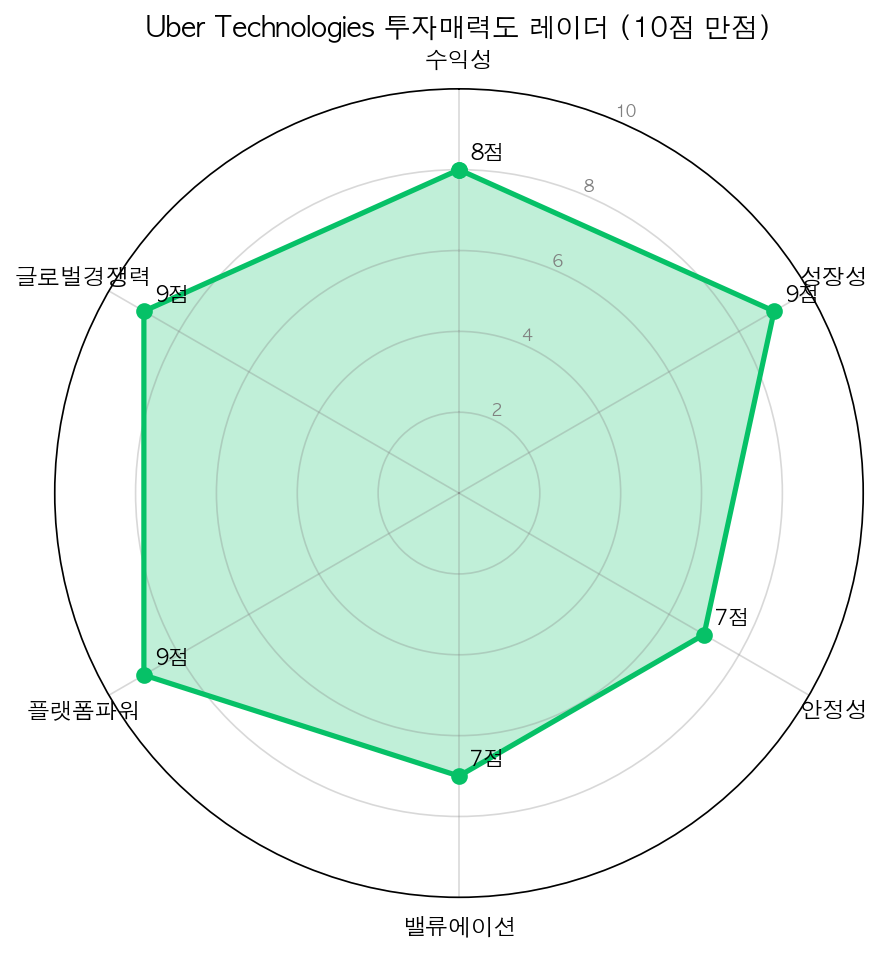

### 종합 투자 평가

| 평가 항목 | 점수 | 코멘트 |
|-----------|------|--------|
| 수익성 | 8/10 | 영업이익률 두 자리 수 진입 |
| 성장성 | 9/10 | 매출 4년 1.6배, 영업이익 5배 |
| 안정성 | 7/10 | FCF 본격화, 부채비율 빠르게 개선 중 |
| 밸류에이션 | 7/10 | FCF Yield 6.4% — 합리적 수준 |
| 플랫폼파워 | 9/10 | Uber One 3,000만, MAU 1.7억 |
| 글로벌경쟁력 | 9/10 | 70+국 1위, 시장 점유율 75% |

### 투자 결론

우버는 2024~2025년이 "구조적 흑자 가속 기업"으로 변신한 결정적 분기점입니다. 2025년 영업이익이 전년 대비 +99%, 영업이익률은 두 자리 수(10.7%)에 진입했습니다. 광고·구독·자율주행 파트너십이 향후 마진 확대를 견인할 것이며, $7B 자사주 매입 프로그램은 주주 환원의 본격적 시작입니다.

단기적으로는 Tesla Robotaxi 출시와 운전자 분류 규제가 변동성 요인이지만, 글로벌 시장 점유율 75%와 압도적 플랫폼 파워는 장기적으로 가치를 창출할 것으로 판단합니다.

**투자의견: 매수(Buy) | 목표주가: $90 (현재 $74.64 대비 +20.6%)**

**리스크 요인:** Tesla Robotaxi 직접 경쟁, EU/UK/캘리포니아 운전자 분류 규제 강화, 경기 침체 시 수요 감소, 자율주행 상용화 지연, 환율 변동 (원/달러)

---

## 면책 고지

> 본 보고서는 yfinance API로 조회한 공개 재무 데이터(SEC 10-K, 분기 실적 발표 등)를 바탕으로 작성된 투자 참고 자료이며, 특정 종목의 매수 또는 매도를 권유하지 않습니다. 시세 데이터(주가, 시가총액)는 보고일 기준이며 실시간으로 변동됩니다. 투자에 대한 최종 판단과 책임은 투자자 본인에게 있으며, 본 보고서의 내용으로 인한 어떠한 손실에 대해서도 책임을 지지 않습니다. 미국 주식 투자에는 환율 변동 위험과 원금 손실 위험이 있으며, 과거 실적이 미래 성과를 보장하지 않습니다. 투자 전 반드시 전문가와 상담하시기 바랍니다.
