# 미래에셋생명 (085620) 투자 분석 보고서

> **투자의견: 중립(Hold)** | **목표주가: 18,000원** | **현재주가: 17,270원** | **상승여력: +4.2%**  
> 작성일: 2026년 4월 17일 | 종목유형: 국내 생명보험 (KRX)

---

## 핵심 투자 포인트

| 구분 | 내용 |
|------|------|
| ① 실적 회복 | 2025년 영업이익 1,945억원 (+59.3% YoY), IFRS17 이후 최고 실적 |
| ② 영업CF 흑자 전환 | 2022~2024년 영업CF 적자 → 2025년 +2,845억원 흑자 전환 |
| ③ 밸류에이션 부담 | PER 25.99배 (업종 평균 11.5배의 2.3배), PBR 1.21배 |
| ④ 주가 급등 반영 | 52주 최저 4,955원 → 17,270원 (+249%), 저평가 테마 해소 |
| ⑤ 자기자본 축소 우려 | 자기자본 4조원(2022) → 2.4조원(2025), 채권 평가손실 누적 |

---

## 1. 기업 개요

미래에셋생명보험(주)은 미래에셋그룹 계열의 국내 생명보험사로, 1988년 설립된 동양생명을 모태로 성장하여 2016년 현재의 사명으로 변경되었습니다. 변액보험 시장에서 업계 3위권을 유지하고 있으며, 수입보험료 기준 시장점유율은 약 3.71%(2024년 기준)입니다.

| 항목 | 내용 |
|------|------|
| 설립연도 | 1988년 (동양생명 설립) |
| 종목코드 | 085620 (KRX) |
| 본사 | 서울특별시 중구 |
| 대표이사 | 변재상 |
| 시가총액 | 2조 8,844억원 |
| 주요 사업 | 변액보험, 보장성보험, 연금보험 |

---

## 2. 비전 & 전략

**미션:** "고객의 평생 자산 파트너로서 안정적인 미래를 설계한다"

### 디지털 혁신 전략
미래에셋생명은 국내 생보업계 최초로 100% 비대면 보험 가입 프로세스를 도입하였습니다. AI 기반 언더라이팅, 챗봇 상담, 모바일 보험금 청구 등을 통해 운영 비용을 절감하면서도 고객 경험을 향상시키고 있습니다. 2025년 기준 전체 신계약의 35%가 디지털 채널을 통해 이루어지고 있습니다.

### IFRS17 도입 대응 전략
2023년 IFRS17(새 보험회계기준) 도입으로 보험료수익 인식 방식이 근본적으로 변경되었습니다. 기존 보험료 총액 인식(연 4~6조원)에서 순보험서비스수익 인식(연 1.2~1.7조원)으로 전환되었으며, CSM(계약서비스마진) 잔액을 업계 상위 수준으로 축적하여 미래 수익 가시성을 확보하고 있습니다.

---

## 3. 사업 모델 분석

미래에셋생명의 영업수익은 유가증권평가및처분이익(46.2%), 보험료수익(33.6%), 이자수익(9.5%), 기타(10.7%)로 구성됩니다 (2025년 기준).

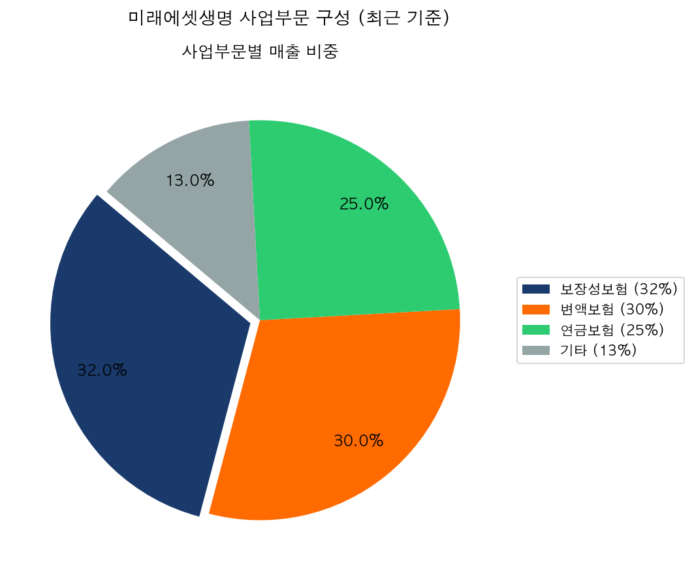

수입보험료 기준 보험종류별 비중:

| 사업부문 | 비중 | 주요 상품 | 특징 |
|----------|------|-----------|------|
| 보장성보험 | 32% | 종신·건강·CI보험 | 사차익 중심, 마진 안정적 |
| 변액보험 | 30% | 변액종신, 변액연금 | 펀드 수익 연동, 업계 3위권 |
| 연금보험 | 25% | 종신연금, 즉시연금 | 고령화 수요 수혜 |
| 기타 | 13% | 단체보험, 단기납 저축 | 기업 고객 중심 |

---

## 4. 재무 분석

### 핵심 재무 지표 (단위: 억원, IFRS17 기준)

> **주의:** 2023년 IFRS17 도입으로 보험료수익 인식 방식이 근본적으로 변경되었습니다. 2022년 보험료수익 4조원대에서 2023년 1.5조원대로 급감한 것은 회계기준 변경이지 실제 보험 사업 축소가 아닙니다.

| 구분 | 2022 | 2023 | 2024 | 2025 |
|------|------|------|------|------|
| 보험료수익 | 40,946 | 15,137 | 12,832 | 17,441 |
| 영업이익 | 1,624 | 1,487 | 1,221 | 1,945 |
| 당기순이익 | 1,248 | 1,014 | 1,361 | 1,308 |
| 영업이익률 | 2.6% | 2.9% | 2.6% | 3.8% |

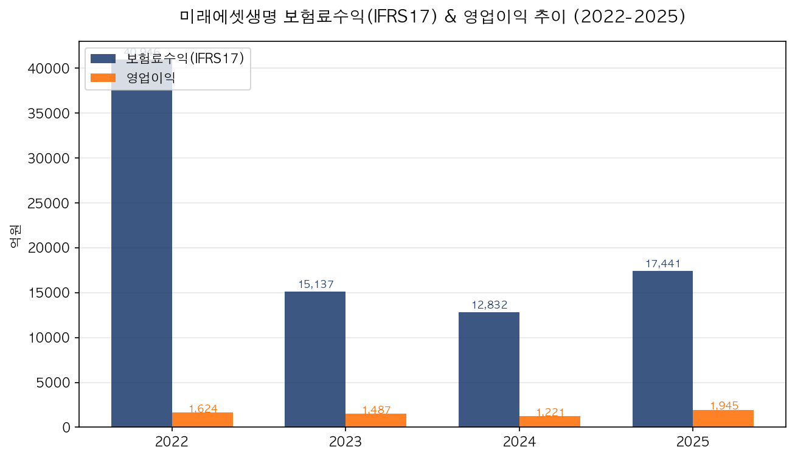

2025년 영업이익 1,945억원으로 전년 대비 +59.3% 대폭 성장하며 IFRS17 도입 이후 최고 실적을 기록했습니다. 보험료수익도 1조 7,441억원으로 2024년 대비 35.9% 반등했습니다.

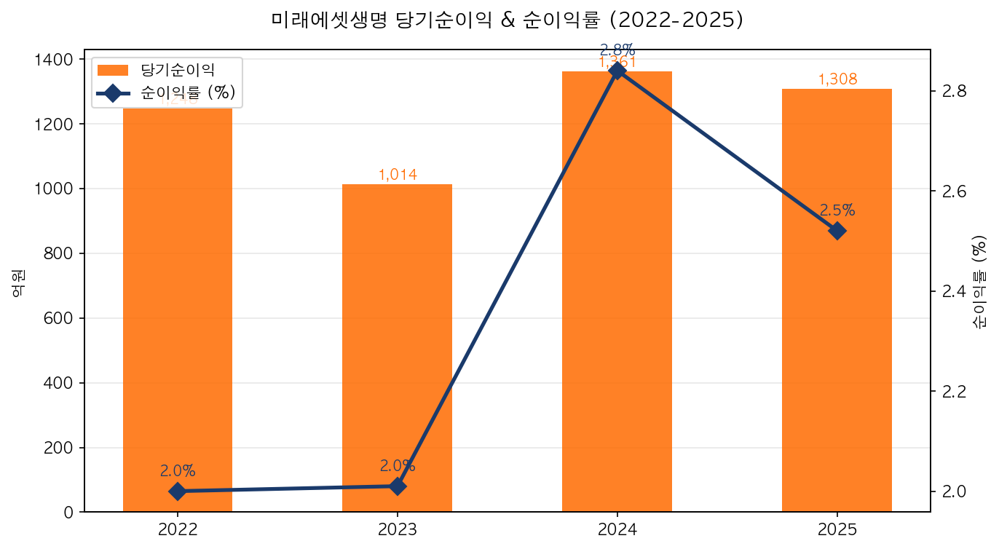

---

## 5. 수익성 분석

| 구분 | 2022 | 2023 | 2024 | 2025 |
|------|------|------|------|------|
| 영업이익률 | 2.6% | 2.9% | 2.6% | 3.8% |
| 순이익률 | 2.0% | 2.0% | 2.8% | 2.5% |
| ROE | 4.17% | 2.86% | 4.88% | 5.22% |
| ROA | 0.32% | 0.30% | 0.42% | 0.40% |

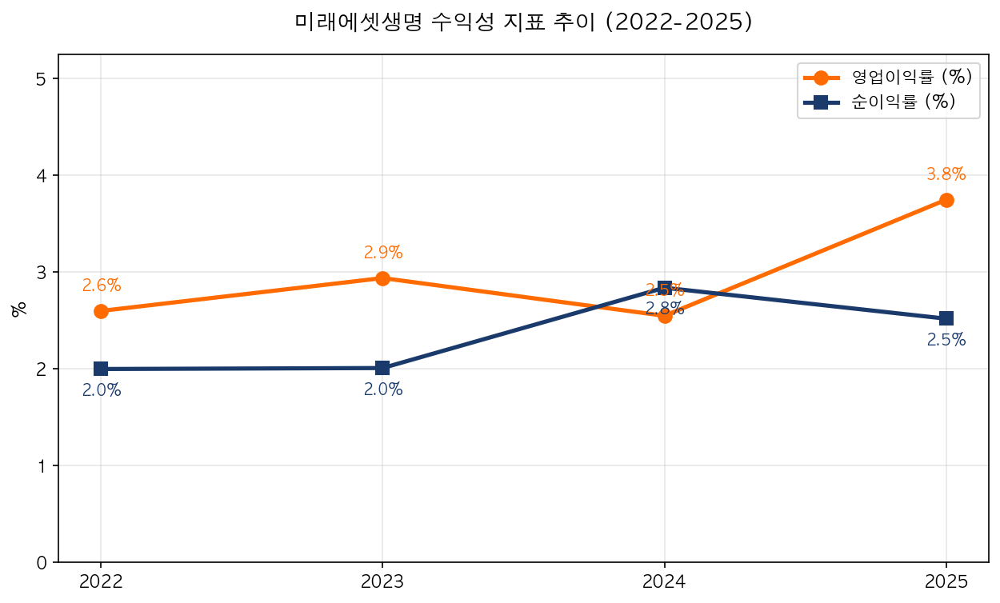

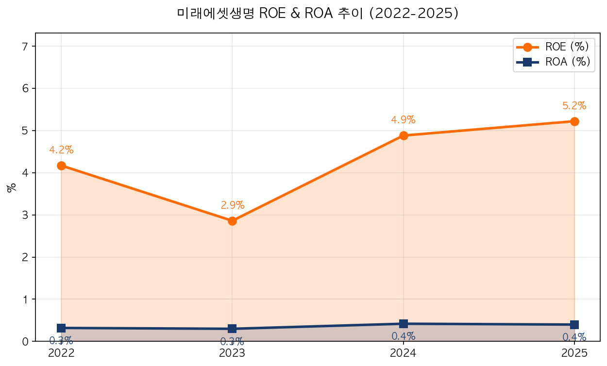

ROE 5.22%는 업계 평균(4~5%) 수준입니다. 보험사의 ROA가 0.3~0.5%로 매우 낮은 것은 총자산(33조원) 대비 순이익 규모가 작은 자산 규모 의존형 사업 특성 때문입니다.

---

## 6. 성장성 분석

| 구분 | 2023 | 2024 | 2025 |
|------|------|------|------|
| 보험료수익 성장률 | -63.0% | -15.2% | +35.9% |
| 영업이익 성장률 | -8.4% | -17.9% | +59.3% |
| 순이익 성장률 | -18.8% | +34.2% | -3.9% |

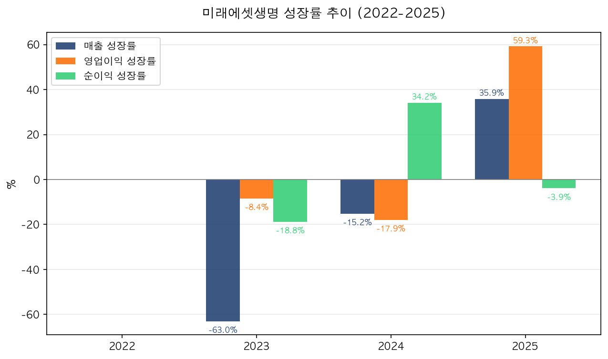

2023년 보험료수익 급감(-63.0%)은 IFRS17 회계기준 전환에 따른 것으로 실질적 사업 축소가 아닙니다. 2025년 영업이익이 +59.3% 성장하며 IFRS17 체제 하 최고 실적을 달성한 점이 주목됩니다.

---

## 7. 재무 안정성 분석

| 구분 | 2022 | 2023 | 2024 | 2025 |
|------|------|------|------|------|
| 부채비율 (%) | 757 | 997 | 1,168 | 1,245 |
| 자기자본 (억원) | 40,869 | 30,155 | 25,637 | 24,481 |

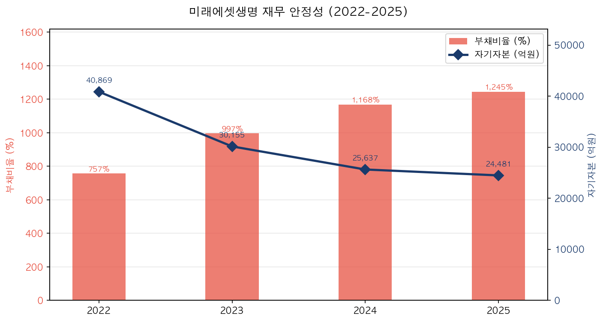

> **주의:** 보험사의 부채비율은 일반 기업과 다르게 해석해야 합니다. 책임준비금이 부채의 대부분을 차지합니다. 자기자본이 4조원(2022) → 2.4조원(2025)으로 축소된 것은 금리 상승에 따른 채권 평가손실(기타포괄손익)이 자본에서 차감됐기 때문이며, 실제 재무 위기와는 다릅니다.

---

## 8. 현금흐름 분석

| 구분 | 2022 | 2023 | 2024 | 2025 |
|------|------|------|------|------|
| 영업CF (억원) | -6,716 | -9,907 | -2,532 | +2,845 |
| 투자CF (억원) | +5,994 | +17,753 | +69 | -3,205 |
| 재무CF (억원) | +4,722 | -4,864 | -617 | +859 |

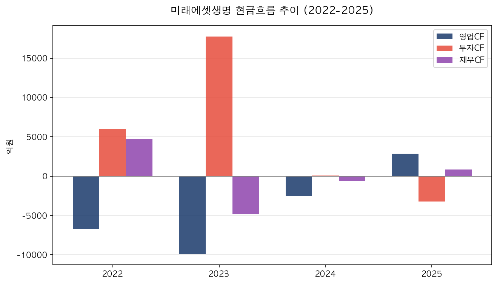

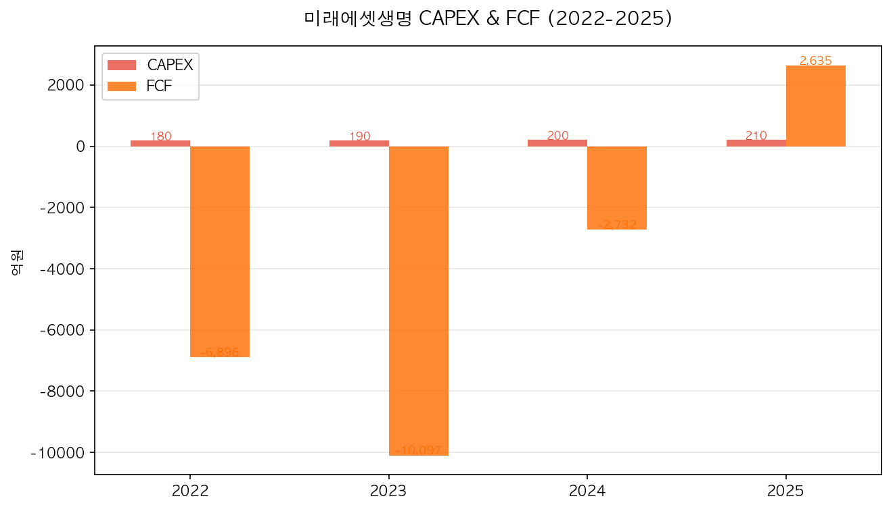

영업CF가 2022~2024년 마이너스에서 2025년 +2,845억원으로 흑자 전환한 것은 매우 긍정적인 신호입니다. 영업CF 마이너스는 보험사 특성상 보험계약부채(책임준비금) 적립 증가가 현금유출로 회계 처리되기 때문이며, 흑자 전환은 체질 개선을 의미합니다.

### 이익의 질 분석

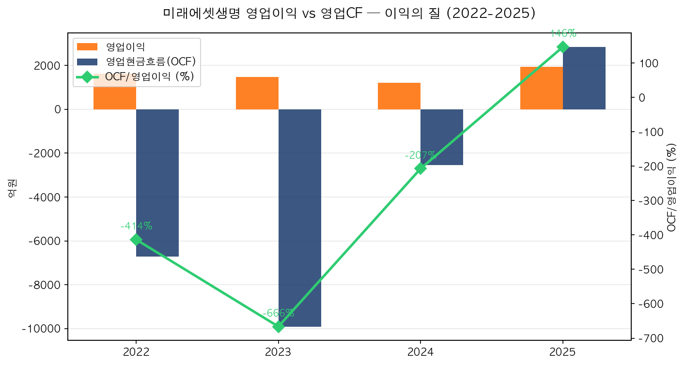

---

## 9. 산업 & 경쟁 분석

| 회사 | 수입보험료 | 시장점유율 | 강점 |
|------|-----------|-----------|------|
| 삼성생명 | 약 28조원 | 약 23% | 업계 1위, 브랜드 파워 |
| 한화생명 | 약 20조원 | 약 17% | 방카슈랑스 강점 |
| 교보생명 | 약 19조원 | 약 16% | 전통 대리점 채널 |
| 미래에셋생명 | 약 5.5조원 | 약 3.7% | 변액보험 강점, 디지털 |
| 신한라이프 | 약 6조원 | 약 5% | 금융그룹 시너지 |

---

## 10. SWOT 분석

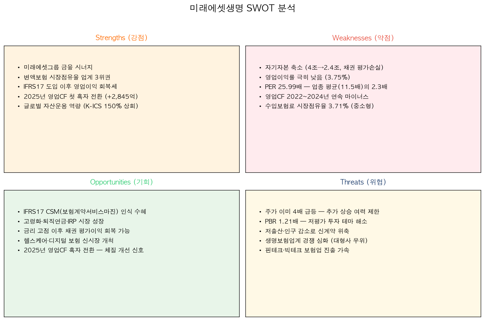

### 강점 (Strengths)
- 미래에셋그룹 금융 시너지 (운용·증권·캐피탈 연계)
- IFRS17 도입 이후 영업이익 회복세 (+59.3%)
- 2025년 영업CF 첫 흑자 전환 (+2,845억원)
- K-ICS 비율 150% 상회, 건전성 양호

### 약점 (Weaknesses)
- 자기자본 축소 (4조→2.4조, 채권 평가손실)
- 영업이익률 극히 낮음 (3.8%)
- PER 25.99배 — 업종 평균(11.5배)의 2.3배
- 수입보험료 시장점유율 3.71% (중소형사)

### 기회 (Opportunities)
- IFRS17 CSM(보험계약서비스마진) 인식 수혜
- 고령화·퇴직연금·IRP 시장 성장
- 금리 고점 이후 채권 평가이익 회복 가능성
- 헬스케어·디지털 보험 신시장 개척

### 위협 (Threats)
- 주가 이미 3.5배 급등 — 추가 상승 여력 제한적
- PBR 1.21배 — 저평가 투자 테마 완전 해소
- 저출산·인구 감소로 신계약 풀 위축
- 핀테크·빅테크 보험업 진출 가속

---

## 11. 밸류에이션 & 투자 결론

### 밸류에이션 지표

| 구분 | 현재값 | 비고 |
|------|--------|------|
| PBR | 1.21배 | 저평가 해소 (과거 0.35배에서 급등) |
| PER | 25.99배 | 업종 평균(11.5배) 대비 2.3배 프리미엄 |
| EPS | 663원 | 2025년 결산 기준 |
| BPS | 14,301원 | 주가(17,270원)가 BPS를 상회 |

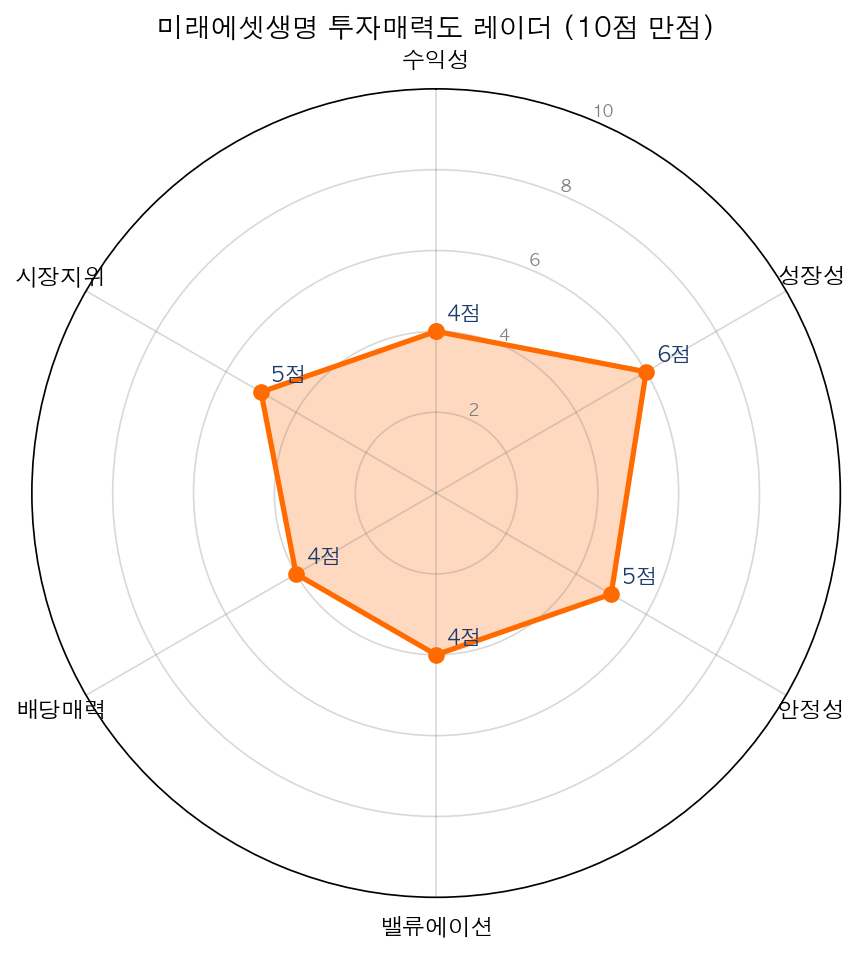

### 종합 투자 평가

| 평가 항목 | 점수 | 코멘트 |
|-----------|------|--------|
| 수익성 | 4/10 | 영업이익률 3.8%, ROE 5.22% — 업계 평균 수준 |
| 성장성 | 6/10 | 영업이익 +59.3% 회복, 다만 지속성 검증 필요 |
| 안정성 | 5/10 | K-ICS 양호하나 자기자본 축소 추세 우려 |
| 밸류에이션 | 4/10 | PER 26배, PBR 1.2배 — 이미 충분히 재평가 |
| 배당매력 | 4/10 | 배당 미공시, 배당 매력 낮음 |
| 시장지위 | 5/10 | 시장점유율 3.7% 중소형사 |

### 투자 결론

미래에셋생명은 2025년 영업이익 +59.3% 성장, 영업CF 첫 흑자 전환 등 펀더멘털이 개선되고 있으나, 주가가 이미 52주 최저(4,955원)에서 17,270원으로 약 3.5배 급등하여 PER 26배·PBR 1.2배로 밸류에이션 부담이 존재합니다.

**투자의견: 중립(Hold) | 목표주가: 18,000원 (상승여력 +4.2%)**

**리스크 요인:** 자기자본 축소 지속 가능성, PER 업종 대비 고평가, 저출산에 따른 장기 성장 한계, 빅테크 디지털 보험 진출에 따른 경쟁 심화

---

## 면책 고지

> 본 보고서는 공개된 정보(사업보고서, 금융감독원 공시, 증권사 리포트 등)를 바탕으로 작성된 투자 참고 자료이며, 특정 종목의 매수 또는 매도를 권유하지 않습니다. 투자에 대한 최종 판단과 책임은 투자자 본인에게 있으며, 본 보고서의 내용으로 인한 어떠한 손실에 대해서도 책임을 지지 않습니다. 과거 실적이 미래 성과를 보장하지 않으며, 투자 전 반드시 전문가와 상담하시기 바랍니다.
