# 샘표 (007540) 종합 투자 분석 보고서

**작성일:** 2026년 4월 2일  
**종목코드:** KRX 007540 (KOSPI)  
**현재주가:** 54,900원 (2026.04.01)  
**시가총액:** 약 1,579억원  
**투자의견:** 관심 (중립) | 종합 평점 3.1/5.0

> 본 보고서는 투자 참고 자료이며, 투자 결정에 따른 모든 책임은 투자자 본인에게 있습니다.

---

## 목차

1. [회사 개요](#1-회사-개요)
2. [비전과 경영철학](#2-비전과-경영철학)
3. [사업모델 분석](#3-사업모델-분석)
4. [재무제표 분석 - 초보자 가이드](#4-재무제표-분석---초보자-가이드)
5. [수익성 분석](#5-수익성-분석)
6. [성장성 분석](#6-성장성-분석)
7. [재무 안정성 분석](#7-재무-안정성-분석)
8. [현금흐름 분석 - 초보자 가이드](#8-현금흐름-분석---초보자-가이드)
9. [산업 분석 및 경쟁 환경](#9-산업-분석-및-경쟁-환경)
10. [SWOT 분석 및 투자 리스크](#10-swot-분석-및-투자-리스크)
11. [밸류에이션 및 투자 결론](#11-밸류에이션-및-투자-결론)

---

## 1. 회사 개요

샘표(주)는 1946년 창업주 박규회가 충무로 삼지장유 양조장을 인수하며 출발한 대한민국 대표 식품 기업의 **지주회사**입니다. 2016년 7월 인적분할을 통해 사업회사인 샘표식품(주)(248170)과 분리되었으며, 2017년 공정거래법상 지주회사로 전환되었습니다.

| 항목 | 내용 |
|------|------|
| 설립일 | 1946년 (분할: 2016.07, 지주전환: 2017) |
| 대표이사 | 박진선 (3세 경영, 오너 일가) |
| 본사 | 서울특별시 중구 충무로 |
| 종목코드 | KRX 007540 (KOSPI) |
| 발행주식수 | 약 287.6만주 (자사주 29.92% 포함) |
| 시가총액 | 약 1,579억원 |
| 직원수 | 약 2명 (지주회사 본체) |
| 핵심 자회사 | 샘표식품(49.38%), 양포식품, 조치원식품 |

### 주주 구성

| 주주 | 지분율 |
|------|--------|
| 박진선 (대표이사, 최대주주) | 34.05% |
| 자사주 (자기주식) | 29.92% (86만주) |
| 박용학 (장남, 4세) | 6.58% |
| 고계원 (배우자) | 3.47% |
| 기타 소액주주 | 약 26% |

> **[Tip]** 자사주 29.92%가 핵심 포인트입니다. 2026년 개정 상법에 따라 자사주 소각이 의무화되면, 소각 시 박진선 대표의 지분율이 34.05%에서 약 48.6%로 자동 상승합니다. 동시에 주당순자산(BPS)도 약 43% 상승하는 효과가 있어 주주가치 제고가 기대됩니다.

---

## 2. 비전과 경영철학

**창업 정신:** "내 가족이 먹지 못하는 것은 만들지도 팔지도 않는다" (창업주 박규회)

**비전:** 우리맛의 가치를 알리고, 세계인을 즐겁게 하는 기업

### 핵심 전략 방향

1. **글로벌 K-소스 기업**: 간장, 연두, 고추장 3대 제품을 세계시장에 확대. 연두는 미국 Whole Foods, Albertsons 등 주요 유통채널 입점. 아마존 매출 매년 세 자릿수 성장.
2. **발효 기술 R&D 강화**: 매출의 4~5%를 R&D에 투자. "우리발효연구중심"은 아시아 유일의 식물성 발효 전문 연구소로, 3,000종 이상의 미생물 자원 보유.
3. **바이오 소재 신사업**: Pepreach(단백질 유래 기능성 소재), Savoryrich(천연 조미 소재) 등 B2B 바이오 소재 시장 진출.
4. **제조 인프라 확장**: 2028년까지 충북 제천 8.1만m² 신공장 건설.
5. **연두 단일 브랜드 연매출 1조원 목표** (10년 내).

---

## 3. 사업모델 분석

샘표(주)는 지주회사로서 자체 영업활동은 거의 없으며, 수익의 대부분이 자회사 실적에 연동됩니다.

### 지주회사 수익 구조

| 수익원 | 비중 | 설명 |
|--------|------|------|
| 지분법이익 | 87.7% | 자회사(샘표식품 등) 실적 반영 |
| 브랜드 로열티 | 9.7% | 샘표 브랜드 사용료 |
| 배당수익 | 1.5% | 자회사 배당금 수취 |
| 임대수익 | 1.1% | 부동산 임대 |

### 매출 구성 (연결 기준)

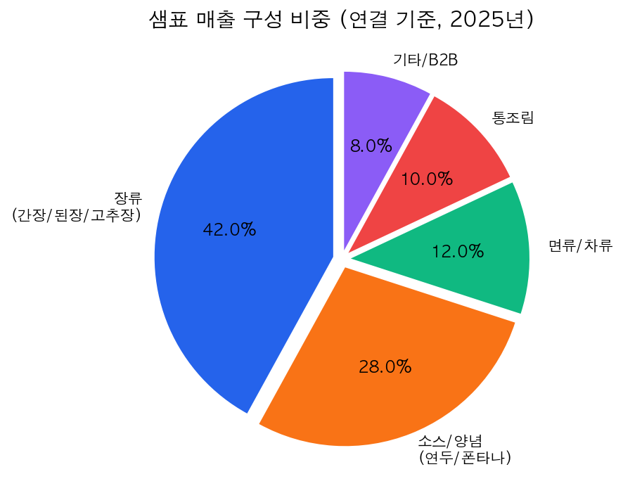

> **[Tip]** 샘표의 투자 포인트를 이해하려면, 자회사 샘표식품(248170)의 사업 실적을 함께 봐야 합니다. 연결재무제표에는 자회사 실적이 모두 포함됩니다.

---

## 4. 재무제표 분석 - 초보자 가이드

### 연결 기준 손익계산서

| 구분 | 2020 | 2021 | 2022 | 2023 | 2024 | 2025 |
|------|------|------|------|------|------|------|
| **매출액 (억원)** | 3,191 | 3,490 | 3,718 | 3,839 | 4,050 | 4,090 |
| **영업이익 (억원)** | 411 | 219 | 103 | 81 | 59 | 241 |
| **당기순이익 (억원)** | 353 | 230 | 162 | 106 | 107 | 188 |
| **영업이익률 (%)** | 12.88 | 6.28 | 2.78 | 2.12 | 1.45 | 5.90 |
| **순이익률 (%)** | 11.1 | 3.40 | 2.81 | 1.58 | 1.62 | 2.38 |

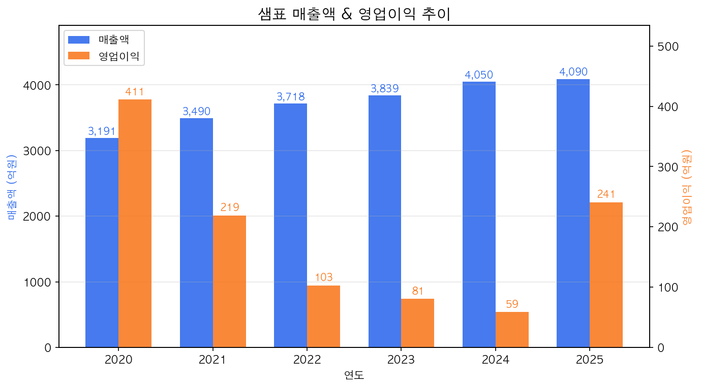

> **[Tip]** 매출액은 "가게의 총 판매금액", 영업이익은 "장사해서 남은 돈", 순이익은 "세금까지 다 내고 진짜 남은 돈"입니다. 샘표는 매출이 매년 성장했지만, 영업이익은 2020년 411억에서 2024년 59억까지 급락했습니다. 연두 등 신제품 마케팅에 대규모 투자를 했기 때문입니다. 2025년 241억으로 대폭 반등한 것은 투자 효과가 나타나기 시작했다는 긍정적 신호입니다.

---

## 5. 수익성 분석

| 지표 | 2020 | 2021 | 2022 | 2023 | 2024 | 2025 |
|------|------|------|------|------|------|------|
| 영업이익률 (%) | 12.88 | 6.28 | 2.78 | 2.12 | 1.45 | 5.90 |
| 순이익률 (%) | 11.1 | 3.40 | 2.81 | 1.58 | 1.62 | 2.38 |
| ROE (%) | 10.50 | 6.42 | 5.35 | 3.06 | 3.26 | 4.63 |
| ROA (%) | 8.50 | 5.58 | 3.57 | 2.26 | 2.25 | 3.88 |

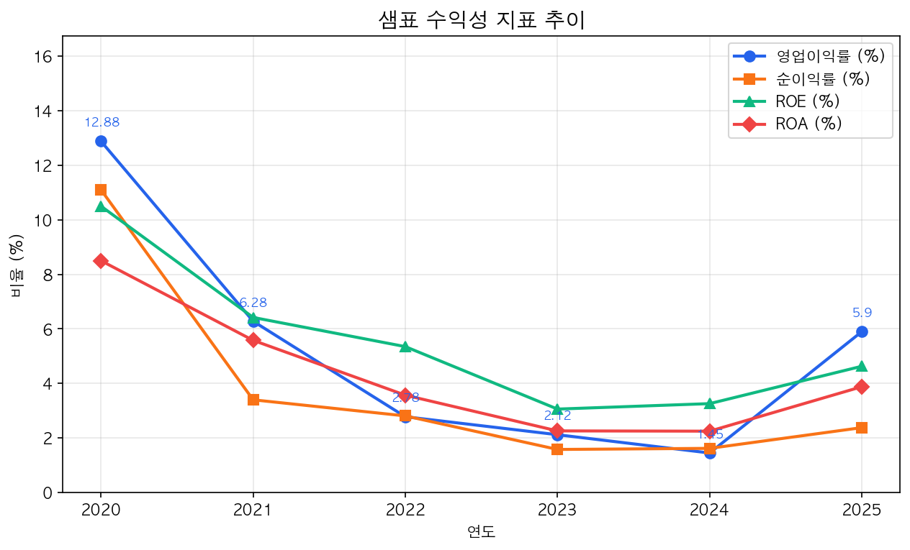

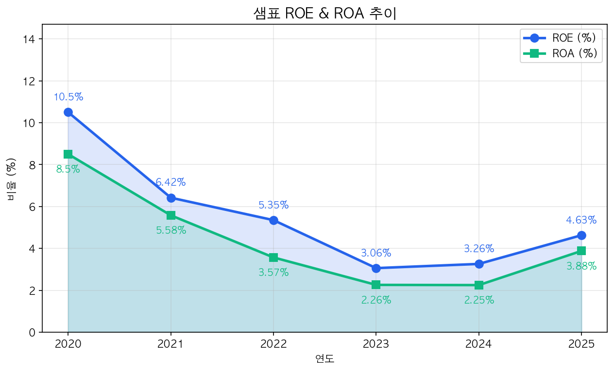

> **[Tip]** ROE는 "내 돈(자본)으로 얼마를 벌었나"를 보여주는 지표입니다. 2020년 10.5%에서 2024년 3.26%로 급락한 것은 이익이 줄었기 때문입니다. 식품업 평균 ROE가 5~8%인 점을 고려하면, 2025년 4.63%는 아직 업계 평균 이하입니다.

---

## 6. 성장성 분석

| 지표 | 2021 | 2022 | 2023 | 2024 | 2025 |
|------|------|------|------|------|------|
| 매출 성장률 (%) | +9.4 | +6.6 | +3.3 | +5.5 | +1.0 |
| 영업이익 성장률 (%) | -46.7 | -52.8 | -21.3 | -27.7 | **+310.9** |
| 순이익 성장률 (%) | -34.8 | -29.6 | -34.6 | +0.9 | +75.7 |

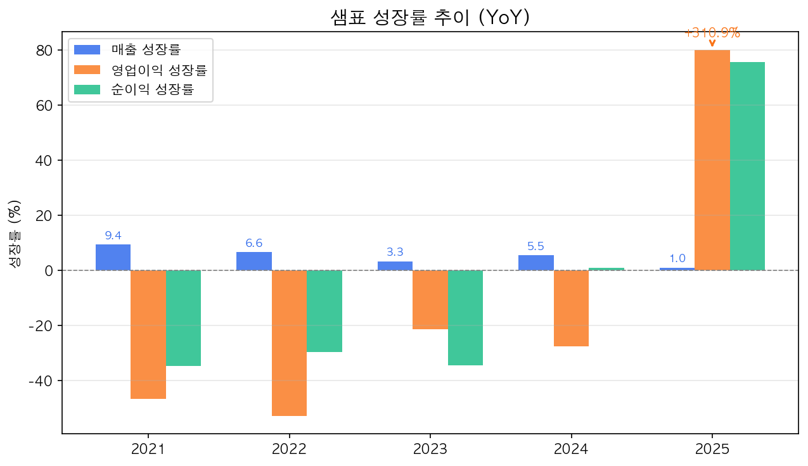

2025년 영업이익 성장률 **+310.9%**는 극적인 V자 반등입니다. 다만 매출 성장률이 +1.0%로 둔화되어, 이익 반등이 비용 절감에 의존한 측면이 있어 지속성 확인이 필요합니다.

> **[Tip]** 매출은 꾸준히 늘었는데 이익이 줄었다는 것은 "많이 팔았지만 남는 게 적었다"는 뜻입니다. 2025년 이익 반등은 "드디어 투자한 보람이 나타나기 시작했다"고 해석할 수 있습니다.

---

## 7. 재무 안정성 분석

| 지표 | 2020 | 2021 | 2022 | 2023 | 2024 | 2025 |
|------|------|------|------|------|------|------|
| 부채비율 (%) | 30.98 | 41.27 | 42.37 | 43.89 | 40.80 | 35.85 |
| 자기자본비율 (%) | 76.3 | 70.8 | 70.2 | 69.5 | 71.0 | 73.6 |
| 유동비율 (%) | 250 | 248 | 211 | 150 | 169 | 199 |
| 이자보상배율 (배) | - | 36.5 | 18.1 | 10.2 | 3.1 | 11.7 |

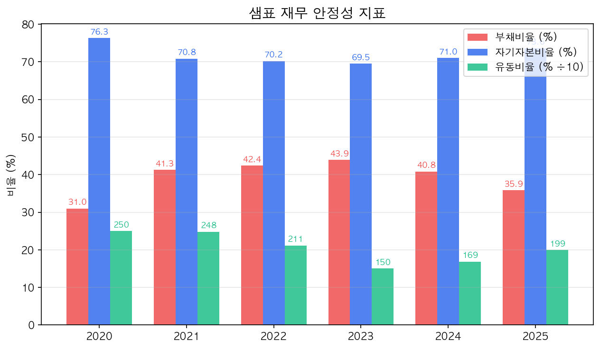

> **[Tip]** 부채비율은 "빌린 돈 ÷ 내 돈"입니다. 100% 이하면 양호, 200% 이상이면 주의입니다. 샘표는 35.85%로 매우 낮아 재무적으로 매우 안전합니다. 유동비율 199%는 "1년 내 갚아야 할 돈의 약 2배에 해당하는 현금성 자산을 보유"한다는 뜻입니다.

---

## 8. 현금흐름 분석 - 초보자 가이드

| 구분 | 2022 | 2023 | 2024 | 2025 |
|------|------|------|------|------|
| 영업활동CF (억원) | 183 | 229 | 351 | 618 |
| 투자활동CF (억원) | -313 | -265 | -149 | -389 |
| 재무활동CF (억원) | -38 | +60 | -75 | -249 |
| CAPEX (억원) | 418 | 312 | 206 | 227 |
| **FCF (억원)** | **-235** | **-83** | **+145** | **+391** |

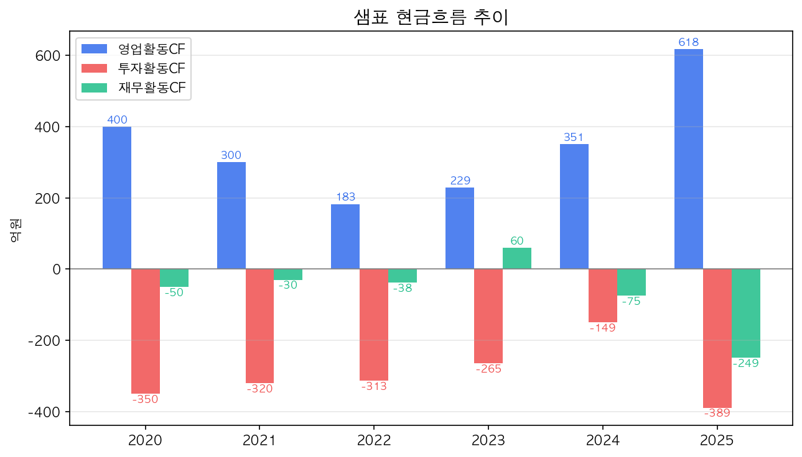

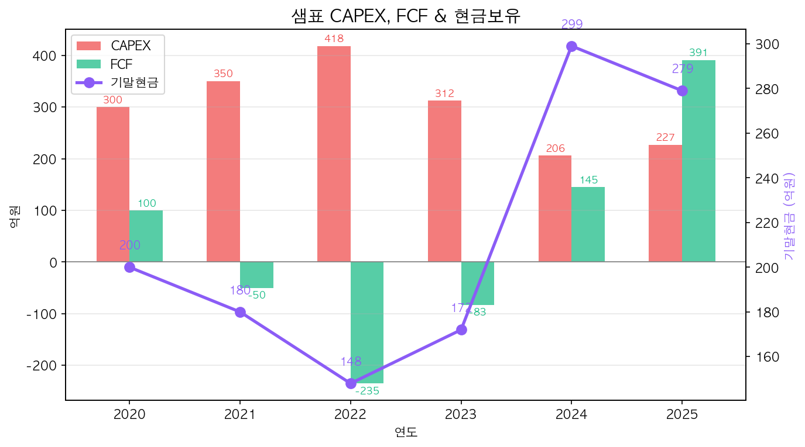

> **[Tip]** FCF(잉여현금흐름)는 "장사해서 번 현금 - 시설투자에 쓴 현금"입니다. FCF가 플러스면 투자를 하고도 현금이 남는다는 뜻입니다. 샘표는 2024년부터 FCF 흑자 전환, 2025년 391억원 달성으로 현금창출력이 크게 개선되었습니다.

### 이익의 질 (Earnings Quality)

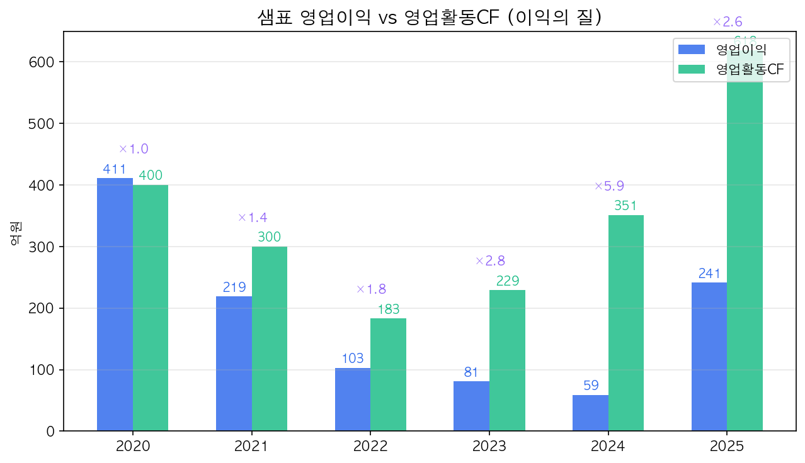

2025년 영업이익 241억원 대비 영업활동CF 618억원 (×2.6배)으로 이익의 질이 매우 높습니다.

---

## 9. 산업 분석 및 경쟁 환경

한국 장류 시장은 약 **1.5조원 규모**의 성숙 시장입니다. 인구 감소와 1인 가구 증가로 전통 장류 소비는 완만히 감소하는 반면, 프리미엄 소스류와 간편식 양념 시장은 성장 중입니다.

### 경쟁사 비교

| 기업 | 시가총액 | PER | PBR | 배당수익률 | ROE |
|------|----------|-----|-----|-----------|-----|
| **샘표** (007540) | **1,579억** | **14.43배** | **0.58배** | **0.36%** | **4.63%** |
| 오뚜기 (007310) | 14,669억 | 21.19배 | 0.61배 | 2.46% | 3.35% |
| 대상홀딩스 (084690) | 3,248억 | N/A | 0.55배 | 3.28% | -15.42% |
| CJ (001040) | 55,145억 | 42.80배 | 1.34배 | 1.64% | 2.69% |

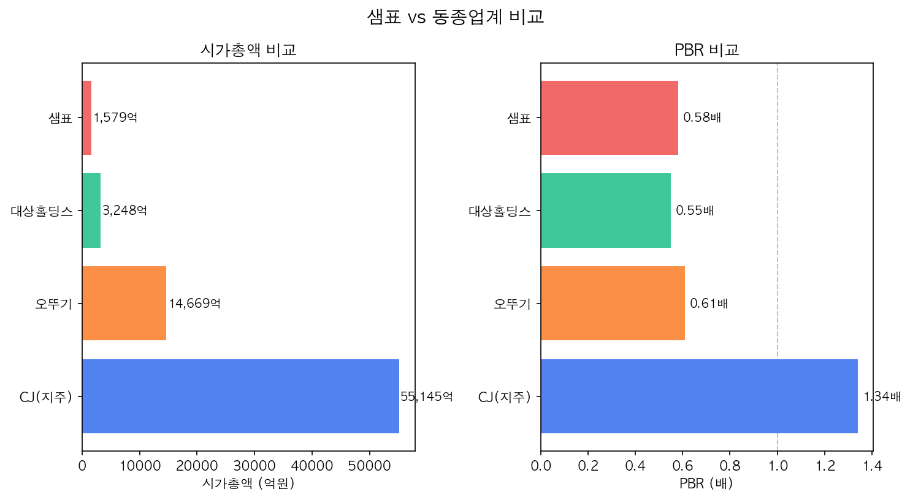

샘표의 간장 시장 점유율 **57%**는 압도적 1위입니다. PER 14.43배로 동종 대비 저렴하지만, 배당수익률 0.36%는 극히 낮습니다.

---

## 10. SWOT 분석 및 투자 리스크

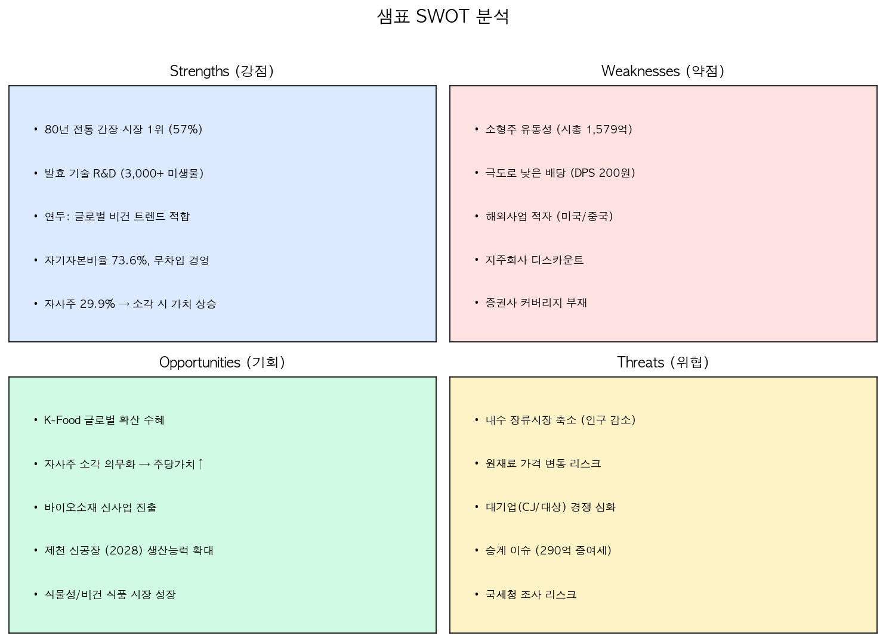

### 핵심 투자 리스크

| 리스크 | 상세 내용 |
|--------|----------|
| **자사주 소각 이슈** | 개정 상법에 따라 29.92% 자사주 소각 의무화. 소각 시 주당가치 상승이지만, 승계 과정에서의 증여세 부담(약 290억원)과 충돌 |
| **극도로 낮은 배당** | DPS 200원 9년간 동결. 누적 순이익 859억원 대비 배당금 37억원(배당성향 4.3%) |
| **승계 불확실성** | 4세 박용학 상무의 경영 승계 진행 중, 290억원 증여세 부담 |
| **소형주 유동성** | 시총 1,579억원, 증권사 커버리지 부재 |
| **해외사업 부진** | 미국법인 적자 지속, K-Food 트렌드 대비 수혜 제한적 |
| **국세청 조사** | 원가/가격 관련 국세청 조사 보도 |

---

## 11. 밸류에이션 및 투자 결론

### 밸류에이션 지표

| 지표 | 2020 | 2021 | 2022 | 2023 | 2024 | 2025 |
|------|------|------|------|------|------|------|
| PER (배) | 7.88 | 10.33 | 13.06 | 23.41 | 16.50 | 14.43 |
| PBR (배) | 0.61 | 0.59 | 0.62 | 0.63 | 0.47 | 0.58 |
| EPS (원) | 6,217 | 4,130 | 3,629 | 2,114 | 2,284 | 3,388 |
| BPS (원) | 80,786 | 72,054 | 75,948 | 77,969 | 80,416 | 84,351 |
| DPS (원) | 200 | 200 | 200 | 200 | 200 | 200 |

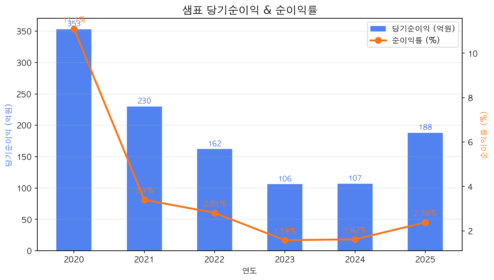

### 종합 투자 평가

| 평가 항목 | 점수 | 코멘트 |
|----------|------|--------|
| 수익성 | ★★★☆☆ (3.0) | 2025년 반등, 지속성 확인 필요 |
| 성장성 | ★★★☆☆ (3.0) | 매출 안정 성장, 연두 글로벌 확대 |
| 재무 안정성 | ★★★★★ (5.0) | 부채비율 36%, 유동비율 199% |
| 현금흐름 | ★★★★☆ (4.0) | FCF 391억, 이익의 질 우수 |
| 밸류에이션 | ★★★★☆ (4.0) | PBR 0.58배, 자사주 소각 시 상승 여력 |
| 배당매력 | ★☆☆☆☆ (1.0) | DPS 200원 동결, 배당수익률 0.36% |
| 지배구조 | ★★☆☆☆ (2.0) | 짠물 배당, 승계 이슈 |
| **종합** | **★★★☆☆ (3.1)** | **가치투자 관점 매력적, 촉매 필요** |

### 투자의견: 관심 (중립)

샘표는 **PBR 0.58배의 전형적인 저PBR 가치주**입니다. 2025년 실적 턴어라운드와 자사주 소각 의무화는 주당가치 상승의 촉매가 될 수 있습니다. 그러나 극도로 낮은 배당, 승계 불확실성, 소형주 유동성 부족이 주가 재평가의 걸림돌입니다.

**전략 제안:** 자사주 소각 시점과 배당 정책 변화를 확인한 후 투자 비중 확대를 검토하는 것이 바람직합니다. 장기 가치투자 관점에서 간장 시장 1위 + 연두 글로벌 성장 스토리는 매력적이나, 단기 촉매가 부족한 상황입니다.

---

*면책 조항: 본 보고서는 투자 참고 자료로 작성되었으며, 특정 종목의 매수/매도를 권유하지 않습니다. 투자 결정에 따른 모든 책임은 투자자 본인에게 있습니다. 작성일: 2026년 4월 2일.*
