# 샘표식품 (248170) 종합 투자 분석 보고서

> **작성일**: 2026년 4월 2일  
> **종목코드**: KRX 248170 (KOSPI)  
> **현재주가**: 28,300원 (2026.04.01)  
> **시가총액**: 1,293억원  
> **투자의견**: 관심 (중립)

---

## 목차

1. [회사 개요](#1-회사-개요)
2. [비전과 경영철학](#2-비전과-경영철학)
3. [사업모델 분석](#3-사업모델-분석)
4. [재무제표 분석](#4-재무제표-분석---초보자-가이드)
5. [수익성 분석](#5-수익성-분석)
6. [성장성 분석](#6-성장성-분석)
7. [재무 안정성 분석](#7-재무-안정성-분석)
8. [현금흐름 분석](#8-현금흐름-분석---초보자-가이드)
9. [산업 분석 및 경쟁 환경](#9-산업-분석-및-경쟁-환경)
10. [SWOT 분석 및 투자 리스크](#10-swot-분석-및-투자-리스크)
11. [밸류에이션 및 투자 결론](#11-밸류에이션-및-투자-결론)

---

## 1. 회사 개요

샘표식품은 1946년 창립 이래 80년 가까운 역사를 가진 대한민국 대표 전통식품 기업입니다. 간장, 된장, 고추장 등 장류를 기반으로 소스, 양념, 면류, 차류, 통조림까지 사업을 확장해왔습니다. 2016년 7월 샘표(주)에서 인적분할되어 사업회사인 샘표식품(주)로 설립되었으며, KOSPI에 종목코드 248170으로 상장되어 있습니다.

| 항목 | 내용 |
|------|------|
| 설립일 | 1946년 (분할설립: 2016.07.04) |
| 대표이사 | 박진선 (3세 경영, 오너 일가) |
| 본사 | 서울특별시 중구 |
| 종목코드 | KRX 248170 (KOSPI) |
| 발행주식수 | 약 457만주 |
| 시가총액 | 약 1,293억원 |
| 직원수 | 약 620명 |
| R&D 인력비중 | 전체 임직원의 약 20% |
| 주요 자회사 | 양포식품, 조치원식품, 샘표아이에스피 |

### 주주 구성

| 주주 | 지분율 |
|------|--------|
| 샘표(주) (지주회사) | 49.38% |
| 박진선 외 특수관계인 (지주회사 기준) | 48.44% |
| 외국인 투자자 | 7.67% |
| 자사주 | 0.04% |
| 기타 소액주주 | 약 42.9% |

> **[Tip]** 오너 일가가 지주회사를 통해 강력한 지배력을 행사하고 있습니다. 4세 승계(박용학 상무)가 진행 중이며, 약 290억원의 증여세 이슈가 있습니다.

---

## 2. 비전과 경영철학

샘표식품의 핵심 비전은 **"발효 기술 기반의 글로벌 식품 기업"**으로의 도약입니다. "우리 발효"를 핵심 키워드로 삼아, 80년간 축적한 식물성 발효 기술을 바탕으로 K-푸드의 세계화를 선도하겠다는 전략입니다.

### 핵심 전략 방향

1. **글로벌 K-소스 기업**: 간장, 연두, 고추장 3대 제품을 세계시장에 확대. 연두는 미국 Whole Foods, Albertsons 등 주요 유통채널에 입점. 아마존 매출 매년 세 자릿수 성장.

2. **발효 기술 R&D 강화**: 매출의 4~5%를 R&D에 투자. 2013년 설립한 "우리발효연구중심"은 아시아 유일의 식물성 발효 전문 연구소로, 3,000종 이상의 미생물 자원 보유.

3. **바이오 소재 신사업**: 미생물 발효 기술을 활용한 Pepreach(단백질 유래 기능성 소재), Savoryrich(천연 조미 소재) 등 B2B 바이오 소재 시장 진출.

4. **제조 인프라 확장**: 2028년까지 충북 제천 제2산업단지에 8.1만m2 규모 신공장 건설. 글로벌 수요 확대 대비.

### ESG 관련

별도의 ESG 보고서는 미발간이나, 발효 기반 식물성 제품 확대(비건/Non-GMO/글루텐프리), 친환경 포장재 도입, 지역 사회 공헌 등을 통해 ESG 가치를 실천 중. 연두 제품은 100% 식물성 원료 기반으로 지속가능한 식품 트렌드에 부합합니다.

---

## 3. 사업모델 분석

샘표식품은 **발효 기술 기반의 종합 식품 제조 기업**입니다.

### 주요 제품/브랜드

| 제품군 | 대표 브랜드/제품 | 특징 |
|--------|-----------------|------|
| 장류 | 샘표 간장, 된장, 고추장 | 국내 간장 시장 1위 |
| 소스/양념 | 연두, 새미네부엌, 차오차이 | 연두: 글로벌 히트상품 |
| 양식소스 | 폰타나 (파스타소스) | 프리미엄 양식 소스 |
| 아시안소스 | 티아시아 | 동남아/중화 요리소스 |
| 면류 | 질러 (라면) | 젊은층 타겟 라면 |
| 차류 | 조치원식품 생산 | 전통 차 제품 |
| 통조림 | 양포식품 생산 | 참치, 콩 통조림 등 |
| B2B 소재 | Pepreach, Savoryrich | 발효 기반 기능성 소재 |

### 매출 구성 변화

핵심 변화는 **장류 중심에서 비장류로의 매출 다각화**입니다.

| 연도 | 장류 비중 | 비장류 비중 |
|------|----------|-----------|
| 2019년 | 58.5% | 41.5% |
| 2020년 | 56.6% | 43.4% |
| 2021년 | 50.9% | 49.1% |
| 2022년 | 49.7% | 50.3% |
| 2023년 | 49.9% | 50.1% |

비장류 매출은 5년간 73% 급증 (2018년 1,235억원 -> 2023년 2,138억원)

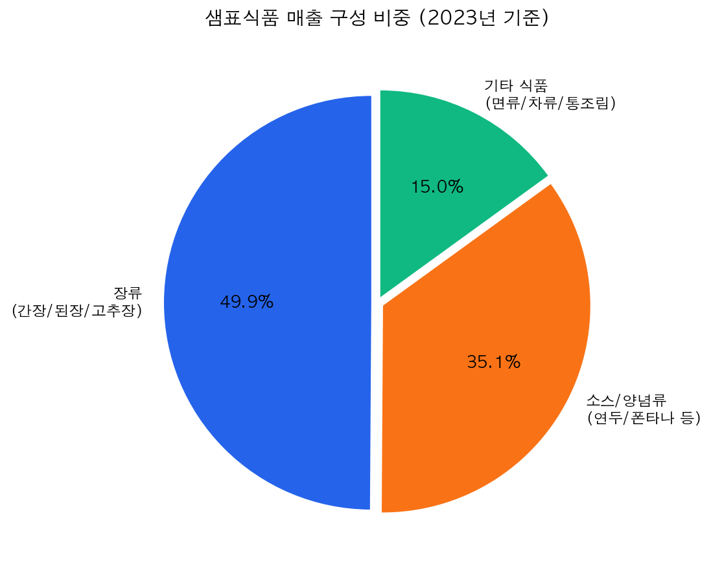

### 경쟁우위

- **80년 브랜드 파워**: 1946년부터 이어온 "샘표 간장"은 국내 간장 시장 부동의 1위
- **독보적 발효 R&D**: 3,000종 이상의 미생물 자원과 다수의 발효 특허 보유
- **글로벌 검증**: 연두는 영국 Great Taste Awards 최우수상, 고추장은 2025 세계일류상품 선정
- **높은 R&D 투자**: 매출의 4~5%, 인력의 20%를 연구개발에 투입하는 기술 중심 기업

---

## 4. 재무제표 분석 - 초보자 가이드

> **[Tip]** 재무제표란 회사의 "성적표"입니다. 매출액은 "총 벌어들인 돈", 영업이익은 "본업으로 남긴 돈", 당기순이익은 "세금까지 다 내고 최종적으로 남은 돈"입니다.

### 핵심 재무지표 (연결기준, 단위: 억원)

| 항목 | 2021 | 2022 | 2023 | 2024 | 2025 |
|------|------|------|------|------|------|
| 매출액 | 3,487 | 3,712 | 3,834 | 4,049 | 4,089 |
| 영업이익 | 235 | 111 | 98 | 65 | 245 |
| 당기순이익 | 237 | 131 | 104 | 101 | 199 |
| 영업이익률(%) | 6.7 | 3.0 | 2.6 | 1.6 | 6.0 |
| 순이익률(%) | 6.8 | 3.5 | 2.7 | 2.5 | 4.9 |
| EPS(원) | 5,186 | 2,868 | 2,283 | 2,203 | 4,366 |
| BPS(원) | 47,073 | 49,788 | 51,784 | 53,866 | 58,050 |
| 배당금(원) | 200 | 200 | 200 | 200 | 200 |

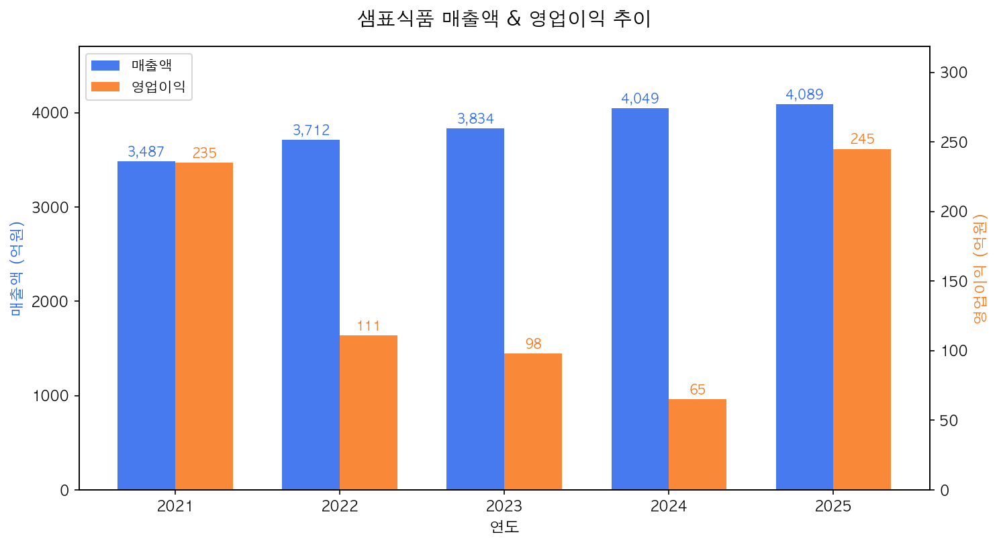

### 해석

매출은 2021~2025년 동안 꾸준히 성장하여 4,089억원까지 도달했습니다. 그러나 영업이익은 2021년 235억원에서 2024년 65억원까지 급락했다가 2025년 245억원으로 극적으로 반등했습니다.

**수익성 악화의 원인**은 비장류 사업 확대를 위한 공격적 마케팅 투자입니다. 판매관리비가 2020년 1,084억원에서 2024년 1,476억원으로 36% 급증했습니다. 연두, 폰타나, 차오차이 등 신규 브랜드 런칭에 막대한 광고비가 투입된 것입니다. 2025년의 반등은 이러한 투자가 성과를 내기 시작했음을 보여줍니다.

> **[Tip]** EPS(주당순이익)란 "주식 1주당 벌어들인 순이익"입니다. 2024년 2,203원에서 2025년 4,366원으로 거의 2배 증가해, 주당 가치가 높아졌습니다. BPS(주당순자산)는 58,050원인데 현재 주가 28,300원은 BPS의 절반에도 미치지 못합니다(PBR 0.49배).

---

## 5. 수익성 분석

| 지표 | 2021 | 2022 | 2023 | 2024 | 2025 |
|------|------|------|------|------|------|
| 영업이익률(%) | 6.7 | 3.0 | 2.6 | 1.6 | 6.0 |
| 순이익률(%) | 6.8 | 3.5 | 2.7 | 2.5 | 4.9 |
| ROE(%) | 11.64 | 5.92 | 4.50 | 4.17 | 7.81 |
| ROA(%) | 7.95 | 3.87 | 2.91 | 2.73 | 5.32 |

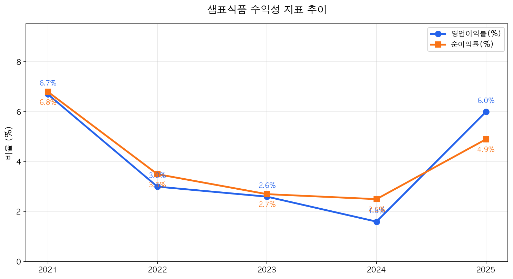

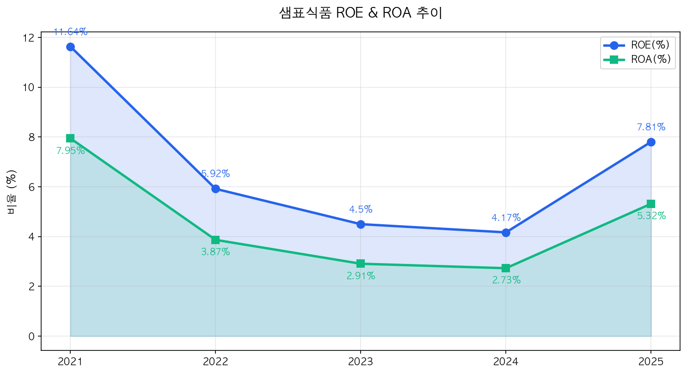

ROE는 "주주의 돈(자기자본)으로 얼마나 효율적으로 이익을 냈는가"를 보여줍니다. 2024년 4.17%에서 2025년 7.81%로 회복한 것은 긍정적이지만, 아직 2021년 수준(11.64%)에는 미치지 못합니다.

> **[Tip]** ROE 7.81%란 자기자본 100원당 약 7.8원의 순이익을 냈다는 의미입니다. 은행 예금금리(3~4%)보다는 높으므로 투자 가치가 있다고 볼 수 있습니다.

---

## 6. 성장성 분석

| 성장률(%) | 2022 | 2023 | 2024 | 2025 |
|-----------|------|------|------|------|
| 매출 성장률 | 6.4 | 3.3 | 5.6 | 1.0 |
| 영업이익 성장률 | -52.8 | -11.7 | -33.7 | +276.9 |
| 순이익 성장률 | -44.7 | -20.6 | -2.9 | +97.0 |

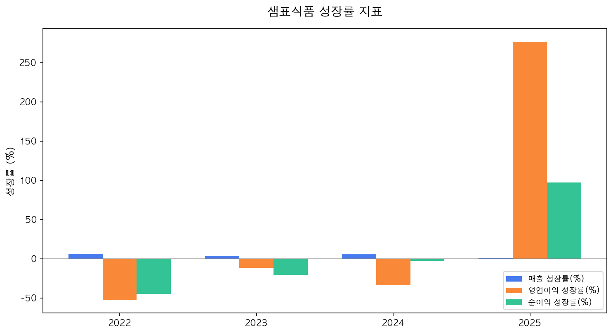

매출은 연평균 4% 내외로 안정적 성장을 이어가고 있습니다. 영업이익은 2022~2024년간 지속적으로 감소했으나 2025년에 **+276.9%**라는 경이적인 반등을 보였습니다.

### 미래 성장 동력

1. **연두의 글로벌 확장**: 연평균 30%+ 해외 매출 성장, 누적 3,500만 병 판매
2. **K-소스 수출 확대**: 간장/연두/고추장 모두 "세계일류상품" 선정
3. **제천 신공장**: 2028년 완공으로 생산능력 대폭 확대
4. **바이오 소재 사업**: 발효 기술 기반 B2B 소재 시장 진출
5. **매출 1조원 목표**: 현재 4,089억원에서 중장기 1조원 달성 목표

---

## 7. 재무 안정성 분석

> **[Tip]** 부채비율은 "빌린 돈 / 내 돈"의 비율입니다. 100% 이하면 빌린 돈보다 내 돈이 더 많다는 뜻이라 안전합니다. 유동비율은 "1년 내 갚아야 할 빚 대비, 1년 내 현금화할 수 있는 자산의 비율"입니다. 100% 이상이면 단기 자금 사정이 양호합니다.

| 지표 | 2021 | 2022 | 2023 | 2024 | 2025 |
|------|------|------|------|------|------|
| 부채비율(%) | 52.4 | 54.1 | 55.1 | 50.4 | 43.5 |
| 자기자본비율(%) | 65.6 | 64.9 | 64.5 | 66.5 | 69.7 |
| 유동비율(%) | 203.9 | 174.1 | 131.3 | 141.1 | 165.1 |
| 이자보상비율(배) | 37.0 | 19.3 | 12.2 | 3.5 | 12.1 |

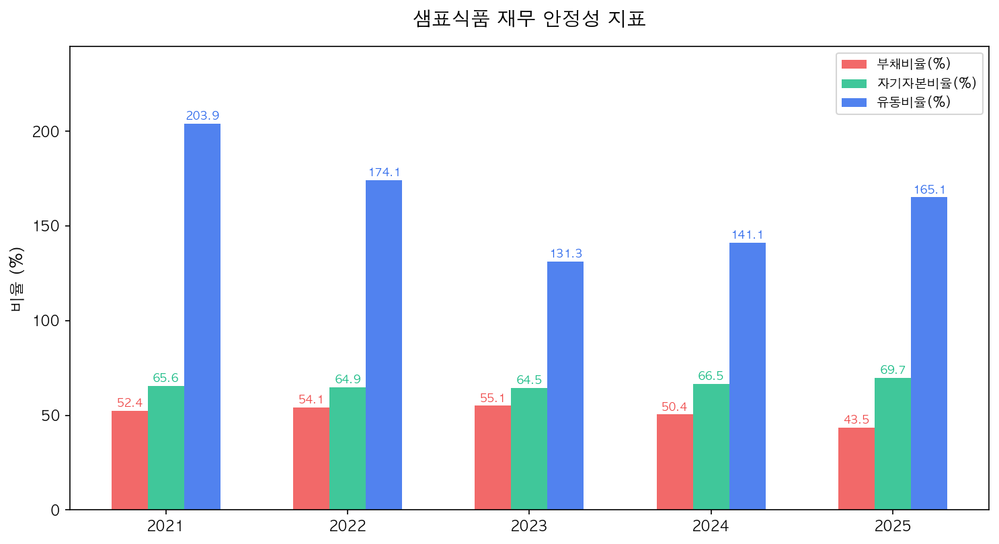

샘표식품의 재무 안정성은 **매우 우수**합니다. 부채비율 43.5%는 제조업 평균(약 80~100%)보다 훨씬 낮고, 자기자본비율 69.7%는 전체 자산의 약 70%가 자기 돈이라는 의미입니다.

---

## 8. 현금흐름 분석 - 초보자 가이드

> **[Tip]** 현금흐름표는 회사에 실제로 돈이 얼마나 들어오고 나갔는지를 보여줍니다. 회사가 흑자인데 현금이 없으면 부도가 날 수 있으므로 매우 중요합니다.

| 항목 (억원) | 2021 | 2022 | 2023 | 2024 | 2025 |
|------------|------|------|------|------|------|
| 영업활동CF | 320 | 152 | 205 | 335 | 583 |
| 투자활동CF | -633 | -311 | -316 | -142 | -374 |
| 재무활동CF | 317 | -8 | 135 | -87 | -236 |
| CAPEX | - | 416 | 312 | 198 | 223 |
| FCF (영업CF-CAPEX) | - | -264 | -107 | 137 | 360 |

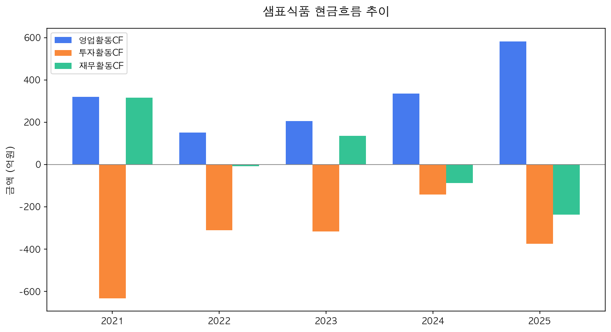

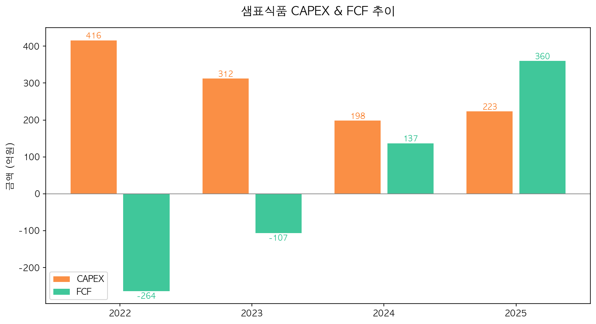

### 이익의 질 분석

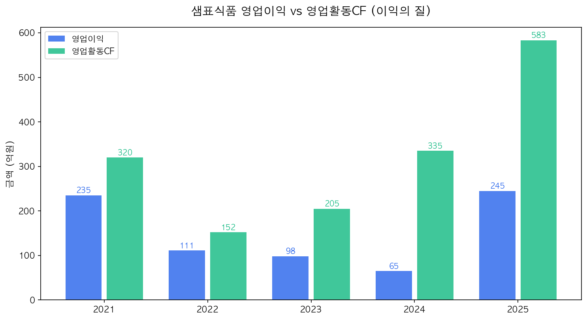

영업활동CF가 영업이익보다 큰 것은 **"이익의 질이 높다"**는 의미입니다. 2025년 영업이익 245억원 vs 영업활동CF 583억원으로, 실제 현금 유입이 장부 이익의 2.4배입니다.

> **[Tip]** FCF(잉여현금흐름)는 "영업으로 벌어들인 현금에서 설비투자비를 뺀 순수한 여유 현금"입니다. 2025년 360억원의 FCF는 회사 재정이 건강하다는 강력한 신호입니다.

---

## 9. 산업 분석 및 경쟁 환경

### 국내 장류 시장

- 시장 규모: 2010년대 중후반 약 1.2~1.3조원에서 현재 약 **9,900억원**으로 축소
- 1인 가구 증가와 인구 감소로 전통 장류 소비 감소
- 반면 **소스류와 간편 양념 시장은 성장** 중

### 글로벌 소스/조미료 시장

- 2024년 약 433억 달러(약 58조원) -> 2030년 약 595억 달러 전망 (연 5~6% 성장)
- 글로벌 발효식품 시장: 2024년 1,265억 달러 -> 연 7% 성장 전망
- K-푸드 열풍으로 한국산 소스 수출 빠르게 성장

### 경쟁사 비교 (2024년 기준)

| 기업 | 매출액 | 주요 제품 | 특징 |
|------|--------|----------|------|
| CJ제일제당 (식품부문) | 11.4조원 | 해찬들, 비비고, 다시다 | 국내 1위, 글로벌 전개 |
| 대상 | 4.1조원 | 청정원, 종가집 | 소스/김치 시장 강자 |
| 오뚜기 | 3.2조원 | 오뚜기 카레, 진라면 | 라면/소스 종합식품 |
| **샘표식품** | **4,049억원** | **샘표 간장, 연두** | **간장 1위, 발효기술** |

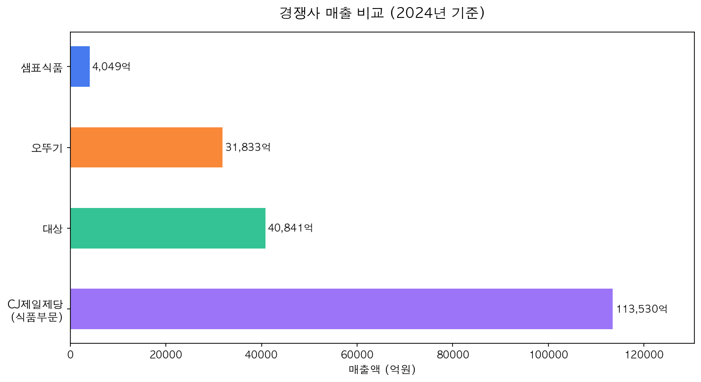

샘표식품은 경쟁사 대비 매출 규모가 작지만, 간장 시장 1위와 독보적 발효 기술이라는 확실한 차별점을 보유하고 있습니다.

---

## 10. SWOT 분석 및 투자 리스크

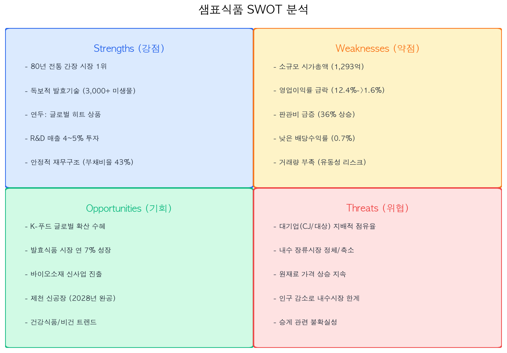

### 주요 투자 리스크

- **수익성 회복의 지속성**: 2025년 수익성 반등이 일시적인지, 구조적 개선인지 확인 필요
- **경쟁 심화**: CJ제일제당, 대상 등 대기업의 소스 시장 공세 심화
- **원재료 가격**: 대두, 밀 등 원재료 가격 변동에 직접적 영향
- **소형주 유동성**: 시가총액 1,293억원의 소형주로 거래량 적어 매매 시 주가 변동 리스크
- **승계 리스크**: 3세에서 4세로의 경영권 승계 과정에서 증여세(약 290억원) 이슈
- **내수 시장 정체**: 국내 장류 시장 축소 추세로 내수 성장에 한계

---

## 11. 밸류에이션 및 투자 결론

### 밸류에이션 지표

| 지표 | 샘표식품 | 업종 평균 | 해석 |
|------|---------|----------|------|
| PER | 6.50배 | 15~20배 | 업종 대비 크게 저평가 |
| PBR | 0.49배 | 1.0~1.5배 | 순자산 대비 절반 가격 |
| ROE | 7.81% | 8~12% | 평균 수준, 회복 추세 |
| 배당수익률 | 0.70% | 1.5~2.5% | 배당 매력 낮음 |

### 주가 성과

| 항목 | 수치 |
|------|------|
| 현재 주가 | 28,300원 (2026.04.01) |
| 52주 최고 | 37,800원 |
| 52주 최저 | 22,300원 |
| 시가총액 | 1,293억원 |
| 베타(1년) | 0.36 (시장 대비 변동성 낮음) |

### 최근 주요 뉴스 (2025~2026)

- 2025년 영업이익 245억원으로 전년 대비 277% 급증, 수익성 회복 확인
- 2025년 3분기 영업이익 128억원(+171% YoY), 순이익 125억원(+394% YoY) 서프라이즈
- 충북 제천 제2산업단지 공장 신설 투자 협약 체결 (2028년 완공 목표)
- 연두, "아누가 2025" 혁신제품 선정 / 고추장, 2025 세계일류상품 선정
- 사업 목적 변경: 건강기능식품, 전자상거래 등으로 사업 영역 확대
- 바이오 소재 신사업 (Pepreach, Savoryrich) 본격 추진

### 종합 투자 평가

| 평가 항목 | 점수 | 코멘트 |
|----------|------|--------|
| 성장성 | 3.5 / 5 | 매출 안정 성장, 글로벌 확장 기대 |
| 수익성 | 3.0 / 5 | 2025년 회복, 지속성 확인 필요 |
| 안정성 | 4.5 / 5 | 낮은 부채비율, 우수한 재무구조 |
| 밸류에이션 | 4.0 / 5 | PER/PBR 극저평가, 자산가치 매력 |
| 배당 매력 | 1.5 / 5 | 연 200원, 수익률 0.7% 미흡 |
| 경영진/지배구조 | 3.0 / 5 | 오너 경영, 승계 이슈 주의 |
| **종합 점수** | **3.3 / 5** | **가치주 관점에서 매력적** |

### 투자의견: 관심 (중립)

샘표식품은 PBR 0.49배의 극단적 저평가 상태에서 2025년 수익성 반등이라는 긍정적 모멘텀이 발생한 종목입니다. 80년 전통의 간장 1위 브랜드, 독보적 발효기술, 연두의 글로벌 히트 등 장기 성장 스토리가 분명합니다.

다만, (1) 수익성 회복의 지속성 검증, (2) 소형주 유동성 리스크, (3) 시가총액 대비 거래량 부족, (4) 낮은 배당 매력 등을 고려하면 단기 트레이딩보다는 **장기 가치투자 관점**에서 접근이 바람직합니다.

특히 제천 신공장 완공(2028년)과 바이오 소재 사업 본격화 시점이 중요한 모니터링 포인트입니다.

---

> **면책 조항**: 본 보고서는 공개된 정보를 바탕으로 작성된 투자 참고 자료이며, 투자 권유를 목적으로 하지 않습니다. 모든 투자 판단과 그에 따른 손익의 책임은 투자자 본인에게 있습니다. 보고서 내 데이터는 작성 시점 기준이며, 이후 변동될 수 있습니다.
