# 코스맥스 (COSMAX, 192820.KS) 투자 분석 보고서

## 📊 핵심 투자 포인트

- **투자의견**: 매수 (Buy)
- **목표주가**: 270,000원
- **현재주가**: 218,500원 (2026년 4월 23일 기준)
- **시가총액**: 약 2조 4,790억원
- **기대 수익률**: +23.6%

---

## 1. 기업 개요

코스맥스(COSMAX)는 **화장품 ODM/OEM 글로벌 1위** 기업입니다. 1992년 설립, 2014년 코스피 상장. 매출 기준 세계 최대의 화장품 제조자개발생산(ODM) 회사로 국내외 600여 개 브랜드에 제품을 공급합니다.

- **대표이사**: 이경수 회장(창업자), 이병주 대표이사
- **주요 사업**: 화장품 ODM/OEM (색조·기초·선케어·건기식 등)
- **글로벌 거점**: 한국·중국(상해/광저우)·미국·인도네시아·태국
- **핵심 고객**: 국내외 대형 브랜드 + 글로벌 인디 브랜드 600+

> 💡 **ODM이란?** "Original Design Manufacturer" — 제조자가 직접 기획·개발·생산까지 도맡는 방식. 브랜드는 마케팅·판매에 집중하면 되므로, 인디 뷰티 브랜드가 급증하는 구조에서 최대 수혜 비즈니스 모델입니다.

---

## 2. 사업 모델 분석

| 사업부문 | 매출 비중 | 특징 |
|---------|----------|------|
| 색조화장품 | 35% | 립·아이·파운데이션, 고마진 핵심 카테고리 |
| 기초화장품 | 30% | 스킨케어·앰플, 안정적 수주 기반 |
| 선케어 | 20% | 글로벌 수요 급증, 수출 비중 높음 |
| 기타/건기식 | 15% | 마스크팩, 이너뷰티 건강기능식품 |

**지역별 매출 비중**: 한국 40% / 중국 30% / 미국 20% / 기타 10%

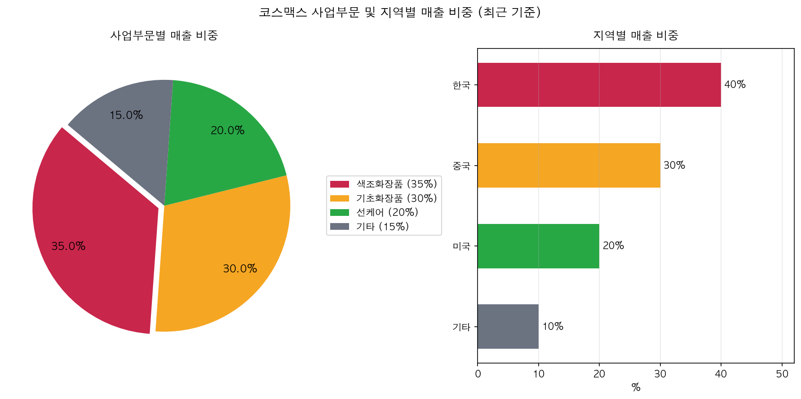

---

## 3. 재무 분석

| 항목 | 2022년 | 2023년 | 2024년 | 2025년 |
|------|--------|--------|--------|--------|
| 매출액 | 16,001억 | 17,775억 | 21,661억 | 23,988억 |
| 영업이익 | 531억 | 1,157억 | 1,754억 | 1,958억 |
| 당기순이익 | 209억 | 571억 | 858억 | 1,231억 |
| 영업이익률 | 3.32% | 6.51% | 8.10% | 8.16% |

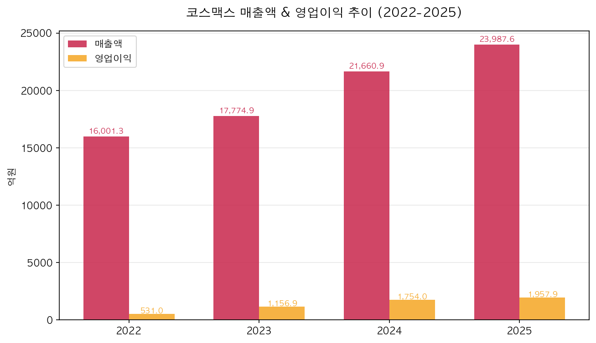
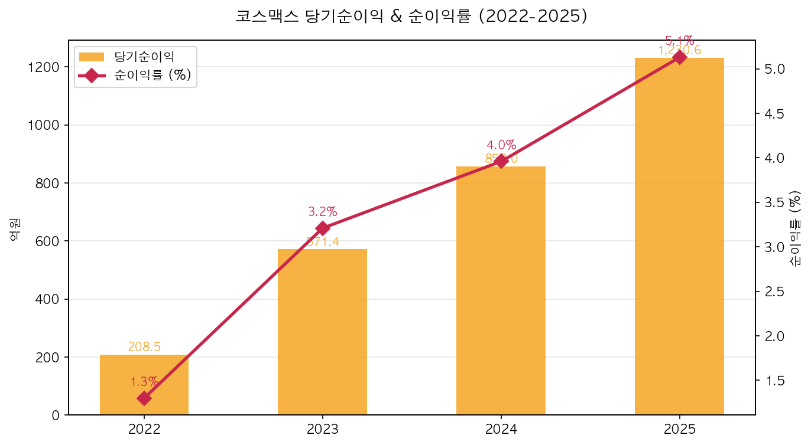

---

## 4. 수익성 분석

| 지표 | 2022 | 2023 | 2024 | 2025 |
|------|------|------|------|------|
| 영업이익률 | 3.32% | 6.51% | 8.10% | 8.16% |
| 순이익률 | 1.30% | 3.21% | 3.96% | 5.13% |
| ROE | 3.59% | 15.76% | 18.12% | **22.05%** |
| ROA | 1.49% | 3.67% | 4.44% | 5.79% |

> ROE가 3.6% → 22.1%로 **6배 개선**. 중국 법인 적자 축소 + 미국/수출 성장이 레버리지로 작용.

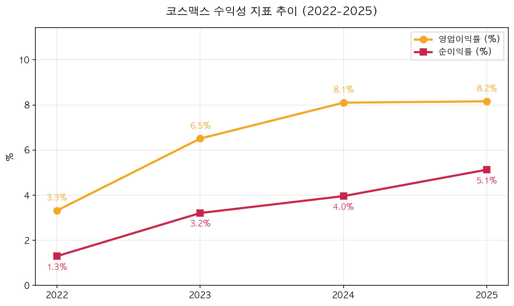
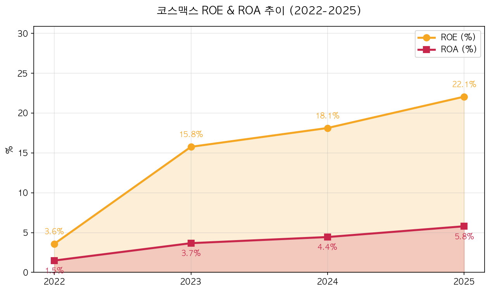

---

## 5. 성장성 분석

| 지표 | 2023 | 2024 | 2025 |
|------|------|------|------|
| 매출 성장률 | +11.1% | +21.9% | +10.7% |
| 영업이익 성장률 | +117.9% | +51.6% | +11.6% |
| 순이익 성장률 | +174.1% | +50.2% | +43.4% |

**3년 연속 매출 두 자릿수 성장 + 영업 레버리지**가 뚜렷합니다.

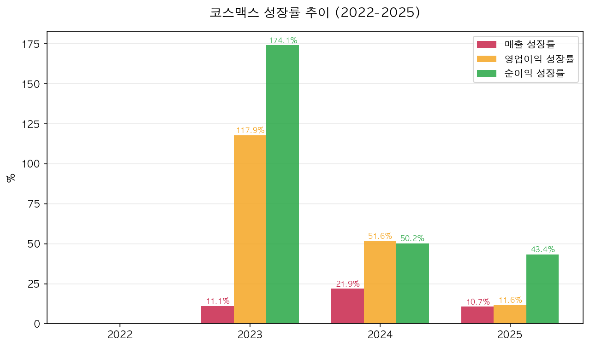

---

## 6. 재무 안정성

| 지표 | 2022 | 2023 | 2024 | 2025 | 기준 |
|------|------|------|------|------|------|
| 부채비율 | 163.86% | 330.61% | 300.99% | **271.08%** | 100%↓ 양호 / 200%↑ 주의 |
| 유동비율 | 90.8% | 83.0% | 84.6% | **81.2%** | 200%↑ 양호 / 100%↓ 주의 |

> ⚠️ **최대 약점**: 부채비율 271%, 유동비율 81% — 재무 레버리지가 높고 단기 유동성 여유가 적음. 다만 부채비율은 330% → 271%로 개선 추세.

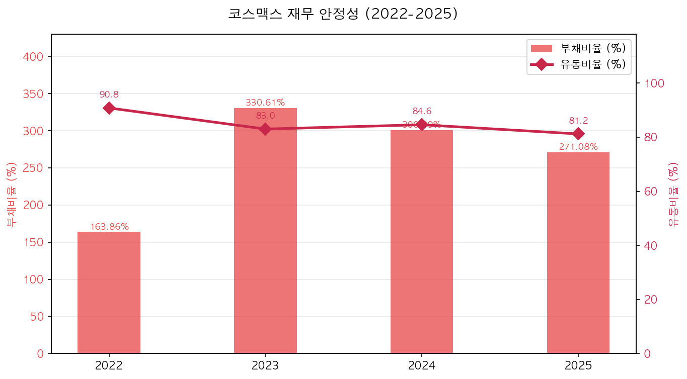

---

## 7. 현금흐름 분석

| 항목 | 2022년 | 2023년 | 2024년 | 2025년 |
|------|--------|--------|--------|--------|
| 영업활동CF | 1,025억 | 2,310억 | 730억 | 867억 |
| 투자활동CF | -313억 | -1,046억 | -1,600억 | -1,794억 |
| 재무활동CF | 35억 | -392억 | 675억 | 283억 |
| CAPEX | 844억 | 901억 | 1,685억 | 1,927억 |
| **FCF** | 182억 | 1,409억 | **-956억** | **-1,060억** |

> ⚠️ 2024~2025년 **FCF 마이너스 전환**은 미국·인니 생산능력 확장 투자 때문. 2026년 이후 수주 회수 시 정상화 기대.

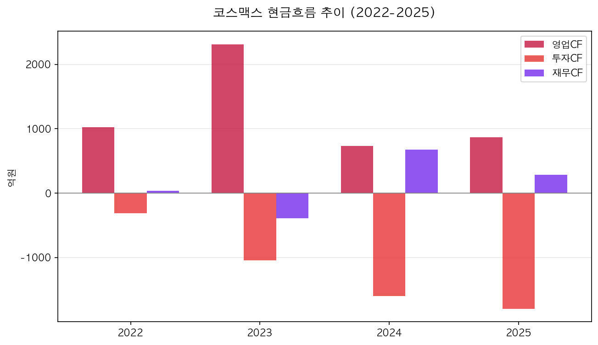
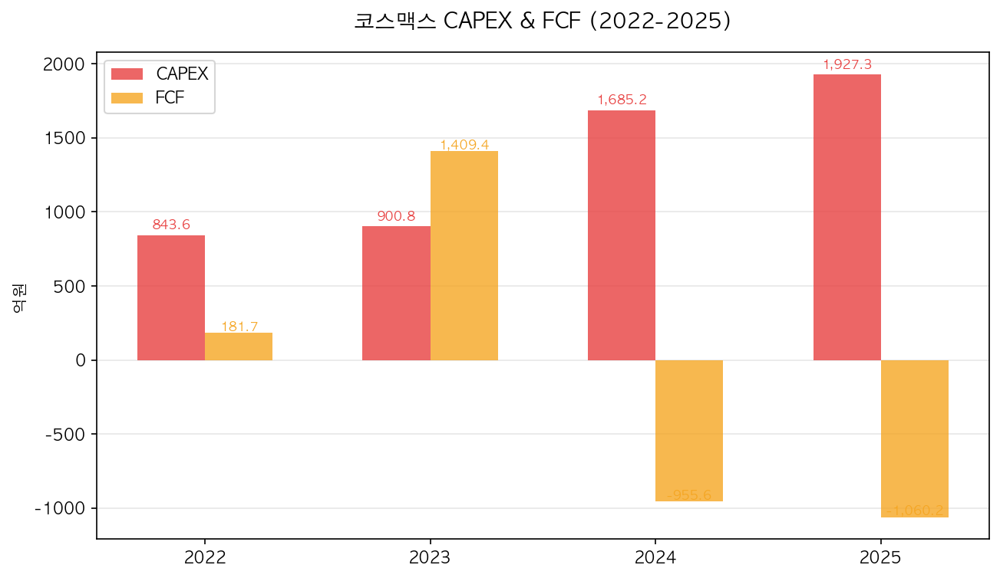
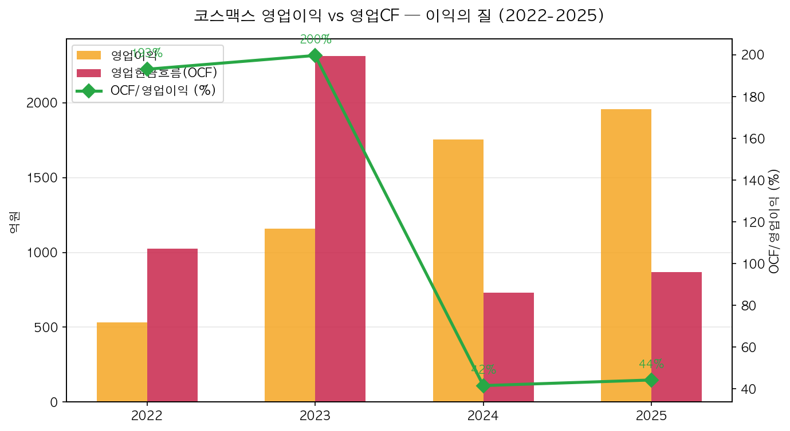

---

## 8. 산업 & 경쟁 분석

| 기업 | 2025년 매출 | 영업이익률 | 특징 |
|------|-------------|------------|------|
| **코스맥스** | **2조 3,988억** | 8.2% | 글로벌 ODM 매출 1위 |
| 한국콜마 | 2조 4,000억 | ~9% | ODM 2위, 국내·미국·중국 |
| 코스메카코리아 | 5,000억 | ~8% | 중견, 미국 잉글우드랩 보유 |
| 인터코스(이탈리아) | €9억 | ~12% | 글로벌 ODM 2위 |

---

## 9. SWOT 분석

### 💪 강점 (Strengths)
- 글로벌 화장품 ODM/OEM 매출 1위
- 국내외 주요 브랜드사와 장기 공급계약
- 색조·기초·선케어 전 카테고리 대응 역량
- K뷰티 글로벌 확산 최대 수혜주
- 미국·유럽 ODM 신규 생산기지 확보 중

### ⚠️ 약점 (Weaknesses)
- 부채비율 271%(2025) — 재무 레버리지 높음
- 유동비율 81% — 단기 유동성 주의
- FCF 마이너스(2024~2025) — 투자 부담 큼
- 특정 고객사 의존도 높음
- 원자재(오일류) 가격 변동 민감

### 🚀 기회 (Opportunities)
- K뷰티 유럽·북미 고성장 지속
- 미국 현지 ODM 수요 증가 (관세 회피)
- 인디 브랜드 급증 → ODM 수요 폭발
- 중국 리오프닝 이후 수요 회복 기대
- 친환경·비건 화장품 ODM 신규 수요

### 🔻 위협 (Threats)
- 미국 관세 리스크 (무역 불확실성)
- 중국 로컬 ODM 업체 가격 경쟁 심화
- 환율 변동 (원화 강세 시 수출 수익성 악화)
- 원자재 비용 상승 압력
- 한국콜마·코스메카코리아 경쟁 심화

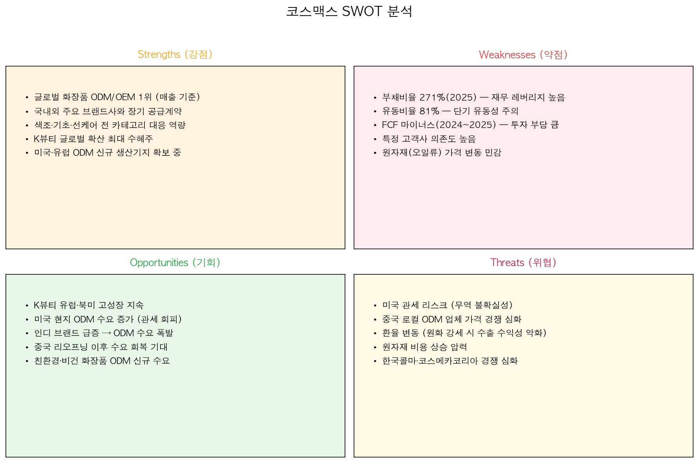

---

## 10. 밸류에이션 & 결론

| 지표 | 현재값 | 해석 |
|------|--------|------|
| PER | 약 20배 | 화장품 업종 평균, 실적 개선 반영 |
| PBR | 약 4.0배 | ROE 22% 고려 시 타당 |
| EV/EBITDA | 약 10배 | 동종 ODM 업종 평균 수준 |
| 배당수익률 | 약 0.5% | 성장 재투자 중심 |
| **목표주가** | **270,000원** | +23.6% 상승여력 |

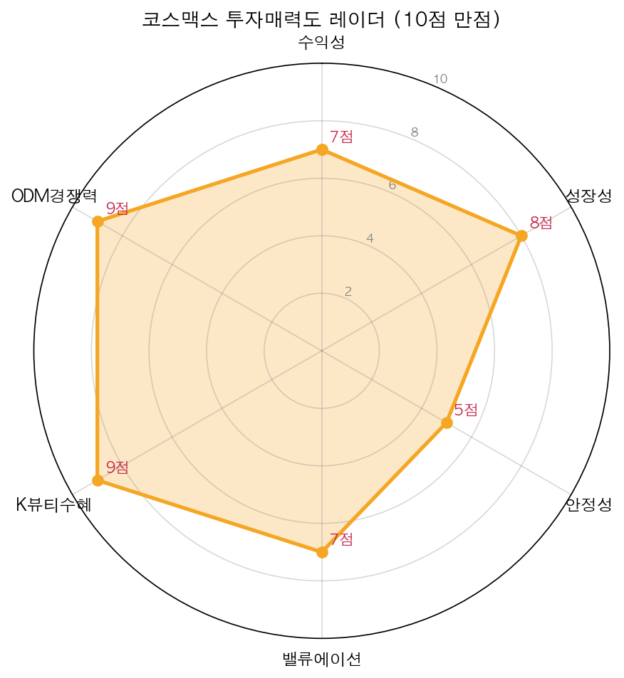

### 핵심 투자 포인트 요약

1. **글로벌 화장품 ODM 매출 1위** — K뷰티 확산 최대 수혜
2. **3년 연속 매출 두 자릿수 성장** (+11 / +22 / +11%)
3. **ROE 3.6% → 22.1%** — 수익성 구조적 정상화
4. **인디 브랜드 급증** → 소량·다품종 ODM 수주 폭증
5. **미국·인니 생산 증설** 완료 시 2026년 FCF 정상화 기대
6. **영업이익률 3.3% → 8.2%** — 마진 확장 여력 존재

**투자 의견: 매수(Buy), 목표주가 270,000원**

*단기 리스크: 부채비율 271%, FCF 마이너스, 미국 관세 불확실성*

---

## ⚠️ 면책 고지

본 투자 분석 보고서는 공개된 정보를 기반으로 투자 참고 목적으로 작성되었습니다. 본 보고서의 내용은 투자 권유 또는 투자 조언을 구성하지 않습니다. 과거의 재무 성과 및 주가 흐름이 미래의 결과를 보장하지 않습니다. 투자 판단의 최종 책임은 전적으로 투자자 본인에게 있습니다. 코스맥스 주식 투자에는 원금 손실 위험이 있습니다.
