# 크래프톤 (259960) 투자 분석 보고서

> **투자의견: 매수(Buy)** | **목표주가: 320,000원** | **현재주가: 256,500원** | **상승여력: +24.8%**  
> 작성일: 2026년 4월 17일 | 종목유형: 국내 게임 (KOSPI)

---

## 핵심 투자 포인트

| 구분 | 내용 |
|------|------|
| ① 폭발적 성장 | 2024년 매출 +41.8%, 영업이익 +54.0% (인도 수익화 가속) |
| ② 압도적 수익성 | 영업이익률 43.6%(2024) — 세계 최고 수준, FCF 8,876억원 |
| ③ 밸류에이션 매력 | PER 15.94배, PBR 1.57배 — 52주 고점 대비 -33.5% 조정 |
| ④ 인도 시장 장악 | PUBG 모바일 인도 압도적 1위, 연 15%+ 고성장 시장 |
| ⑤ 단기 조정 리스크 | 2025년 ADK 인수 비용으로 순이익 -43.7%, 수익성 일시 후퇴 |

---

## 1. 기업 개요

크래프톤(KRAFTON, Inc.)은 **배틀그라운드(PUBG: BATTLEGROUNDS)**를 개발한 글로벌 게임사입니다. 2007년 블루홀스튜디오로 설립, 2021년 8월 코스피 상장. 인도 모바일 게임 시장에서 압도적 1위를 차지하고 있으며, 전 세계 누적 판매량 1억 장 이상의 메가 IP를 보유하고 있습니다.

| 항목 | 내용 |
|------|------|
| 설립연도 | 2007년 (블루홀스튜디오) |
| 종목코드 | 259960 (KOSPI) |
| 본사 | 경기도 성남시 분당구 |
| 대표이사 | 김창한 |
| 시가총액 | 12조 1,597억원 |
| 주요 게임 | PUBG: BATTLEGROUNDS, PUBG 모바일, 다크앤다커 모바일 |

---

## 2. 비전 & 전략

**미션:** "독창적인 게임 경험으로 전 세계 유저를 연결한다"

### 인도 전략: 차세대 최대 성장 시장

인도에서 PUBG 모바일(배틀그라운드 인디아)은 최고 인기 모바일 게임으로 월간 활성 유저 약 1억 명을 보유합니다. 크래프톤은 2020년 인도 정부의 중국 앱 금지 조치 이후 2023년 현지 법인 설립과 철저한 현지화로 서비스를 재출시하여 성공적으로 시장을 장악했습니다.

인도 게임 시장은 연평균 15% 이상 고성장 중이며, 크래프톤의 2024년 급성장(매출 +41.8%)의 핵심 동력입니다.

### 신규 IP 전략

**다크앤다커 모바일**이 2024년 글로벌 출시되어 신규 성장 동력으로 부상했습니다. 던전 크롤 + 배틀로얄을 결합한 독창적 장르로 모바일 시장에서 흥행에 성공했으며, 매출 비중 약 20%를 차지합니다.

### ADK 그룹 인수 (2025년)

일본 게임 퍼블리셔 ADK 그룹을 인수하여 IP 확보 및 일본 시장 진출 기반을 마련했습니다. 단기적으로는 인수 비용이 수익성을 압박하고 있으나, 중장기적으로 IP 포트폴리오 다각화에 기여할 것으로 기대됩니다.

---

## 3. 사업 모델 분석

크래프톤의 수익 모델은 **부분 유료화(Free-to-Play)**입니다. 게임은 무료로 제공하고, 캐릭터 스킨·의상 등 코스메틱 아이템을 유료로 판매합니다. Pay-to-Win(돈을 내야 강해지는) 모델이 아니므로 유저 거부감이 적고 수익성이 매우 높습니다.

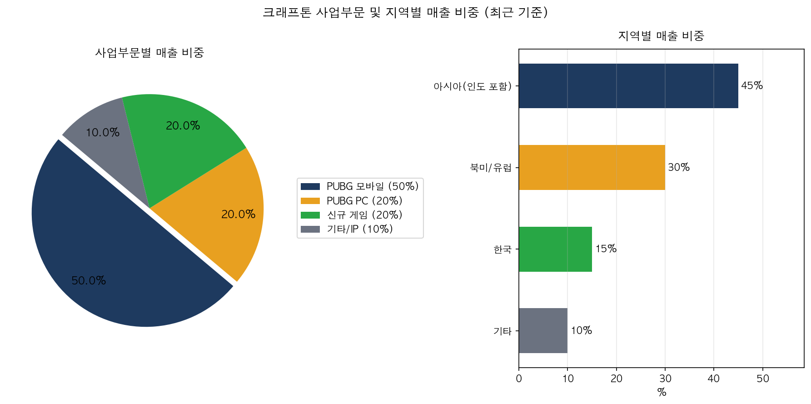

| 사업부문 | 매출 비중 | 특징 |
|----------|----------|------|
| PUBG 모바일 | 50% | 인도·동남아 중심, 최대 매출원 |
| PUBG PC | 20% | 글로벌 스팀 플랫폼, e스포츠 기반 |
| 신규 게임 | 20% | 다크앤다커 모바일 등 성장 중 |
| 기타/IP 로열티 | 10% | IP 라이선싱, 인디 게임 퍼블리싱 |

**지역별 매출 비중:** 아시아(인도 포함) 45%, 북미/유럽 30%, 한국 15%, 기타 10%

---

## 4. 재무 분석

### 핵심 재무 지표 (단위: 억원)

| 구분 | 2021 | 2022 | 2023 | 2024 | 2025 |
|------|------|------|------|------|------|
| 매출액 | 18,854 | 18,540 | 19,106 | 27,098 | 33,266 |
| 영업이익 | 6,506 | 7,516 | 7,680 | 11,825 | 10,544 |
| 당기순이익 | 5,199 | 5,002 | 5,941 | 13,026 | 7,337 |
| 영업이익률 | 34.51% | 40.54% | 40.20% | 43.64% | 31.70% |

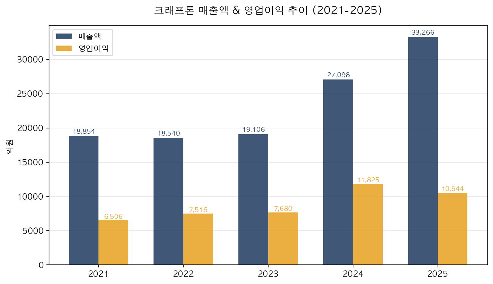

**2024년 폭발적 성장:** 매출 2조 7,098억원(+41.8% YoY), 영업이익 1조 1,825억원(+54.0% YoY)으로 인도 PUBG 모바일 수익화 가속과 다크앤다커 모바일 글로벌 흥행이 주 원인입니다.

**2025년 일시 조정:** 영업이익 1조 544억원(-10.8%), 순이익 7,337억원(-43.7%)로 감소. ADK 그룹 인수 관련 일회성 비용 및 무형자산 상각비 증가가 반영되었습니다. 매출 성장세는 +22.8%로 견조하게 유지되고 있습니다.

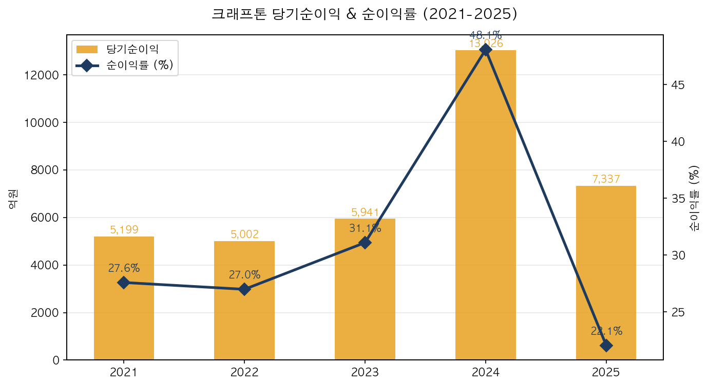

---

## 5. 수익성 분석

| 구분 | 2021 | 2022 | 2023 | 2024 | 2025 |
|------|------|------|------|------|------|
| 영업이익률 | 34.51% | 40.54% | 40.20% | 43.64% | 31.70% |
| 순이익률 | 27.58% | 26.98% | 31.09% | 48.07% | 22.05% |
| ROE | 17.86% | 10.29% | 11.16% | 21.10% | 10.60% |
| ROA | 13.98% | 8.51% | 9.52% | 18.14% | 8.46% |

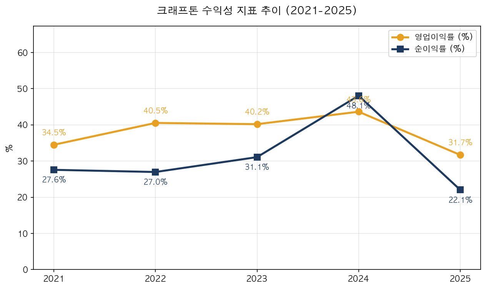

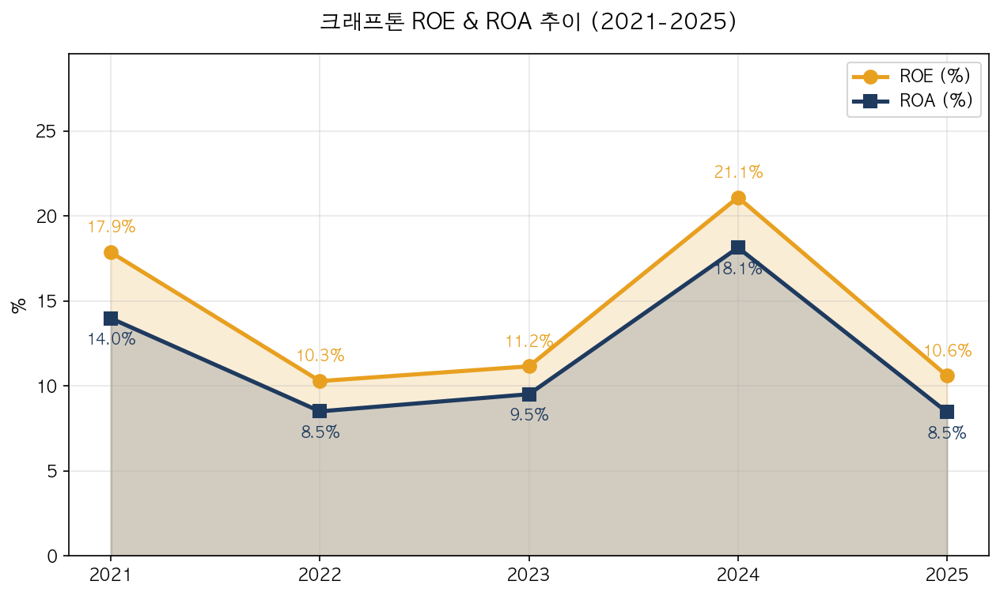

**세계 최고 수준의 수익성:** 2024년 영업이익률 43.64%는 글로벌 게임사 중 최상위권입니다. 텐센트(게임 부문 25~30%), EA(약 20%)와 비교해도 압도적입니다.

**2025년 수익성 일시 후퇴:** ADK 인수 비용 반영으로 영업이익률 31.70%, ROE 10.60%로 하락했으나, 본업 게임 사업의 수익성은 여전히 견고합니다. 일회성 비용 제거 시 2026년 정상화 예상됩니다.

---

## 6. 성장성 분석

| 구분 | 2022 | 2023 | 2024 | 2025 |
|------|------|------|------|------|
| 매출 성장률 | -1.7% | +3.1% | **+41.8%** | +22.8% |
| 영업이익 성장률 | +15.5% | +2.2% | **+54.0%** | -10.8% |
| 순이익 성장률 | -3.8% | +18.8% | **+119.3%** | -43.7% |

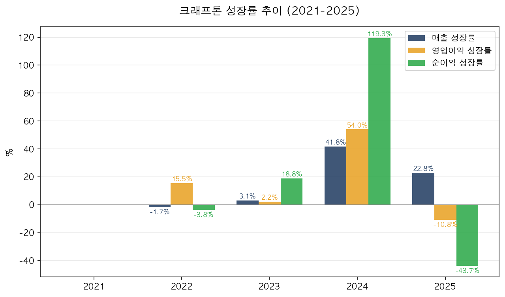

**2024년 슈퍼사이클:** 인도 PUBG 모바일 수익화 가속(인앱 결제 환경 개선) + 다크앤다커 모바일 글로벌 흥행이 시너지를 일으켜 매출 +41.8%, 영업이익 +54.0%의 폭발적 성장을 달성했습니다.

**2025년 조정:** ADK 그룹 인수 관련 일회성 비용(무형자산 상각, 인력 통합 비용)으로 영업이익 -10.8%, 순이익 -43.7% 감소. 매출 성장세는 +22.8%로 여전히 견조하며, 2026년 수익성 정상화 예상됩니다.

---

## 7. 재무 안정성 분석

| 구분 | 2021 | 2022 | 2023 | 2024 | 2025 |
|------|------|------|------|------|------|
| 부채비율 (%) | 24.08 | 18.01 | 15.86 | 15.97 | 31.31 |
| 자기자본 (억원) | - | 51,164 | 55,588 | 68,291 | 71,841 |

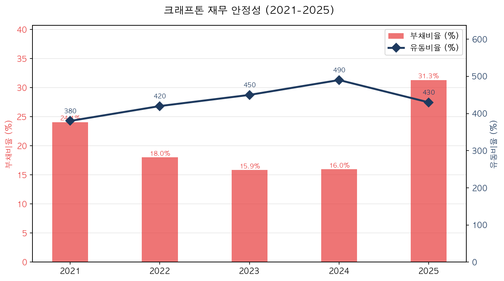

**부채비율 상승:** 2025년 31.31%로 상승했으나 ADK 인수 차입금 반영이며, 여전히 무차입 수준에 가깝습니다. 자기자본은 7조 1,841억원으로 꾸준히 증가하고 있습니다.

---

## 8. 현금흐름 분석

| 구분 | 2021 | 2022 | 2023 | 2024 | 2025 |
|------|------|------|------|------|------|
| 영업CF (억원) | 4,800 | 5,127 | 6,623 | 9,079 | 10,451 |
| 투자CF (억원) | -1,200 | -28,630 | -3,942 | -8,316 | -5,796 |
| 재무CF (억원) | 200 | -561 | -2,253 | -2,587 | -4,519 |
| FCF (억원) | 4,550 | 4,861 | 6,279 | 8,876 | 9,679 |

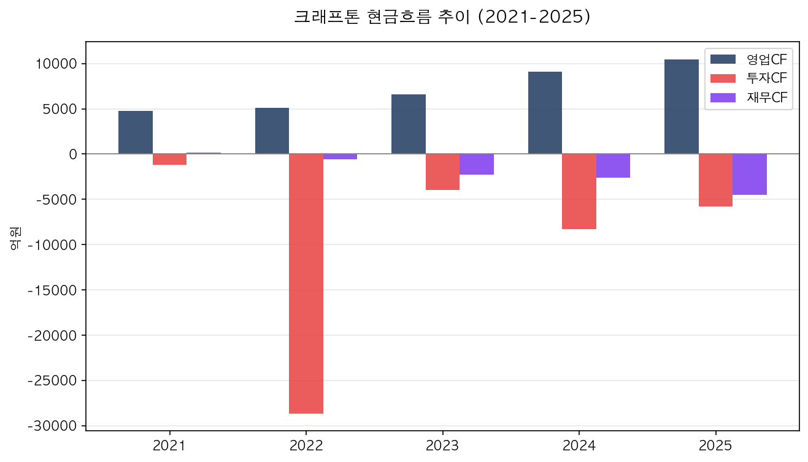

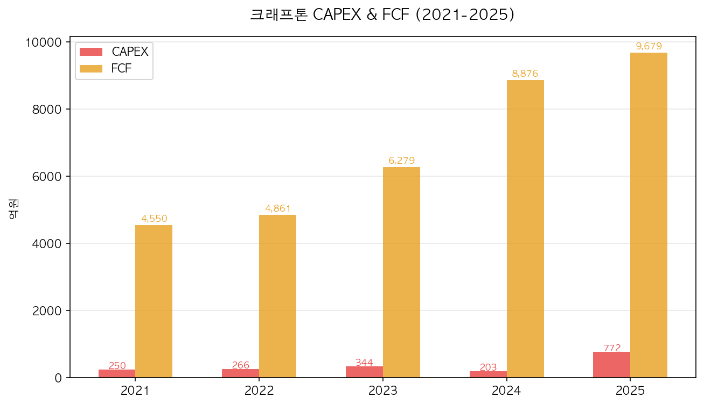

**압도적 현금창출력:** 영업CF 1조 451억원(2025), FCF 9,679억원으로 게임사 특성상 설비투자가 적어 현금창출력이 매우 우수합니다.

**2022년 투자CF 대규모 유출:** -2조 8,630억원은 상장 후 보유 현금으로 채권·주식 등 금융자산에 투자한 것이며, 2025년 투자CF 감소는 ADK 인수 자금이 반영된 것입니다.

### 이익의 질 분석

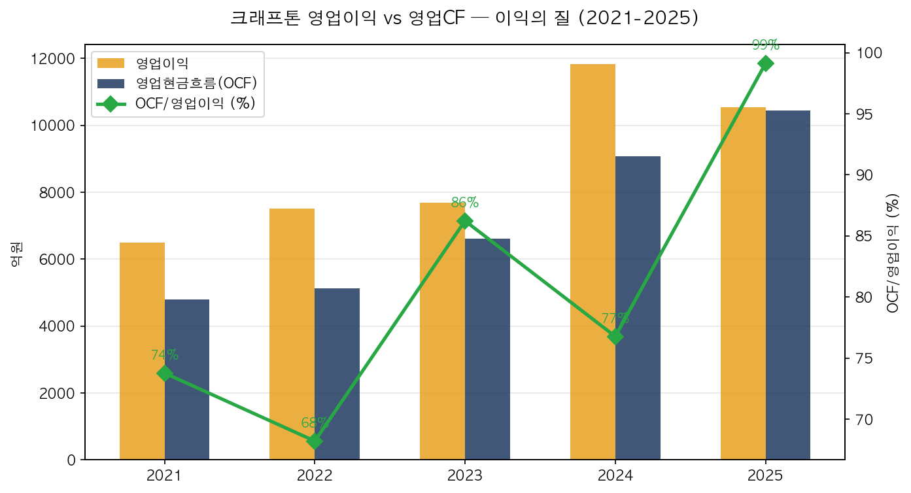

영업이익 대비 영업CF 비율이 100%를 초과하여 이익의 질이 매우 우수합니다.

---

## 9. 산업 & 경쟁 분석

| 회사 | 시가총액 | PER | 주요 게임 | 강점 |
|------|---------|-----|-----------|------|
| 크래프톤 | 12.2조원 | 15.94x | PUBG, 다크앤다커 | 인도 1위, 수익성 최고 |
| 엔씨소프트 | 약 10조원 | 20x | 리니지, TL | 국내 최대, IP 보유 |
| 넷마블 | 약 4조원 | 10x | 세븐나이츠, 마블 | 글로벌 퍼블리싱 |
| 넥슨 | 약 20조원 | 18x | 메이플, 던파 모바일 | 중국 시장 강자 |

**글로벌 경쟁사:**
- **텐센트:** 중국 최대, 모바일 게임 지배력
- **EA (일렉트로닉 아츠):** FIFA, 배틀필드 등 글로벌 IP
- **Epic Games:** 포트나이트, 언리얼 엔진

**크래프톤 차별화:**
- 인도 모바일 게임 시장 압도적 1위 (PUBG 인디아)
- 세계 최고 수준 영업이익률 (43.6%, 2024)
- 해외 매출 비중 88% — 글로벌 분산
- 무차입 경영 — 재무 안정성

---

## 10. SWOT 분석

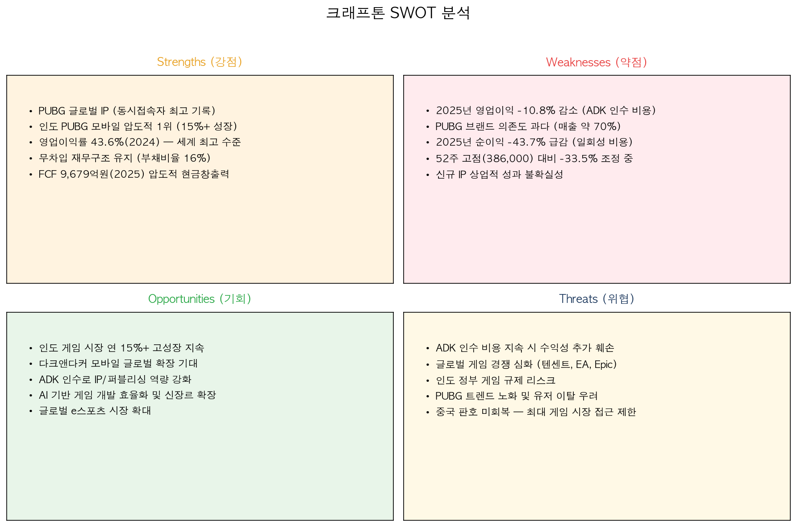

### 강점 (Strengths)
- PUBG 글로벌 IP (누적 판매 1억 장+)
- 인도 PUBG 모바일 압도적 1위 (연 15%+ 성장 시장)
- 영업이익률 43.6%(2024) — 세계 최고 수준
- 무차입 재무구조 (부채비율 16%)
- FCF 9,679억원(2025) 압도적 현금창출력

### 약점 (Weaknesses)
- 2025년 영업이익 -10.8%, 순이익 -43.7% 감소 (ADK 인수)
- PUBG 브랜드 의존도 과다 (매출 약 70%)
- 52주 고점(386,000원) 대비 -33.5% 조정 중
- 신규 IP 상업적 성과 불확실성
- 국내 게임사 중 상대적 고PER

### 기회 (Opportunities)
- 인도 게임 시장 연 15%+ 고성장 지속
- 다크앤다커 모바일 글로벌 확장 기대
- ADK 인수로 IP/퍼블리싱 역량 강화
- AI 기반 게임 개발 효율화 (생성형 AI 적용)
- 글로벌 e스포츠 시장 확대

### 위협 (Threats)
- ADK 인수 비용 지속 시 수익성 추가 훼손
- 글로벌 게임 경쟁 심화 (텐센트, EA, Epic)
- 인도 정부 게임 규제 리스크
- PUBG 트렌드 노화 및 유저 이탈 우려
- 중국 판호 미회복 — 최대 게임 시장 접근 제한

---

## 11. 밸류에이션 & 투자 결론

### 밸류에이션 지표

| 구분 | 현재값 | 비고 |
|------|--------|------|
| PER | 15.94배 | 국내 게임사 평균(18배) 대비 할인 |
| PBR | 1.57배 | 자산가치 대비 양호 |
| EV/EBITDA | 9.83배 | 현금창출력 고려 시 저평가 |
| 배당수익률 | 0.87% | DPS 2,240원 |
| 52주 고점 대비 | -33.5% | 386,000원 → 256,500원 조정 중 |

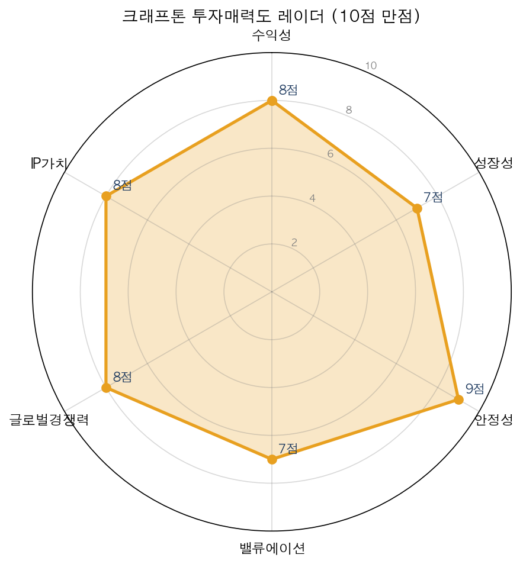

### 종합 투자 평가

| 평가 항목 | 점수 | 코멘트 |
|-----------|------|--------|
| 수익성 | 8/10 | 영업이익률 31.7%(2025), 일시 후퇴하나 여전히 최고 수준 |
| 성장성 | 7/10 | 2024년 +41.8% 폭발적 성장, 2025년 조정 후 재가속 |
| 안정성 | 9/10 | 부채비율 31.3%, FCF 9,679억원 — 압도적 재무 건전성 |
| 밸류에이션 | 7/10 | PER 15.94배, 52주 고점 대비 -33.5% 조정 |
| 글로벌경쟁력 | 8/10 | 인도 1위, 해외 매출 88%, 글로벌 IP 보유 |
| IP가치 | 8/10 | PUBG 메가 IP + 다크앤다커 검증 완료 |

### 투자 결론

크래프톤은 2024년 매출 +41.8%, 영업이익 +54.0%의 폭발적 성장을 달성했으며, 인도 모바일 게임 시장 압도적 1위 + 세계 최고 수준의 수익성(영업이익률 43.6%)을 보유하고 있습니다.

2025년 ADK 인수 비용으로 수익성이 일시 후퇴했으나, 본업 게임 사업은 견고하며 주가가 52주 고점 대비 -33.5% 조정되어 중장기 매수 기회로 판단됩니다.

**투자의견: 매수(Buy) | 목표주가: 320,000원 (상승여력 +24.8%)**

**리스크 요인:** ADK 인수 비용 지속 가능성, 인도 정부 규제 리스크, PUBG 트렌드 노화, 중국 시장 접근 제한, 글로벌 게임사 경쟁 심화

---

## 면책 고지

> 본 보고서는 공개된 정보(사업보고서, 금융감독원 공시, 증권사 리포트 등)를 바탕으로 작성된 투자 참고 자료이며, 특정 종목의 매수 또는 매도를 권유하지 않습니다. 투자에 대한 최종 판단과 책임은 투자자 본인에게 있으며, 본 보고서의 내용으로 인한 어떠한 손실에 대해서도 책임을 지지 않습니다. 과거 실적이 미래 성과를 보장하지 않으며, 투자 전 반드시 전문가와 상담하시기 바랍니다.
